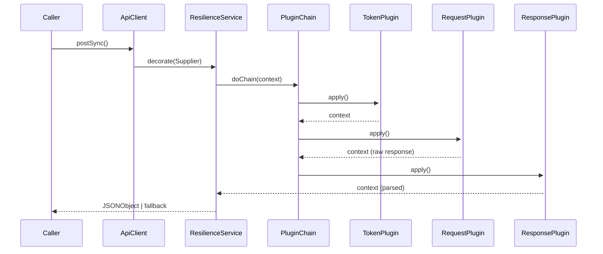

## 1. 概览

本 SDK 为调用第三方 REST 接口提供一套 **弹性治理 + 插件式流水线** 框架：

- 暴露两个入口：`ApiClient.postSync()` 和 `ApiClient.postAsync()`。
- 内置插件顺序：`TokenPlugin → RequestPlugin → ResponsePlugin`（通过 `@Order` 控制）。
- 默认使用 AES‑CBC‑PKCS5 加密与双 MD5 签名（可替换）。
- 异步调用基于 `CompletableFuture`，线程池可自定义注入。


## 2. 快速开始

### 2.1 环境要求

- **JDK 17+**
- **Spring Boot 3.x**
- **Maven 3.9+** / Gradle 8+
- Redis（仅当使用默认的 `TokenPlugin` 缓存实现时需要）

### 2.2 依赖引入（Maven）

```xml
<dependency>
    <groupId>com.example</groupId>
    <artifactId>api-client-sdk</artifactId>
    <version>1.0.0</version>
</dependency>
```

### 2.3 最小示例

```java
@SpringBootApplication
public class DemoApp {
    public static void main(String[] args) {
        var ctx = SpringApplication.run(DemoApp.class, args);
        ApiClient api = ctx.getBean(ApiClient.class);

        JSONObject resp = api.postSync("/query_order", Map.of(
            "orderId", "20250704001"
        ));

        System.out.println(resp.toJSONString());
    }
}
```


## 3. 架构总览

### 3.1 时序图



### 3.2 简化类图

------

## 4 · 核心组件

| 组件                  | 职责                                                         |
| --------------------- | ------------------------------------------------------------ |
| **ApiClient**         | 公共门面；构造 `ApiContext`，启动插件链；处理同步 / 异步分支 |
| **ApiPlugin**         | 纯函数 `apply(ApiContext)`；顺序由 `@Order` / `Ordered` 决定 |
| **ApiContext**        | 在插件间传递数据的可变载体                                   |
| **ResilienceService** | 为调用包裹 CircuitBreaker、RateLimiter、Retry、Bulkhead；可按 URL 选择策略 |
| **HttpService**       | 极薄的 Hutool POST 封装；可替换                              |

------

## 5 · 内置插件

### 5.1 TokenPlugin

- **位置**：链首（order = 0）。
- **功能**：通过 `/query_token` 获取或复用访问 Token。
- **缓存**：Redis `SETEX`，TTL 可配置；Key = `token:{appId}`。
- **扩展**：实现 `TokenProvider` 即可替换缓存层。

### 5.2 RequestPlugin

- 从 context 读取业务参数。
- 加密载荷 → 计算签名。
- 通过 `HttpService` 发 HTTP POST。
- 将原始响应文本写入 context (`RAW_RESPONSE`)。

### 5.3 ResponsePlugin

- 解密并解析 JSON。
- `Ret != 0` 时抛出 `ApiException`。
- 将解析结果写入 `PARSED_RESPONSE`。

------

## 6 · Resilience4j 配置

### 6.1 YAML 示例

```yaml
api:
  resilience:
    default:
      circuitBreaker:
        failureRateThreshold: 50
        slidingWindowSize: 20
        waitDurationInOpenState: 10s
      retry:
        maxAttempts: 3
        backoff:
          delay: 200ms
          multiplier: 2
```

### 6.2 动态策略

`ResilienceServiceImpl` 根据 URL 前缀返回不同配置：

```java
if (url.startsWith("/query_token")) {
    return fastRetryBreakerConfig();
} else if (url.contains("/payment")) {
    return aggressiveCircuitConfig();
}
```

可用 **配置中心**（如 Nacos / Consul）替换 `if` 逻辑，支持热更新。

------

## 7 · 安全

- **加密**：AES‑128‑CBC + PKCS5Padding。IV 及密钥从 Spring 配置或 Vault 加载。
- **签名**：默认 `md5( secret + md5(payload) )`；实现 `SignAlgorithm` SPI 可换 HMAC‑SHA256。
- **生产建议**：
  - 密钥放在 KMS，不要硬编码在 YAML。
  - 定期轮换；暴露 `KeySupplier` Bean。

------

## 8 · 扩展指南

### 8.1 新增自定义插件

```java
@Component
@Order(50)
public class LoggingPlugin implements ApiPlugin {
    @Override
    public void apply(ApiContext ctx) {
        log.info("REQ: {}", ctx.get("ENCRYPTED_BODY"));
    }
}
```

### 8.2 注入自定义线程池

```java
@Bean
public Executor apiExecutor() {
    return new ThreadPoolExecutor(
        32, 64,
        60, TimeUnit.SECONDS,
        new LinkedBlockingQueue<>(),
        new ThreadFactoryBuilder().setNameFormat("api-worker-%d").build()
    );
}
```

### 8.3 替换 `HttpService`

实现 `HttpService` 接口并加 `@Primary` 注解即可。

------

## 9 · 故障排查

| 异常                         | 常见原因             | 处理办法                            |
| ---------------------------- | -------------------- | ----------------------------------- |
| `SignatureMismatchException` | 密钥错误或载荷被篡改 | 检查配置，在本地重新签名对比        |
| `CallNotPermittedException`  | 断路器打开           | 查看错误率 & 半开状态指标           |
| `BulkheadFullException`      | 线程池耗尽           | 增加线程池，或改用响应式链路        |
| `TimeoutException`           | 下游接口延迟         | 调整 `timeoutDuration` 或启用 Retry |

日志类别：`com.example.api.*`，默认 **INFO**；问题排查时可调至 **DEBUG**。

------

## 10 · 版本历史

| 版本  | 日期       | 关键更新     |
| ----- | ---------- | ------------ |
| 1.0.0 | 2025-07-04 | 首次公开发布 |

------

## 11 · 许可证 / 贡献

本项目基于 **Apache 2.0** 协议开源。欢迎以 PR 形式贡献代码：

1. Fork → 新建功能分支。
2. 补充测试（`mvn test`）。
3. 提 PR，并关联 Issue。

------

**Happy hacking!**
