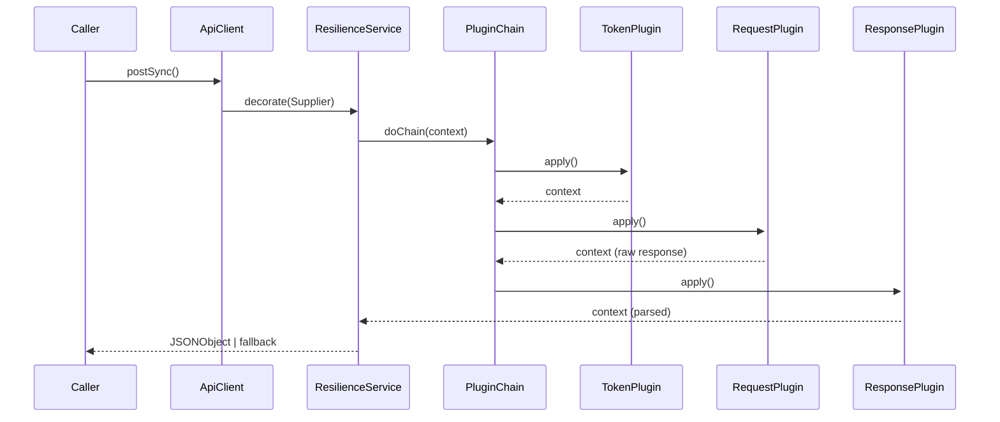

## 1. 概览

本 SDK 为调用第三方 REST 接口提供一套 **弹性治理 + 插件式流水线** 框架：

- 暴露两个入口：`ApiClient.postSync()` 和 `ApiClient.postAsync()`。
- 内置插件顺序：`TokenPlugin → RequestPlugin → ResponsePlugin`（通过 `@Order` 控制）。
- 默认使用 AES‑CBC‑PKCS5 加密与双 MD5 签名（可替换）。
- 异步调用基于 `CompletableFuture`，线程池可自定义注入。


## 2. 快速开始

### 2.1 环境要求

- **JDK 17+**
- **Spring Boot 3.x**
- **Maven 3.9+** / Gradle 8+
- Redis（仅当使用默认的 `TokenPlugin` 缓存实现时需要）

### 2.2 依赖引入（Maven）

```xml
<dependency>
    <groupId>com.example</groupId>
    <artifactId>api-client-sdk</artifactId>
    <version>1.0.0</version>
</dependency>
```

### 2.3 最小示例

```java
@SpringBootApplication
public class DemoApp {
    public static void main(String[] args) {
        var ctx = SpringApplication.run(DemoApp.class, args);
        ApiClient api = ctx.getBean(ApiClient.class);

        JSONObject resp = api.postSync("/query_order", Map.of(
            "orderId", "20250704001"
        ));

        System.out.println(resp.toJSONString());
    }
}
```


## 3. 架构总览

### 3.1 时序图




## 4. 核心组件

| 组件                  | 职责                                                         |
| --------------------- | ------------------------------------------------------------ |
| **ApiClient**         | 公共门面；构造 `ApiContext`，启动插件链；处理同步 / 异步分支 |
| **ApiPlugin**         | 纯函数 `apply(ApiContext)`；顺序由 `@Order` / `Ordered` 决定 |
| **ApiContext**        | 在插件间传递数据的可变载体                                   |
| **ResilienceService** | 为调用包裹 CircuitBreaker、RateLimiter、Retry、Bulkhead；可按 URL 选择策略 |
| **HttpService**       | 极薄的 Hutool POST 封装；可替换                              |


## 5. 内置插件

### 5.1 TokenPlugin

- **位置**：链首（order = 0）。
- **功能**：通过 `/query_token` 获取或复用访问 Token，获取到的Token存在ApiContext
- **缓存**：Redis `SETEX`，TTL 可配置；Key = `token:{appId}`

### 5.2 RequestPlugin

- 从 context 读取业务参数。
- 加密载荷 → 计算签名。
- 通过 `HttpService` 发 HTTP POST。
- 将原始响应文本写入 context (`RAW_RESPONSE`)。

### 5.3 ResponsePlugin

- 解密并解析 JSON。
- `Ret != 0` 时抛出 `ApiException`。
- 将解析结果写入 `PARSED_RESPONSE`。


## 6. Resilience4j 动态配置

### 6.1 Nacos 配置与自动刷新

在 `bootstrap.yaml` 中新增对 Nacos Config 的依赖与自动刷新：

```yaml
spring:
  application:
    name: api-client
  cloud:
    nacos:
      config:
        server-addr: nacos.company.internal:8848
        file-extension: yaml
        shared-configs:
          - dataId: api-resilience.yaml
            group: DEV
            refresh: true    # <── 关键：打开自动推送与刷新
```

- `refresh: true` 让 Spring Cloud Alibaba 在 Nacos 配置变动时，通过长轮询自动更新本地 Environment。

然后配置格式 (`api-resilience.yaml`)

```yaml
api:
  resilience:
    mappings:
      - id: token
        pattern: "/query_token"
        circuit-breaker:
          failureRateThreshold: 20
          waitDurationInOpenState: 2s
          slidingWindowSize: 10
        retry:
          maxAttempts: 5
          initialInterval: 100ms
          multiplier: 2
      - id: payment
        pattern: "/payment/**"
        circuit-breaker:
          failureRateThreshold: 50
          waitDurationInOpenState: 10s
          slidingWindowSize: 20
        bulkhead:
          maxConcurrentCalls: 50
      - id: default
        pattern: "/**"
        circuit-breaker:
          failureRateThreshold: 60
          slidingWindowSize: 50
```


### 6.2 属性映射

```java
@Configuration
@RefreshScope              // Nacos 推送后，Spring 会重新实例化本 Bean
@ConfigurationProperties(prefix = "api.resilience")
public class ResilienceMappings {
    private List<Mapping> mappings = new ArrayList<>();

    /** 根据 URL 找到最具体（最长 pattern）的 Mapping */
    public Optional<Mapping> find(String url) {
        PathPatternParser parser = new PathPatternParser();
        return mappings.stream()
            .sorted(Comparator.comparingInt(
                (Mapping m) -> m.getPattern().length()
            ).reversed())  // 把最长的 pattern 放到前面，优先匹配最精确项
            .filter(m -> parser.parse(m.getPattern())
                             .matches(PathContainer.parsePath(url)))
            .findFirst();
    }
}
```

- `@ConfigurationProperties` 将 Nacos 下发的 `api.resilience.mappings` 列表自动绑定到 `mappings` 字段。

- `@RefreshScope` 保证 Nacos 一旦有新配置，Spring 会**销毁并重新创建**此 Bean，`mappings` 里就会是最新值 。

### 6.3 Mapping 与 Props 几个核心 POJO

```java
@Data
public class Mapping {
    private String id;
    private String pattern;
    private CircuitBreakerProps circuitBreaker;
    private RetryProps retry;
    private BulkheadProps bulkhead;
}

@Data
public class CircuitBreakerProps {
    private float failureRateThreshold = 50f;
    private int   slidingWindowSize    = 20;
    private Duration waitDurationInOpenState = Duration.ofSeconds(10);
}

@Data
public class RetryProps {
    private int      maxAttempts     = 3;
    private Duration initialInterval = Duration.ofMillis(200);
    private double   multiplier      = 2.0;
}

@Data
public class BulkheadProps {
    private int maxConcurrentCalls = 50;
}
```

- 每个 `Mapping` 对应一条 Nacos 配置。

- Props 类只是承载参数的简单 POJO，由 Spring Boot 自动注入 。

### 6.4 ResilienceServiceImpl：按 URL 构建 & 缓存策略

```java
@Service
@RefreshScope
public class ResilienceServiceImpl implements ResilienceService {

    private final ResilienceMappings mappings;
    private final CircuitBreakerRegistry cbRegistry;
    private final RateLimiterRegistry rateLimiterRegistry;
    private final RetryRegistry retryRegistry;
    private final BulkheadRegistry bulkheadRegistry;
    // 按 URL 缓存上次构建好的 ResilienceOps
    private final ConcurrentMap<String, ResilienceOps> cache = new ConcurrentHashMap<>();

    public <T> Supplier<T> decorate(String url, Supplier<T> call, Function<Throwable,T> fallback) {
        // 1. 从 cache 中取，若不存在则 buildOps(url)
        ResilienceOps ops = cache.computeIfAbsent(url, this::buildOps);

        // 2. 用 Resilience4j Decorators 按 ops 装饰调用
        return Decorators.ofSupplier(call)
                .withCircuitBreaker(ops.getCircuitBreaker())
                .withRetry(ops.getRetry())
                .withBulkhead(ops.getBulkhead())
                .withFallback(fallback)
                .decorate();
    }

    private ResilienceOps buildOps(String url) {
        // 3. 根据最新的 mappings 找到匹配的 Mapping
        Mapping m = mappings.find(url)
                .orElseThrow(() -> new IllegalStateException("No resilience config for URL: " + url));

        String name = m.getId() + ":" + Math.abs(url.hashCode());

        // 4. 从各自的 Registry 中创建/获取同名实例
        CircuitBreaker cb = cbRegistry.circuitBreaker(name, toCbConfig(m.getCircuitBreaker()));
        Retry retry       = retryRegistry.retry(name, toRetryConfig(m.getRetry()));
        Bulkhead bulkhead = bulkheadRegistry.bulkhead(name, toBulkheadConfig(m.getBulkhead()));

        return new ResilienceOps(cb, retry, bulkhead);
    }

    // ... toCbConfig(), toRetryConfig(), toBulkheadConfig() 按 Props 转 Config ...
    // 例如
    private CircuitBreakerConfig toCbConfig(CircuitBreakerProps p) {
        return CircuitBreakerConfig.custom()
                .failureRateThreshold(p.getFailureRateThreshold())
                .slidingWindowSize(p.getSlidingWindowSize())
                .waitDurationInOpenState(p.getWaitDurationInOpenState())
                .build();
    }
    
    public static class ResilienceOps {
        private final CircuitBreaker circuitBreaker;
        private final Retry retry;
        private final Bulkhead bulkhead;
        // 构造 + getter 略
    }
}
```

- **缓存**：`cache` 保证同一个 URL 只做一次匹配 & 实例化，后续高性能复用。

- **唯一性**：`name = id:urlHash` 确保 Registry 中同一策略不会冲突。

- **动态感知**：当 Nacos 配置变更时，`ResilienceMappings` 被重新创建，`ResilienceServiceImpl`也被重新创建（因为标注了`@RefreshScope`，整个 Service Bean 都会被重建，连同其 `cache` 字段也会变成空的新实例），**下次**再调用 `decorate(...)`，`cache.computeIfAbsent` 会调用 `buildOps`，拿到**最新**的 `Mapping` 与新参数构造新的 `CircuitBreaker`/`Retry`/`Bulkhead`。

- **注意**：如果想要**立即**在现有 cache 上刷新所有策略，可监听 `org.springframework.cloud.context.refresh.ContextRefreshedEvent` 或 `RefreshScopeRefreshedEvent`，在事件中执行 `cache.clear()`，保证所有旧实例被丢弃并重建。


## 8. 扩展指南

### 8.1 新增自定义插件

```java
@Component
@Order(50)
public class LoggingPlugin implements ApiPlugin {
    @Override
    public void apply(ApiContext ctx) {
        log.info("REQ: {}", ctx.get("ENCRYPTED_BODY"));
    }
}
```

### 8.2  注入自定义线程池

```java
@Bean
public Executor apiExecutor() {
    return new ThreadPoolExecutor(
        32, 64,
        60, TimeUnit.SECONDS,
        new LinkedBlockingQueue<>(),
        new ThreadFactoryBuilder().setNameFormat("api-worker-%d").build()
    );
}
```

### 8.3 替换 `HttpService`

实现 `HttpService` 接口并加 `@Primary` 注解即可。

