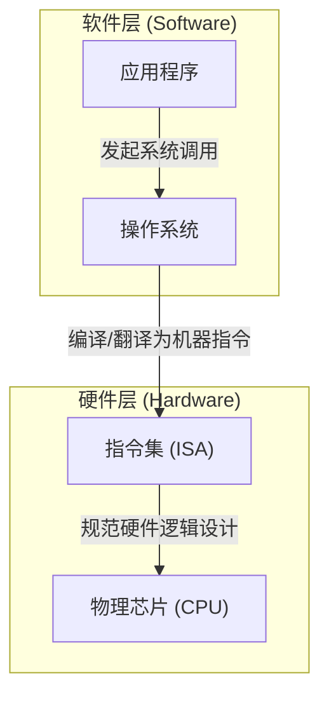
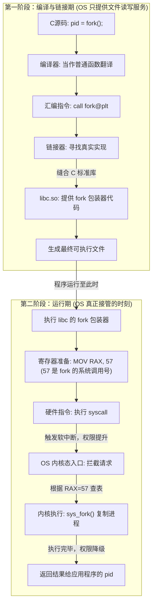
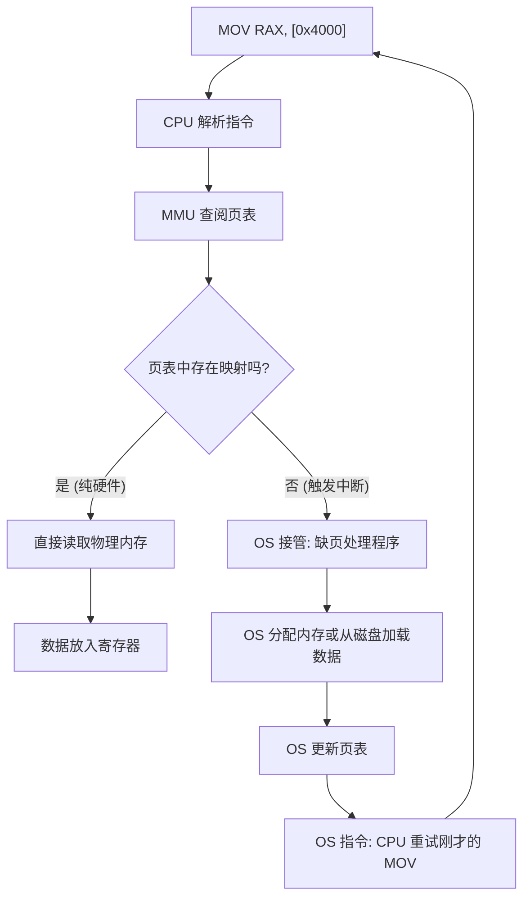

# 指令集、芯片与操作系统的底层协同

指令集、物理芯片和操作系统构成了计算机体系结构中最核心的**抽象层级**。它们之间的关系本质上是“协议”、“实现”与“管理者”的关系。

---

## 1. 宏观架构

### 1.1 核心概念定义

-   **指令集 (ISA, Instruction Set Architecture)**：软件与硬件之间的沟通“协议”。它定义了 CPU 能够执行的基础命令（机器指令）。
-   **物理芯片 (CPU)**：指令集的**物理载体与执行者**。通过晶体管将抽象指令转化为电子脉冲。
-   **操作系统 (OS)**：硬件的**管理者与协调者**。它通过指令集指挥芯片，并为应用提供安全的运行环境。

### 1.2 抽象层级关系图

---

## 2. 代码如何变成机器指令

在程序运行前，用户编写的高级代码（如 `a = b + c`）需要降维成芯片能看懂的 `0` 和 `1`。在这个阶段，**操作系统（OS）本身其实是处于“旁观者”和“场地提供方”的位置，它并没有直接参与代码的翻译逻辑。**

### 2.1 编译型（C/C++）的四步进化

当敲下 `gcc main.c` 时，OS 仅仅是“场地提供方”，而 GCC 负责翻译：

1.  **预处理 (Preprocessing)**：处理 `#` 指令，代码仍是 C。
2.  **编译 (Compilation)**：将 C 翻译为**汇编指令**（.s）。此时逻辑已锁定在特定 ISA。
3.  **汇编 (Assembly)**：将汇编助记符**一对一**翻译成二进制**机器指令**（.o）。
4.  **链接 (Linking)**：**OS 登场提供“通讯录”**。链接器将 `.o` 文件与系统提供的 **C 标准库 (libc)** 缝合，解决像 `printf` 或 `fork` 这种系统级功能的代码归宿。

> [!NOTE] 汇编与机器指令的关系
> 汇编指令是机器指令的“助记符”。物理芯片是“文盲”，它看不懂 `MOV`，只懂高低电平。汇编器负责这种极致的“降维”。

> [!TIP]
> **在“编译汇编”这个阶段，操作系统（OS）本身其实是处于“旁观者”和“服务提供者”的位置，它并没有直接参与代码的翻译逻辑。**
> 
> 真正的重头戏发生在**链接期（Link Time）** 和 **运行期（Run Time）**。

### 2.2 字节码与虚拟机（Java/Python）

-   **虚拟机 (VM)**：运行在 OS 之上的“软件 CPU”。它通过“查字典”的方式，将中间字节码实时翻译成当前芯片的机器指令。
-   **JIT (即时编译)**：对热点代码直接编译为物理机器码并缓存，使执行速度无限接近 C。

---

## 3. 运行层

程序跑起来后，根据代码性质，物理芯片和操作系统的参与程度完全不同。

### 3.1 用户态计算

例如`add(a,b)`。如果只是一个普通的 `add(a, b)` 方法，整个世界会瞬间变得极其简单。在这个场景下，**操作系统（OS）会彻底“隐身”，它对你执行的加法操作一无所知，也完全不参与。**

普通的 `add` 方法是纯粹的**用户态**逻辑，它是一场只有“编译器”和“物理芯片”参与的二人转。

```mermaid
graph TD
    subgraph "第一阶段：编译与链接期 (纯用户代码)"
        SourceCode["C源码: int c = add(a, b);"] --> Compiler["编译器: 直接翻译为基础算术指令"]
        Compiler --> ASMCall["汇编指令: call add ... add eax, ebx"]
        ASMCall --> Linker["链接器: 计算程序内部的相对跳转地址"]
        Linker -->|"无需操作系统库缝合"| Executable["生成最终可执行文件"]
    end

    subgraph "第二阶段：运行期 (物理芯片的独角戏)"
        Executable -->|"PC寄存器指向指令地址"| CPUFetch["物理芯片: 获取加法指令"]
        CPUFetch -->|"无软中断，不涉及特权"| ALUExec["ALU (算术逻辑单元): 直接进行电子门电路计算"]
        ALUExec --> ReturnValue["将结果写回目标寄存器 (如 EAX)"]
    end
    
    %% 旁注说明
    OSNote["注: 整个过程中，操作系统内核处于休眠或旁观状态，完全不被唤醒"] -.-> ALUExec
```

当你写下 `int c = add(a, b);` 并编译运行时：

- **编译期（纯粹的字典翻译）：** GCC 看到 `add` 函数，发现这只是普通的变量相加。它翻开**指令集**字典，直接把你的 C 代码翻译成几条最基础的汇编指令：比如把变量放到寄存器里（`MOV`），然后执行加法（`ADD`）。这里没有任何向外求助的意图。
- **链接期（内部地址绑定）：** 链接器发现 `add` 函数是你自己写在代码里的（或者在同项目的其他 `.c` 文件里）。它只需要在最终的程序里算一下距离：“哦，`add` 函数的代码在当前位置往前 64 个字节的地方”。于是它把相对地址写进去。**这个过程根本不需要去系统目录找 `libc.so` 来缝合。**
- **运行期：** 当程序跑到 `add` 这里时：
    1. 物理芯片直接跳转到你写好的那段 `ADD` 机器码地址。
    2. 物理芯片内部的 ALU 接收到高低电平，几个晶体管状态一翻转，加法就算完了。
    3. 结果放回寄存器，程序继续往下走。

**核心结论：** 普通函数（如 `add`）没有 `syscall`，没有权限提升，不触发任何硬件中断。**操作系统就像房东，它把房子（内存和 CPU 时间）租给你之后，只要你不砸墙（越界访问内存）、不要求改建（申请新内存或新进程，如 `fork`），房东就绝对不会上门干涉你自己在房间里做仰卧起坐（执行 `add`）。**

### 3.2 系统调用

> [!TIP] 为了理清 `fork()` 从一行 C 代码变成系统级操作的全过程，我们需要明确编译器（GCC）和操作系统（OS）的分工。
> 
> - **普通函数 vs 系统调用 (System Call)：** 像 `add(a, b)` 是普通函数，完全在应用程序自己的内存里执行（用户态）。而 `fork()` 是系统调用，它的真正逻辑代码写在操作系统内核里，应用程序没有权限直接运行，必须通过一种“特殊通道”向 OS 申请代办。
> - **C 标准库 (libc / glibc)：** 操作系统提供给开发者的“代理人”。它是一组预先编译好的机器码集合。你调用的 `fork()` 其实是 `libc` 提供的一个同名“包装函数（Wrapper）”。
> - **陷入内核 (Trap / Context Switch)：** 物理芯片提供的一种硬件机制。通过执行特定的机器指令（如 x86-64 的 `syscall` 指令），程序会立刻交出控制权，将 CPU 从普通权限切换为最高权限，并唤醒操作系统内核。

让我们拆解一下，当你写下 `pid = fork();` 并按下编译键时，到底发生了什么：

- **编译期（OS 是“场地提供方”）：** 当你运行 `gcc` 时，OS 只是把 CPU 时间和内存借给 GCC 这个软件。GCC 在检查你的 C 代码时，看到 `fork()`，它根本不知道这是一个系统调用。它只会在 `<unistd.h>` 头文件里看到一个函数声明，于是就把它生硬地翻译成一句普通的汇编指令：`call fork`。
- **链接期（OS 提供了“通讯录”）：** GCC 的链接器（ld）发现你的代码里缺少 `fork` 的具体实现代码。这时，它会去 OS 系统目录里找到 **C 标准库（libc.so）**。链接器把 `libc` 里的 `fork` 包装器代码地址填入你的程序中。**这里的 `libc` 可以看作是 OS 提前写好并留在系统里的“系统调用代理代码”。**
- **运行期（OS 终于“登场办案”）：** 当你的程序真正跑起来，执行到 `fork` 包装器时，核心动作来了：
    1. **准备暗号：** `libc` 代码会往物理芯片的 `RAX` 寄存器里放入数字 `57`（在 Linux x86-64 架构中，57 代表 `fork` 系统调用）。
    2. **敲击硬核通道：** 紧接着，`libc` 会执行一条特殊的硬件汇编指令：`syscall`。
    3. **OS 全面接管：** `syscall` 指令瞬间触发硬件中断，暂停你的程序，把物理芯片切换到最高权限（内核态）。**此时，操作系统内核被彻底唤醒。**
    4. **执行内核逻辑：** OS 内核接手后，去查 `RAX` 寄存器，发现是 57 号请求。于是 OS 开始在自己的最高权限内存区里分配资源、复制页表、创建全新的子进程。
    5. **返回用户态：** OS 办完事后，把新进程的 ID 放回寄存器，再次操作物理芯片降级权限，把控制权还给你的 C 程序。

**总结：** 在编译 C 代码时，操作系统本身几乎不参与代码转换的逻辑，它只负责提供底层的 `libc` 库供链接器打包。真正的魔法，在于 `libc` 中隐藏的那句 `syscall` 汇编指令，它在**程序运行的那一刻**，打通了应用程序通向操作系统内核的物理硬件桥梁。

---

### 3.3 缺页异常

内存访问（如 `MOV RAX, [0x4000]`）是指令集、芯片与 OS 配合最精密的日常场景。当 CPU 的 MMU（内存管理单元）在转换物理地址失败时，OS 将作为“救火队长”被动介入托底。

---

## 5. 总结：协议、实现与管理者

-   **指令集 (ISA)**：制定游戏规则。它定义了 `MOV` 指令如何写，以及 `syscall` 指令如何触发中断。
-   **物理芯片 (CPU)**：死板但极速的执行者。它通过 ALU 计算结果，通过 MMU 翻译地址。
-   **操作系统 (OS)**：幕后的操盘手。它维护页表、处理异常、管理进程，并在硬件搞不定时（如缺页、系统调用）出面接管。
