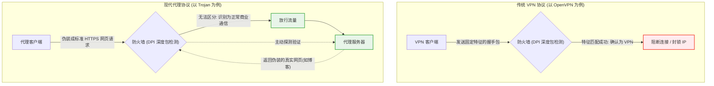

什么是 VPN

VPN（Virtual Private Network，虚拟专用网络）是一种在公共网络（如互联网）上建立安全、加密通信隧道的网络层技术。它的核心机制是**数据加密**和**流量代理**。

VPN 最初的设计初衷是为了企业办公：让出差的员工能够通过不安全的公共网络，安全地接入公司内部局域网。后来，由于其能够隐藏用户的真实 IP 地址并对传输内容进行加密，它被广泛应用于保护个人网络隐私、绕过地理限制以及突破网络审查。

### 3. 步骤详细说明

基于上面的数据流向图，VPN 的工作原理可以拆解为以下几个关键步骤：

- **起点（用户设备）：** 当你启动 VPN 软件时，它会在你的操作系统底层接管网络流量。在你访问网站时，设备会使用特定的加密协议（如 OpenVPN、IPsec 或 WireGuard）将你的真实网络请求打包并加密。
- **途经（本地网络提供商 ISP）：** 这些被加密成“乱码”的数据包会通过你的宽带运营商（如当地的电信、移动）发送出去。此时，ISP 就像一个快递员，他只知道要把包裹送到“VPN 服务器”的地址，但由于**加密隧道**的保护，他无法拆开包裹查看里面的具体内容，也不知道包裹最终要转寄给哪一家具体的“目标网站”。这就成功避开了网络审查设备对传输内容的嗅探和拦截。
- **中转（VPN 服务器）：** 加密数据包到达 VPN 服务器后，服务器使用密钥将其解密，还原成普通的网络请求。随后，VPN 服务器充当你的“代理人”，代替你向最终的“目标网站”发起访问。
- **终点（目标网站）：** 目标网站收到请求并返回数据。在目标网站的服务器看来，发起这次访问的 IP 地址是“VPN 服务器”的 IP，你的真实本地 IP 被彻底隐藏了。这也是为什么连接国外的 VPN 服务器后，你可以解锁具有特定地理限制的服务（如流媒体）。

结合上面的对比图，我们可以将 Clash、机场节点与传统 VPN 的核心差异拆解如下：

- **Clash 为什么不是严格意义上的 VPN 软件？** 传统的 VPN 软件（如 Cisco AnyConnect 或 OpenVPN）会在你的设备上建立一个“虚拟网卡”，强制把**所有**的网络流量（无论国内国外）都塞进加密隧道里。 Clash 本质上是一个**代理客户端**。它的强项是“智能分流”：它像一个交通警察，拿着一份规则清单，看到去往百度的流量就直接放行（直连），看到去往 Google 的流量才将其打包发往国外的节点。虽然 Clash 现在也有了虚拟网卡模式（TUN 模式），用起来感觉和 VPN 一模一样，但其核心引擎依然是基于规则的代理分发。
- **机场节点为什么不是传统 VPN 服务器？** 传统 VPN 服务器的目的是“加密与安全”，它的数据包特征非常明显，就像是在公路上开着一辆带有特殊标志的押运车，网络防火墙一眼就能认出它并在特殊时期进行精准拦截。 机场节点运行的是 Shadowsocks、Vmess、Trojan 等专属代理协议。这些协议的核心目的是**“伪装与欺骗”**。它们把你的翻墙流量伪装成最普通的、无害的 HTTPS 网页浏览流量。数据包看起来就像是一辆普通的私家车，从而能够隐蔽地穿过防火墙的审查。

传统的 VPN 协议（如 OpenVPN）和现在“机场”最常使用的轻量级代理协议（如 Shadowsocks、Trojan）在防封锁技术上有什么本质的区别吗？

在防封锁技术上，传统 VPN 和轻量级代理协议的本质区别在于**“加密（Encryption）”与“混淆（Obfuscation）”的区别**。

- **传统 VPN (如 OpenVPN, IPsec):** 设计初衷是**“安全与防篡改”**。它们拥有严谨的协议结构和固定的握手特征。在网络审查者眼中，它们就像一辆喷涂着“高级机密”字样的装甲运钞车——虽然极其安全、无法看透内部，但目标极其明显。
    
- **现代代理协议 (如 Shadowsocks, Trojan):** 设计初衷是**“伪装与穿越”**。它们的核心是抹除协议特征，将流量伪装成无意义的随机数据（如 SS）或最常见的 HTTPS 商业网页流量（如 Trojan）。在审查者眼中，它们就像一辆完美融入早高峰车流的普通私家车。

### 3. 步骤详细说明

基于上面的防御与检测博弈图，我们可以将两者的本质区别拆解为以下几个技术层面的对抗：

- **传统 VPN 的致命伤：明文特征 (Signatures)** 像 OpenVPN 这样的传统协议，在建立连接的初期（握手阶段），其数据包的头部通常会包含明文的协议标识。防火墙采用的 **DPI (深度包检测)** 技术可以瞬间抓取这些特征码。一旦匹配成功，防火墙就会直接丢弃数据包（表现为连接超时）或者将你的节点 IP 关进黑名单。
    
- **Shadowsocks 的破局：流量随机化 (Randomization)** 早期的翻墙协议（如 Shadowsocks）移除了所有协议头部的特征，将真实数据通过强加密算法变成了一堆毫无规律的“随机乱码”。防火墙在检测时，找不到任何已知 VPN 的特征，因此只能放行。但随着防火墙进化出了“随机数据启发式分析”，纯粹的随机流量也变得容易引起怀疑，进而被封锁。
    
- **Trojan / Vmess 的终极进化：拟态伪装 (Masquerading)** 为了彻底骗过防火墙，Trojan 等现代协议不再仅仅是“隐藏特征”，而是**“主动伪装”**。它们将翻墙流量完美包裹在 TLS（传输层安全协议）中，使其看起来和访问普通的 HTTPS 网站（如银行、外贸网站）一模一样。 更绝的是**“主动探测防御”**（如流程图中虚线所示）：如果防火墙产生怀疑，主动向你的代理服务器发送探测请求，代理服务器会立刻“装傻”，返回一个真实的、合法的网页（比如一个普通的英文博客）。防火墙无法区分你到底是在翻墙，还是真的在浏览那个博客，为了避免误杀海量的正常跨国商业通信，它只能选择放行。