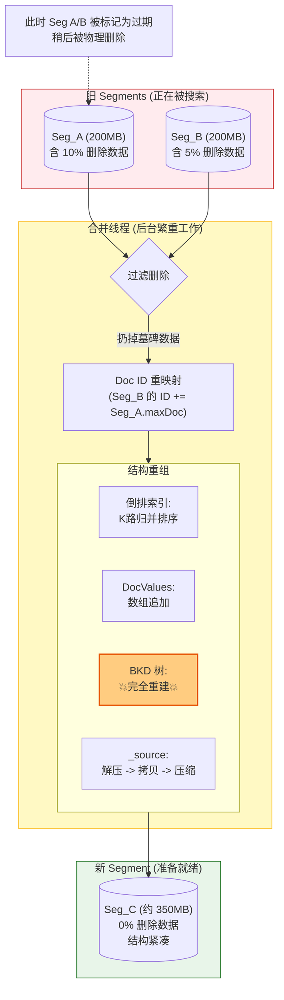

# Segment Merging

**ES 的写入是产生不可变 Segment 的过程。** 随着时间推移，会产生大量的小 Segment。这会导致：

1. **资源消耗**：每个 Segment 都需要文件句柄、内存和 CPU 开销。
    
2. **搜索延迟**：搜索操作必须遍历所有 Segment 并合并结果。
    

因此，后台的 **Merge（合并）** 过程至关重要 。

## 1. TieredMergePolicy (分层合并策略)

ES 默认使用 **TieredMergePolicy**，其逻辑远比简单的“合并相邻文件”复杂。

### 1.1 评分机制 (Scoring Merges)

TieredMergePolicy 不会强制合并相邻的 Segment，而是从所有 Segment 中挑选出“最适合”的一组进行合并。它会计算每个候选合并组合（Merge Specification）的得分（Score），得分越低越好（Lower is better）。

核心评分考量因素：

- **Skew（大小偏斜度）**：参与合并的 Segment 大小越接近越好。合并一个 10GB 和一个 1KB 的段是非常低效的。
    
- **Total Size（总大小）**：合并后的总大小越小，I/O 开销越小。
    
- **Deletes（删除数据比例）**：这是关键优化点。包含大量 Tombstone（已删除文档标记）的 Segment 会被优先选中。因为只有在 Merge 过程中，这些被标记为删除的文档才会被物理丢弃，从而回收磁盘空间 。
    
## 2. 段合并底层

### 1.1 物理删除

- **平时（Merge 前）**：当你执行 `DELETE doc/1` 时，ES **并没有**真的删除数据。它只是在单独的 `.del` 文件里给 ID 为 1 的文档打了个“墓碑标记”。搜索时，ES 会读出数据，然后看一眼墓碑：“哦，这个标了删除，那我不返回给用户”。这意味着**删除的数据依然占用磁盘空间**。
    
- **合并时**：
    
    - Merge 线程在读取 Input Segments 时，会**自动跳过**那些被标为“已删除”的文档。
        
    - **结果**：新生成的 Output Segment 中，彻底没有了那些被删除的数据。
        
    - **现象**：你会发现合并完成后，磁盘占用率突然显著下降。

> [!TIP] 
> 这解释了为什么删除大量文档后，搜索性能短期内反而可能下降（因为即使是死文档也参与了 I/O 和解码）。

### 1.2 ID 重映射：文档的大迁徙

这是整个合并过程中最烧脑、最核心的步骤。

- **问题**：
    
    - Segment A 有 `Doc ID`：`0, 1, 2`
        
    - Segment B 有 `Doc ID`：`0, 1`
        
    - 如果直接拼起来，会有两个 `Doc ID` `0`，系统就乱了。
        
- **解决**：**Doc ID Remapping（重排）**。
    
    - ES 会先定下顺序（比如先放 A，再放 B）。
        
    - Segment A 的 `Doc ID` 保持不变：`0->0, 1->1, 2->2`。
        
    - Segment B 的 `Doc ID` 必须**整体偏移**：`0->3, 1->4`。
        

**后果**：所有的数据结构（倒排表、DocValues、BKD）在合并时，都必须严格遵守这个新的 ID 映射关系。

ES内部有两套ID体系：

**第一套：`_id` (业务 ID / 身份证号)**

这是你在写入数据时指定的（或者 ES 自动生成的 UUID）。

- **例子**：`"user_1001"`, `"order_2026_xxyy"`.
    
- **范围**：**在整个 Index（索引）内唯一**。
    
- **你的理解是对的**：确实不能有两个文档都叫 `"user_1001"`。
    
**第二套：`Doc ID` (Lucene 内部 ID / 排队号)**

这是 Lucene 为了极致性能，在底层**自动分配**的一个整数（Integer）。

- **例子**：`0`, `1`, `2`, `3`...
    
- **范围**：**仅在当前 Segment 内唯一**。
    
- **为什么会有重复？**
    
    - **Segment A** 是一个独立的小文件，它里面的第一个文档叫 **0号**。
        
    - **Segment B** 是另一个独立的小文件，它里面的第一个文档也叫 **0号**。

### 1.3 数据结构重组

#### A. 倒排索引 (Inverted Index) -> CPU/内存 密集型

- **动作**：**K 路归并排序 (K-Way Merge Sort)**。
    
- **过程**：
    
    1. 打开 A 和 B 的字典迭代器。
        
    2. 发现 A 有 `"apple"`，B 也有 `"apple"`。
        
    3. 把 A 的 Postings List `[0, 2]` 和 B 的 `[0, 1]`（经过 ID 偏移变成 `[3, 4]`）拼接。
        
    4. 写入新文件：`apple -> [0, 2, 3, 4]`。
        

#### B. DocValues (列式存储) -> I/O 密集型

- **动作**：**顺序追加 (Sequential Append)**。
    
- **过程**：
    
    1. 把 A 的 `price` 数组读进内存缓冲区。
        
    2. 写入新文件。
        
    3. 把 B 的 `price` 数组读进来，追加写到后面。
        
- _注意：如果字段开启了压缩（如 GCD），可能需要重新计算所有数据的最大公约数，这会消耗一些 CPU。_
    

#### C. BKD 树 (数值/地理位置) -> CPU 密集型 (重灾区)

- **动作**：**完全重建 (Full Rebuild)**。
    
- **过程**：
    
    1. ES 无法简单地把两棵树“拼”在一起。
        
    2. 它必须把 Tree A 和 Tree B 的所有叶子节点的数据点（Points）全部取出来，变成一堆散乱的数值。
        
    3. **从零开始**，使用这些所有的点，构建一棵全新的、平衡的 BKD 树。
        
    4. **代价**：这就是为什么如果你的索引有很多数值字段，Merge 操作会把 CPU 跑满的原因。
        

#### D. Stored Fields (`_source`) -> 纯 I/O 搬运

- **动作**：**字节流拷贝**。
    
- **过程**：`_source` 字段通常是巨大的 JSON 文本。合并时，ES 只是疯狂地从旧文件读取字节，解压，然后压缩写入新文件。这是磁盘 IO 吞吐的大头。

### 1.4 段切换

合并过程可能持续几秒甚至几分钟。在这期间，旧的 Segment A 和 B **依然在提供搜索服务**。新 Segment C 在悄悄地写。

当 Segment C 彻底写完并刷盘（fsync）后，ES 会执行一个毫秒级的**原子切换**：

1. **Commit Point 更新**：修改元数据，“现在的有效 Segments 列表是 `[C]`，不再是 `[A, B]`”。
    
2. **打开新 Segment**：Segment C 开始对外服务。
    
3. **关闭旧 Segment**：Segment A 和 B 此时变成“孤儿”。
    
4. **物理删除**：稍后，ES 的清理进程会把 `_0.cfs` 和 `_1.cfs` 从磁盘上物理删掉。

## 3. Force Merge 的风险

用户可以手动调用 `_forcemerge` API 将索引合并为 1 个 Segment。虽然这能最大化搜索性能，但对于频繁写入的索引极其危险：

1. **巨型 Segment**：产生一个巨大的 Segment（如 50GB），后续几乎无法再被自动合并（因为很难找到跟它大小匹配的伙伴）。
    
2. **I/O 阻塞**：强制合并会触发大量的磁盘 I/O，可能导致集群短时间内无响应。
    
    因此，`_forcemerge` 通常只建议用于 **Rollover** 后的冷索引（不再写入的历史数据）。

