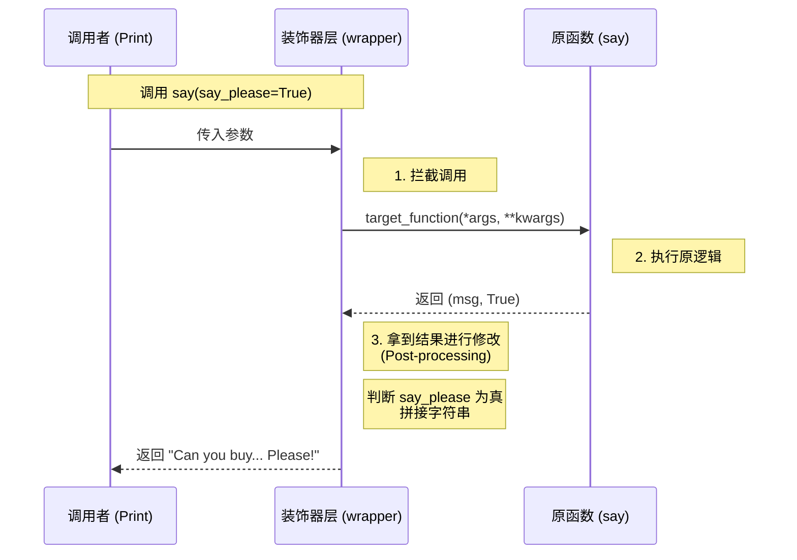

# Python 基础语法

> **参考资料**: [Learn Python in Y Minutes](https://learnxinyminutes.com/zh-cn/python/)

> [!IMPORTANT] 以下内容是补充

## 1. 核心数据结构

### 字典（Dictionary）

Python 的字典不仅仅是简单的哈希表，其返回的视图对象（View Objects）具有独特的特性。

示例：`valid_dict = {"one": 1}`

#### 1.1 字典视图 (Dictionary Views)

当你调用 `d.keys()`, `d.values()`, 或 `d.items()` 时，返回的是**视图对象**。

*   **特性**：
    1.  **不可变性 (Read-only)**：不能通过视图对象直接修改字典（无 `.append()` 或 `.remove()`）。
    2.  **动态绑定 (Dynamic)**：它不拥有数据，只是底层哈希表的**动态窗口**。字典内容变化，视图实时更新。
    3.  **Set-like (仅部分)**：`keys()` 和 `items()` 是类集合的，支持集合运算；`values()` 则不然。

#### 1.2 `list(d.keys())` vs `d.keys()`

| 特性      | `a = list(valid_dict.keys())` | `b = valid_dict.keys()` |
| :------ | :---------------------------- | :---------------------- |
| **类型**  | `list` (列表)                   | `dict_keys` (视图对象)      |
| **内存**  | **深拷贝**：开辟新空间存储所有 Key         | **轻量级**：不存储数据，只引用原字典    |
| **实时性** | **静态**：字典变了，`a` 不会变           | **动态**：字典变了，`b` 自动同步    |
| **功能**  | 支持索引 (`a[0]`) 和修改             | 不支持索引，主要用于迭代和成员检查       |

```python
valid_dict = {"one": 1}
a = list(valid_dict.keys())
b = valid_dict.keys()

valid_dict["two"] = 2
print(a) # ['one'] -> 静态副本
print(b) # dict_keys(['one', 'two']) -> 实时视图
```

#### 1.3 常用方法对比

| 方法 | 返回内容 | 常用场景 | 集合运算 |
| :--- | :--- | :--- | :--- |
| **`d.keys()`** | 所有的键 (Key) | 成员检查 (`in`)，找共有/差异键 | **支持** |
| **`d.values()`** | 所有的值 (Value) | 只关心数据内容 | 不支持 |
| **`d.items()`** | 键值对 (Key, Value) | **绝大多数遍历场景** | **支持** (需Value可哈希) |

#### 1.4 迭代器

```python
d = {"name": "Kwai", "age": 25}
# 获取第一个插入的键值对 (Python 3.7+)
first_item = next(iter(d.items())) # ('name', 'Kwai')
```

#### 1.5 字典推导式

```python
# Key-Value 互换
inverted = {v: k for k, v in d.items()}
# 条件过滤
filtered = {k: v for k, v in d.items() if v > 10}
```

---

## 2. 魔法方法

“魔法方法”（Magic Methods），在 Python 社区里更地道的叫法是 **Dunder Methods**（**D**ouble **Under**score Methods，双下划线方法）。

作为 Java/Go 开发者，你可以这样理解：

**魔法方法是 Python 对象“隐式接口”的实现机制。**

在 Java 中，如果你想让一个对象能被 `sort`，你需要 `implements Comparable` 并重写 `compareTo`。

在 Python 中，你不需要显式继承任何接口，你只需要实现 `__lt__` (less than) 或 `__gt__` (greater than) 等魔法方法，Python 解释器就会自动识别。

以下是按照**使用场景**分类的详细讲解：

---

### 1. 构造与初始化：`__init__` vs `__new__`

这是 Java 开发者最容易产生误区的地方。

- **`__new__` (构造器)**：
    - 它是静态方法，真正负责**创建实例**并返回内存空间。        
    - 类似 Java 的 `new` 关键字背后的内存分配逻辑。        
    - **场景**：极少用，除非你要继承不可变类型（如 `int`, `str`）或实现单例模式。        
- **`__init__` (初始化器)**：
    - 它拿到已经创建好的实例（`self`），给它**赋值**。
    - 类似 Java 的构造函数 `Constructor() { this.x = x; }`。
    - **场景**：99% 的类都只需要写这个。


``` python
class Person:
    def __init__(self, name):
        self.name = name  # 初始化属性
```

---

### 2. 字符串表示：`__str__` vs `__repr__`

这相当于 Java 的 `toString()`，但 Python 把它拆分成了两个层面。

- **`__str__` (面向用户)**：
    - 触发时机：`print(obj)` 或 `str(obj)`。
    - 目的：可读性好，给最终用户看。
- **`__repr__` (面向开发者)**：
    - 触发时机：在终端直接输入变量名回车，或 `repr(obj)`。
    - 目的：**准确性**，最好能通过这个字符串重建对象（`eval(repr(obj)) == obj`）。


``` Python
class User:
    def __init__(self, name):
        self.name = name

    def __str__(self):
        return f"User: {self.name}"

    def __repr__(self):
        # 类似 Go 的 %#v，显示类型和内部结构
        return f"<User object name='{self.name}' at {hex(id(self))}>"

u = User("Gemini")
print(u)              # 触发 __str__ -> User: Gemini
print(repr(u))         # 触发 __repr__ -> <User object name='Gemini' at 0x...>
```

---

### 3. 运算符重载：`__add__`, `__eq__` 等

这是 Python 比 Java 灵活得多的地方。通过实现这些方法，你的对象可以使用 `+`, `-`, `*`, `==` 等符号。

- **`__add__`**: 处理 `+`
- **`__eq__`**: 处理 `==` (类似 Java `equals`)
- **`__lt__`**: 处理 `<` (用于排序)

**实战场景：向量加法**

``` Python
class Vector:
    def __init__(self, x, y):
        self.x = x
        self.y = y

    # 定义 + 号的行为
    def __add__(self, other):
        return Vector(self.x + other.x, self.y + other.y)

    def __str__(self):
        return f"Vector({self.x}, {self.y})"

v1 = Vector(1, 2)
v2 = Vector(3, 4)
v3 = v1 + v2  # 自动调用 v1.__add__(v2)
print(v3)     # Vector(4, 6)
```

---

### 4. 容器与集合：`__getitem__`, `__len__`

想让你的对象像 `list` 或 `dict` 一样支持下标访问 (`obj[0]`) 或求长度 (`len(obj)`) 吗？

- **`__len__`**: 响应 `len(obj)`。
- **`__getitem__`**: 响应 `obj[key]` 或 `obj[index]`。
- **`__setitem__`**: 响应 `obj[key] = value`。

**实战场景：即使不是列表，也能用下标**

``` Python
class Team:
    def __init__(self, members):
        self.members = members

    def __len__(self):
        return len(self.members)

    def __getitem__(self, index):
        return self.members[index]
        
t = Team(["Alice", "Bob", "Charlie"])

print(len(t))   # 3 (调用 __len__)
print(t[1])     # Bob (调用 __getitem__)
# 最神奇的来了：因为实现了 __getitem__，它自动变成了可迭代的！
for member in t:
    print(member)
```

例二：

``` python
class Person:
    def __init__(self, name, age, addr):
        self.name = name
        self.age = age
        self.addr = addr

    # 1. 设置操作 (Set)
    def __setitem__(self, key, value):
        print(f"--- 触发 __setitem__: 设置 {key} ---")
        setattr(self, key, value)

    # 2. 获取操作 (Get)
    def __getitem__(self, key):
        print(f"--- 触发 __getitem__: 读取 {key} ---")
        # 使用 getattr 可以防止程序因为找不到属性而直接崩溃
        # 第三个参数是默认值，如果属性不存在就返回它
        return getattr(self, key, "属性不存在")

    def __repr__(self):
        return f"Person(name='{self.name}', age={self.age}, addr='{self.addr}')"

p1 = Person("keith", 20, "guangdong")

# 触发 __setitem__
p1["age"] = 25 

# 触发 __getitem__
print(p1["age"])   # 输出: 25
print(p1["name"])  # 输出: keith
print(p1["job"])   # 输出: 属性不存在
```


---

### 5. 可调用对象：`__call__`

这是 Java 没有的特性。它允许你把一个**对象实例**当成**函数**来调用。

- **触发时机**：`instance()`

**实战场景：保留状态的函数（比闭包更直观）**

``` Python
class Adder:
    def __init__(self, n):
        self.n = n

    def __call__(self, x):
        return self.x + self.n

add_10 = Adder(10) # 这是一个对象
print(add_10(5))   # 但你可以像函数一样调用它！输出 15
```

这在编写 **装饰器 (Decorator)** 或复杂的 **回调逻辑** 时非常有用。

---

### 6. 上下文管理：`__enter__`, `__exit__`

这就是 `with open(...)` 背后的魔法，相当于 Java 的 `try-with-resources` (`AutoCloseable` 接口)。

- **`__enter__`**: 进入 `with` 块时执行（比如获取锁、打开文件）。
- **`__exit__`**: 离开 `with` 块时执行（无论是否报错），用于清理资源。

``` Python
class DatabaseConnection:
    def __enter__(self):
        print("连接数据库...")
        return self

    def __exit__(self, exc_type, exc_val, exc_tb):
        print("关闭连接，释放资源")

# 使用
with DatabaseConnection() as db:
    print("正在查询数据")
# 出了缩进，自动调用 __exit__
```

---
### 总结对照表

| **魔法方法**      | **对应的 Python 语法/操作** | **Java/Go 类比**               |
| ------------- | -------------------- | ---------------------------- |
| `__init__`    | `obj = Class()`      | Constructor                  |
| `__str__`     | `print(obj)`         | `toString()`                 |
| `__eq__`      | `obj1 == obj2`       | `equals()`                   |
| `__len__`     | `len(obj)`           | `List.size()` / `len()`      |
| `__getitem__` | `obj[i]`             | `List.get(i)` / `Map.get(k)` |
| `__call__`    | `obj()`              | 类似实现 `Callable` 接口           |
| `__enter__`   | `with obj:`          | `try-with-resources`         |

### 补充：鸭子类型

#### Java (名义类型 Nominal Typing)

在 Java 中，你要想把一个对象当鸭子用，它必须**显式地**继承鸭子类或实现鸭子接口。类型声明是第一位的。

``` java
// Java: 必须有身份证明（implements Duck）
public void letItQuack(IDuck duck) {
    duck.quack();
}

// 哪怕 Person 也有 quack 方法，但没有 implements IDuck，传进去就会编译报错
```

#### Python (鸭子类型 Duck Typing)

在 Python 中，**身份证明不重要，能力才重要**。解释器不会检查你的“证件”（Type），只会尝试调用你的方法。

``` python
class RealDuck:
    def quack(self):
        print("嘎嘎嘎")

class Person:
    def quack(self):
        print("这人在模仿鸭子叫")

def let_it_quack(thing):
    # Python 不检查 thing 是谁，只管调用
    # 如果 thing 有 quack 方法，就运行；没有，就报错
    thing.quack()

d = RealDuck()
p = Person()

let_it_quack(d) # 正常运行
let_it_quack(p) # 正常运行！虽然他是人，但他能“像鸭子一样叫”
```


## 3. 类与继承

> 代码参考 https://learnxinyminutes.com/zh-cn/python/ 的 `batman`, `superhero`, `bat`, `human` 的例子

> [!TIP] `batman` 的 `__init__` 方法中的 `*args` 以及 `**kwargs`
> 其实就是简单的参数透传，把传给`batman`的参数透传给父类。
> 至于顺序，是因为Python 严格的 **函数调用参数顺序规则**：位置参数 (Positional) 必须在 关键字参数 (Keyword) 之前
> 

### 3.1 详解：函数参数的“排队法则”

我们可以把 Python 的 4 种参数拆解开，看作一个 **“流水线分类器”**。

#### 1. 参数顺序

定义函数时，参数必须严格按照以下顺序排列，否则报 `SyntaxError`：

1.  **普通位置参数** (Positional Arguments)
2.  **可变位置参数** (`*args`)
3.  **命名关键字参数** (Keyword-Only Arguments) 
4.  **可变关键字参数** (`**kwargs`)

---

#### 2. 核心概念拆解

**A. 普通位置参数**
最常见的参数，如 `def func(a, b)`。
*   **特点**：必须传（除非有默认值），按位置“入座”。

**B. 可变位置参数 (`*args`)**
*   **作用**：像 **“吸尘器”**，把所有剩余的 **未命名** 参数吸入一个 **元组 (tuple)** 中。

**C. 命名关键字参数 (Keyword-Only Arguments)**
*   **位置**：排在 `*args` **之后**。
*   **含义**：因为 `*args` 已经吸走了所有“位置参数”，排在它后面的参数 **永远无法通过位置访问**。
*   **后果**：调用时必须显式指定参数名 (`key=value`)。

**D. 可变关键字参数 (`**kwargs`)**
*   **作用**：像 **“垃圾桶”** ，接收所有剩余的 **关键参数**，存入一个 **字典 (dict)**。

---

#### 3. 代码实战演示

```python
def mixed_function(p1, p2, *args, k1, k2, **kwargs):
    print(f"1. 普通位置参数: p1={p1}, p2={p2}")
    print(f"2. 可变位置参数 (*args): {args}")
    print(f"3. 强制具名参数 (Keyword-Only): k1={k1}, k2={k2}")
    print(f"4. 可变关键字参数 (**kwargs): {kwargs}")

# === 调用 ===
mixed_function(
    1, 2,              # -> 对应 p1, p2
    3, 4, 5,           # -> 被 *args 吸走
    k1="A", k2="B",    # -> 必须指名道姓传给 k1, k2
    extra="X", foo="Y" # -> 剩下的甩给 **kwargs
)
```

**运行结果：**

```text
1. 普通位置参数: p1=1, p2=2
2. 可变位置参数 (*args): (3, 4, 5)
3. 强制具名参数 (Keyword-Only): k1=A, k2=B
4. 可变关键字参数 (**kwargs): {'extra': 'X', 'foo': 'Y'}
```

#### 4. 为什么要这样设计？

假设我们把 `k1` (具名参数) 放在 `*args` 之前：`def func(p1, k1, *args)`。
当你调用 `func(1, 2, 3)` 时，`k1` 会直接拿走 `2`，它就变成了普通的“位置参数”，失去了“强制具名”的特性。

**结论**：`*args` 就像一道 **“墙”**。挡在它后面的参数，必须“喊名字”才能翻过去。

#### 5. 特殊技巧：裸星号 `*`

如果你不需要接收无限的位置参数 (`*args`)，但又想强制要求某些参数必须用名字传递，可以使用单独的 `*`。

```python
# * 后面的 force_delete 必须用关键字传递
def secure_delete(filename, *, force_delete):
    if force_delete:
        print(f"Deleting {filename}...")

# secure_delete("file.txt", True)           # ❌ 报错：TypeError
secure_delete("file.txt", force_delete=True) # ✅ 正确
```

这就类似 Java/Go 中的 Options 模式或 Config 对象，强制调用者确认参数含义。

---

### 3.2 命名规范对照表

以下是 Python 中下划线的常见用法（对应 Java/Go 概念）：

| **格式** | **例子** | **Java/Go 类比** |
| :--- | :--- | :--- |
| **无下划线** | `name` | `public` 字段 |
| **单前导下划线** | `_age` | `protected` / `package-private` (约定俗成，不强制) |
| **双前导下划线** | `__id` | `private` (解释器会改名，触发 Name Mangling) |
| **双前后下划线** | `__init__` | 系统魔术方法 / 钩子 |


## 4. 装饰器

装饰器本质上是一个“高阶函数”，它接受一个函数作为参数，并返回一个新的函数。

```python
# 装饰器(decorators)  
# 这个例子中，beg装饰say  
# beg会先调用say。如果返回的say_please为真，beg会改变返回的字符串。  
from functools import wraps  
  
  
def beg(target_function):  
    @wraps(target_function)  
    def wrapper(*args, **kwargs):  
        msg, say_please = target_function(*args, **kwargs)  
        if say_please:  
            return "{} {}".format(msg, "Please! I am poor :(")  
        return msg  
  
    return wrapper  
  
  
@beg  
def say(say_please=False):  
    msg = "Can you buy me a beer?"  
    return msg, say_please  
  
  
print(say())  # Can you buy me a beer?  
print(say(say_please=True))  # Can you buy me a beer? Please! I am poor :(
```

### 1. `@` 到底干了什么？

你代码中的 `@beg` 其实是一个 **“语法糖” (Syntactic Sugar)**。

```python
@beg
def say(say_please=False):
    pass
```

在 Python 解释器眼里，上面这段代码等价于下面这一行：

```
# 1. 把 say 函数丢进 beg 里
# 2. beg 返回了一个新函数 (wrapper)
# 3. 把这个新函数重新赋值给变量名 say
say = beg(say)
```

**这意味着什么？** 当你后面调用 `say()` 时，你**以为**你在调用原来那个 `say`，但**实际上**你调用的是 `beg` 内部定义的 `wrapper` 函数。原来的 `say` 已经被“偷梁换柱”了。

---

### 2. 流程可视化

让我们看看当你运行 `print(say(say_please=True))` 时，数据是如何流转的：



### 3. 代码逐行拆解

```python
def beg(target_function):
    # target_function 就是原本的 'say'
    
    # @wraps 是个好习惯，后面会讲
    @wraps(target_function)
    
    # 这是真正的“替代者”。
    # *args, **kwargs 保证了无论原函数有多少参数，wrapper 都能接得住
    def wrapper(*args, **kwargs):
        
        # A. 【执行前】你可以在这里写代码（比如 权限校验）
        
        # B. 【执行原函数】调用原本的 say
        # 这里的 msg, say_please 是原函数的返回值
        msg, say_please = target_function(*args, **kwargs)
        
        # C. 【执行后】你可以在这里修改返回值（比如 你的例子）
        if say_please:
            return "{} {}".format(msg, "Please! I am poor :(")
        
        # 如果不满足条件，就原样返回
        return msg

    # D. 【关键一步】把这个伪装好的新函数返回出去，替换掉原来的 say
    return wrapper
```

### 4. Java 对比

这就是 **AOP (面向切面编程)** 的动态代理。

比如 Spring 的 `@Transactional` 或 `@Cacheable`。你在方法上加个注解，Spring 就在运行时动态生成一个代理类，在你的方法前后加上了开启事务/提交事务的逻辑。Python 的装饰器就是轻量级的 AOP。

### 5. 关于 `@wraps(target_function)`

你在代码里引入了 `from functools import wraps`，这是非常专业的操作。

如果不写这一行，因为 `say` 已经被替换成了 `wrapper`，当你打印 `say.__name__` 时，它会输出 `wrapper`，而不是 `say`。这会导致调试困难，或者让生成文档的工具失效。

`@wraps` 的作用就是把原函数（`say`）的元数据（函数名、文档注释等）**拷贝**给新函数（`wrapper`），让这个“替代者”看起来更像原装货。