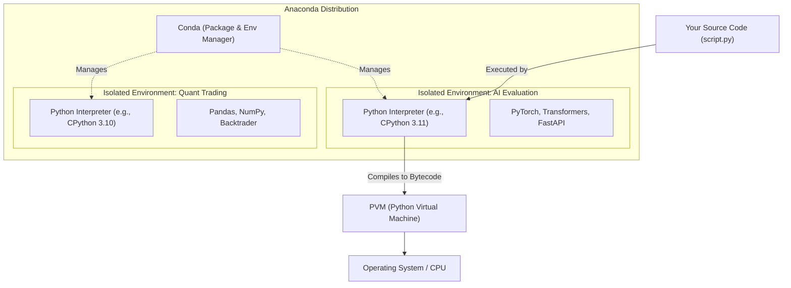
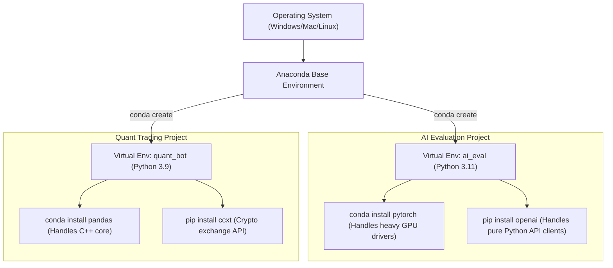
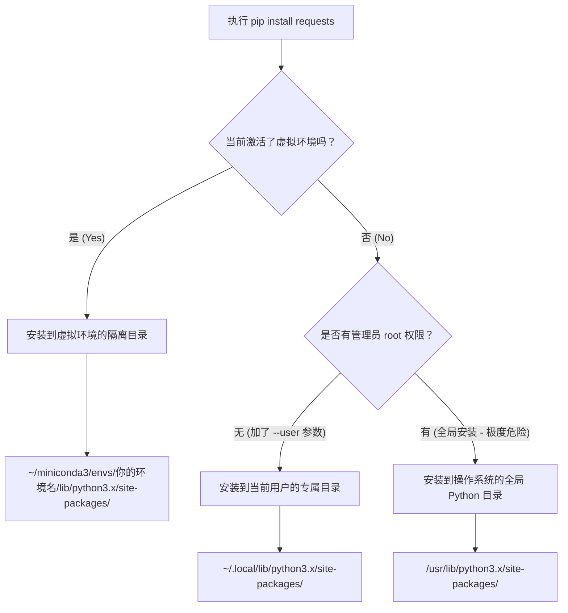

# Python 环境管理、工具链与底层执行逻辑全解析

本文档旨在拆解 Python 生态中的核心基础设施，包括解释器原理、环境管理器（Anaconda/Miniconda）以及包管理工具（pip/conda）的深层逻辑。

---

## 1. Python 解释器与 Anaconda 的基石地位

### 1.1 什么是 Python 解释器 (Python Interpreter)？

**定义**：它是 Python 代码的“执行引擎”。由于 Python 是一门解释型语言，计算机 CPU 无法直接看懂你写的 `.py` 源码，必须依靠解释器在运行时（Runtime）将代码翻译并执行。

**针对 Java/Go 开发者的深度类比**：

*   **Go 视角**：在 Go 中，你通过 `go build` 直接把源码编译成了底层操作系统能懂的二进制机器码。Python 则不同，它不直接生成这种机器码。
*   **Java 视角**：在 Java 中，你把源码编译成 `.class` 字节码，交由 **JVM (Java Virtual Machine)** 运行。
*   **Python 视角**：在 Python 中，**解释器就相当于 JVM + 即时编译器**。当你运行 `python script.py` 时，解释器内部会先将源码编译成隐藏的字节码（Bytecode），然后由内部的 **PVM (Python Virtual Machine)** 逐行解释执行。

最正统、使用最广的 Python 解释器是用 C 语言写的，叫 **CPython**。你在官网下载的 Python，默认就是它。

### 1.2 什么是 Anaconda？

**定义**：Anaconda 是一个**包含了 Python 解释器 + 核心科学计算库 + 环境管理器的“全家桶”发行版**。

**为什么开发者需要它？**

如果你仅仅依靠官方纯净版的 Python 解释器和标准的包管理工具 `pip`，在进行 AI 模型训练、量化交易数据分析或机器学习时，你会面临巨大的“折磨”：

1.  **C/C++ 依赖地狱**：像 `NumPy`, `Pandas`, `PyTorch` 这些底层高度依赖 C/C++ 甚至 GPU CUDA 驱动的库，用原生的 `pip` 安装时，经常会因为本地缺少 C 编译器、驱动版本不匹配而导致报错崩溃。
2.  **环境隔离困难**：项目 A 可能需要 Python 3.8 + TensorFlow 1.x，项目 B 可能需要 Python 3.10 + PyTorch 2.x。在纯净版 Python 中，很难优雅地同时管理这些版本冲突。

**Anaconda 的解决方案**：

*   它自带了专门的包/环境管理器叫 **`conda`**（你可以把它看作是强化版的 Maven 或 Go Modules）。
*   `conda` 下载的包都是**预编译好的二进制文件**（连底层的 C/C++ 依赖都帮你打包好了），直接下载就能跑。
*   它天生支持创建完全隔离的虚拟环境。

> [!TIP] Miniconda
> *   Anaconda 是一个“重型全家桶”（通常 3GB-5GB），包含了大量不常用的软件。
> *   **Miniconda**：只有 Python 解释器 + `conda` 命令 + 基础依赖。体积仅 50MB 左右，非常干净。你需要什么包再自己装，这是纯命令行玩家的最佳选择。

### 1.3 架构与流程全景图

下面是 Python 解释器与 Anaconda 生态的关系结构图：



---

## 2. pip 与 conda

### 2.1 什么是 pip？

**`pip` (Pip Installs Packages)** 是 Python 官方标准的**包管理工具**。

*   **类比**：它就像 Java 生态中的 **Maven/Gradle**，或者 Go 语言中的 **`go mod` / `go get`**。
*   **作用**：当你需要一个第三方库时（比如处理 HTTP 请求的 `requests`），你运行 `pip install requests`，它就会去官方仓库 **PyPI (Python Package Index)** 下载别人写好的代码并放到你的 Python 目录里。
*   **致命弱点**：`pip` 是一个纯粹的“Python 代码搬运工”。如果你安装的库（比如做 AI 评测系统或量化回测时用到的底层计算库）依赖系统的 C/C++ 编译器或显卡驱动，`pip` 会假设你的电脑上已经装好了这些底层依赖。如果没有，它就会在编译阶段直接疯狂报错。这就是为什么我们需要 `conda`。

### 2.2 pip vs conda

`conda` 不仅仅是个包管理器，它更像是一个**跨语言的“虚拟环境管家”**。它不仅能安装 Python 包，还能顺手把底层的 C++ 库、GPU 相关的 CUDA 驱动等二进制文件一并下载好。

| 特性 | pip | conda |
| :--- | :--- | :--- |
| **定位** | 官方 Python 包管理器 | 环境管理器 + 跨语言包管理器 |
| **包来源** | PyPI (Python 官方库) | Anaconda Repository (预编译二进制包) |
| **依赖处理** | 只管 Python 级别的依赖 | 连带底层的 C/C++ 等系统级依赖一起解决 |
| **最佳实践** | 安装纯 Python 写的轻量级库 | 安装重型科学计算、AI、量化数据处理库 |

> **开发秘籍**：在实际开发中，我们通常会在 `conda` 创建的虚拟环境里，混合使用 `conda` 和 `pip` 来装包。

### 2.3 多项目并行的环境隔离架构

为了让你直观理解它们的关系，这里是你在同一台电脑上同时开发“AI 评测系统”和“量化交易程序”时的标准架构：



---

## 3. Conda 核心实战指南

以下是开发者每天都会用到的高频命令与操作流程。

### 3.1 查看环境状态

这是排查环境冲突的第一步。

```bash
# 查看你的电脑里目前是什么状态
conda env list
# 或者
conda info --envs
```

*执行后，你会看到一个列表，带有 `*` 号的那一行，表示你当前正处于哪个环境中。默认通常是 `base` 环境。*

### 3.2 环境的增删改查

强烈建议：**永远不要在 `base` 环境里写项目**。每个项目（如 AI 评测、个人博客工具链等）都应该有自己独立的房间。

*   **创建全新的干净环境**：
    ```bash
    # 语法：conda create -n [环境名称] python=[版本号]
    conda create -n ai_eval python=3.11
    ```
*   **进入（激活）环境**：
    ```bash
    conda activate ai_eval
    # 激活后，终端提示符最前面通常会多出一个 (ai_eval) 字样。
    ```
*   **在环境里安装包**：
    进入环境后，安装的库只会存在于当前环境，绝不污染系统和其他项目。
    ```bash
    # 首选 conda 装重型库
    conda install numpy pandas
    # 如果 conda 仓库找不到，再用 pip 补充
    pip install requests
    ```
*   **退出与删除**：
    ```bash
    # 退出当前环境
    conda deactivate
    # 删除不需要的环境
    conda remove -n ai_eval --all
    ```

---

## 4. 包存储路径与 site-packages

### 4.1 如何看某个环境安装了哪些依赖？

*   **在 Conda 环境中（最推荐）**：使用 **`conda list`**。它不仅会列出 `conda install` 的包，还会显示 `pip install` 的纯 Python 包。甚至可以不进入环境直接看：`conda list -n ai_eval`。
*   **在原生 Python 中**：使用 `pip list` 或 `pip freeze`。

### 4.2 `pip install` 默认下载到哪里了？

在 Java 中，Maven 会集中缓存到 `~/.m2`。但 Python 会把包直接塞进“当前正在使用的解释器”旁边的 **`site-packages`** 文件夹里。

**存储逻辑决策树：**



**为什么全局安装极度危险？**

因为像 Ubuntu、macOS 等系统的许多底层工具也是 Python 写的。如果你全局安装覆盖了某个依赖版本，可能会导致操作系统本身的某些系统命令直接崩溃！

### 4.3 终极验证技巧：100% 确定包位置
如果你想确定某个包到底被装到了哪里，可以直接打印它的 `__file__` 属性：
```python
import requests
import pandas

print(requests.__file__)
print(pandas.__file__)
```

这会精准打印出这个包在硬盘上的绝对路径。

---

## 总结对照表

| **概念**         | **本质**     | **Java/Go 生态类比**              | **适用场景**          |
| :------------- | :--------- | :---------------------------- | :---------------- |
| **Python 解释器** | 执行引擎       | JVM / Go Runtime              | 所有 Python 程序的绝对基础 |
| **Anaconda**   | 科学计算全家桶发行版 | JDK + Spring Boot + Maven 超级包 | 数据分析、机器学习、量化开发    |
| **Conda**      | 跨语言虚拟环境管家  | 强化版 Maven + 虚拟隔离              | 解决系统级依赖、多项目版本管理   |
| **pip**        | 官方包管理工具    | `go get` / `go mod`           | 处理纯 Python 逻辑包    |

