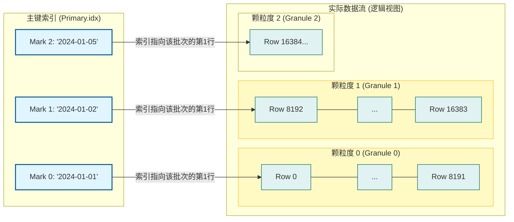
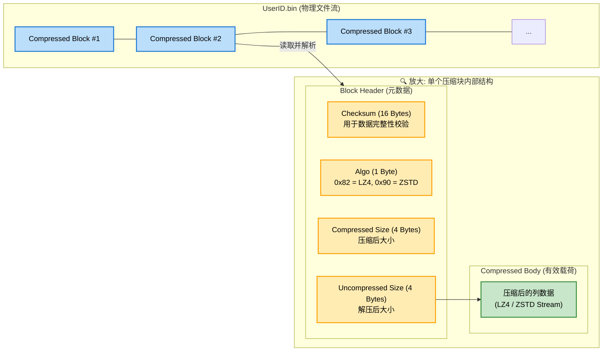
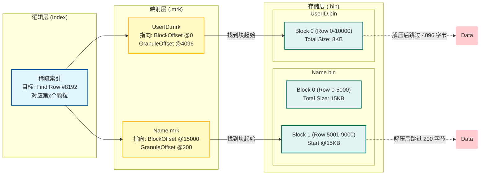
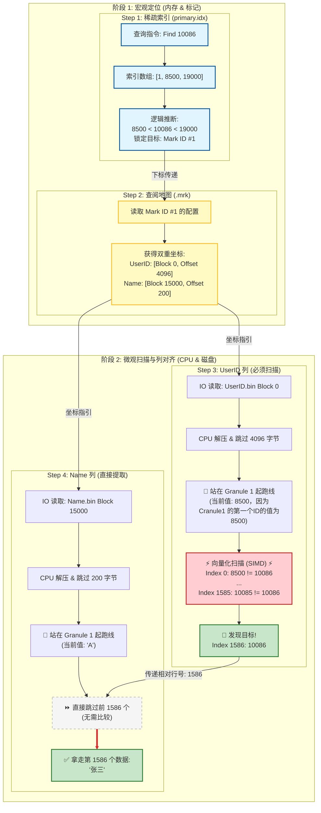
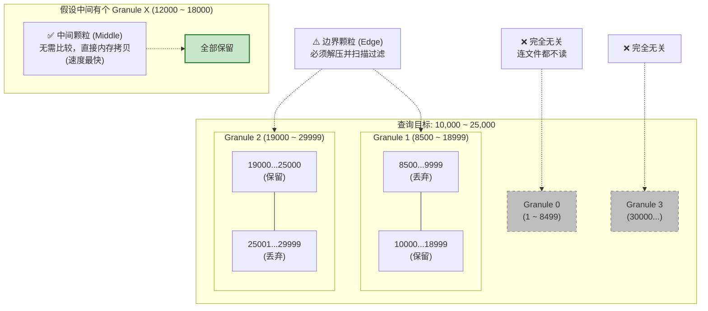

# ClickHouse 核心数据结构与存储架构深度研究报告

## 1. 引言：分析型数据库的架构演进与 ClickHouse 的定位

在海量数据实时分析（OLAP）领域，ClickHouse 凭借其卓越的查询性能和极高的数据吞吐能力，已成为事实上的行业标准之一。不同于传统的事务型数据库（OLTP）依赖于 B+ 树和行式存储来保障事务的原子性（ACID），ClickHouse 的核心设计理念完全围绕着“读取速度”与“写入吞吐”展开。其架构的基石在于**列式存储（Column-Oriented Storage）** 与 **向量化执行（Vectorized Execution）** 的深度结合。

本报告旨在从底层原理出发，详尽剖析 ClickHouse 的核心数据结构。我们将深入文件系统的二进制层面，解析 `MergeTree` 存储引擎的物理布局；深入内存的 C++ 类层次结构，探讨 `IColumn` 接口与 `PaddedPODArray` 如何配合 SIMD 指令集实现纳秒级的数据处理；并全面分析从稀疏索引到跳数索引（Skipping Indices）的剪枝逻辑。通过对 `.bin` 数据文件、`.mrk` 标记文件以及 `primary.idx` 主键索引文件的交互机制进行解构，本报告将揭示 ClickHouse 如何在千亿级数据规模下实现毫秒级响应的根本原因。

---

## 2. 存储层核心架构：MergeTree 引擎的物理形态

ClickHouse 的存储层不仅仅是数据的持久化容器，更是查询优化的第一道防线。`MergeTree` 系列引擎是 ClickHouse 中最核心、机制最复杂的存储引擎，其设计思想源自 LSM-Tree（Log-Structured Merge Tree），但针对分析型负载进行了大量改良。

### 2.1 数据分区（Partitioning）与分片（Part）的生命周期

在 ClickHouse 的文件系统中，表（Table）被逻辑分割为多个**分区（Partition）**，而每个分区在物理上由多个**不可变**的**分片（Part）** 组成。这种层级结构是实现高效管理和查询剪枝的基础。

#### 2.1.1 分区的逻辑隔离

分区是通过 `PARTITION BY` 子句定义的。不同于其他数据库将分区仅视为元数据标记，ClickHouse 中的分区直接对应文件系统中的目录（在 detach 模式下）或数据管理的逻辑单元。

- **查询剪枝（Pruning）：** 当查询包含分区键（如日期）的过滤条件时，ClickHouse 能够直接忽略不符合条件的分区。这种剪枝发生在查询执行的最早期，远早于读取任何索引文件 。
    
- **数据管理：** 分区是数据生命周期管理（TTL）和操作（如 `DROP PARTITION`）的基本粒度。删除一个分区的效率远高于删除同等数量的行，因为前者本质上是文件系统的目录删除操作。
    

#### 2.1.2 分片（Part）的不可变性与命名规则

分片是 ClickHouse 数据存储的原子物理单元。任何写入操作（INSERT）都不会直接修改现有文件，而是**生成一个新的分片目录**。这种**不可变（Immutable）** 设计消除了写入时的锁竞争，极大地提升了并发写入性能。

**分片命名规范深度解析：**

一个典型的分片目录名称如 `20240101_1_1_0`，其格式为 `PartitionID_MinBlockNum_MaxBlockNum_Level`。

- **PartitionID (`20240101`)**：根据分区键生成，标识数据所属的逻辑分区。
    
- **MinBlockNum (`1`) & MaxBlockNum (`1`)**：表示该分片包含的数据块（Block Number）范围。这是一个自增的逻辑计数器，用于确定数据的逻辑顺序。在发生合并（Merge）之前，Min 和 Max 通常相同；合并后，新分片的范围将覆盖所有源分片的范围 。
    
- **Level (`0`)**：合并层级（Merge Level）。新写入的分片层级为 0。当两个或多个分片合并时，新生成的合并分片层级为 `max(level_sources) + 1`。该层级用于指导后台合并策略，确保合并树的平衡。

> [!TIP] 为什么Min 和 Max 通常相同？
> **因为它们是“刚出生”的片段。** 当一个新的 `INSERT` 语句执行时，它生成了一个独立的物理目录。这个目录里的数据**纯粹**属于这一次写入操作（BlockNum）。
> 比如文件名 `20240101_1_1_0` 翻译过来就是：“我是 20240101 分区的，我**仅**包含第 **1** 次写入的数据（从 1 到 1）”。
> 此时它还没有和任何人合并，所以范围就是 `[Self, Self]`。

> [!TIP] 合并干了什么？
> **ClickHouse 把“小文件”粘成了“大文件”，并更新了身份证。** ClickHouse 痛恨小文件（影响查询速度）。后台进程会不断扫描目录，发现 `_1_1_0` 和 `_2_2_0` 都在同一个分区且相邻，就会启动合并：
> 1. **物理合并**：把两个目录里的数据读取出来，排序，去重（如果是 ReplacingMergeTree），写入一个新的物理目录。
> 2. **重命名（更新范围）**：
> 	- 新文件的 **MinBlock** 取自来源文件的最小值（即 1）。
> 	- 新文件的 **MaxBlock** 取自来源文件的最大值（即 2）。
> 	- **Level** 升级（0 -> 1），表示它已经经过了一次进化。
> 3. **最终结果**：生成新目录 `20240101_1_2_1`（翻译：我包含了从第 1 次到第 2 次写入的所有数据）。旧目录 `20240101_1_1_0` 和 `20240101_2_2_0` 会被标记为非激活，稍后被物理删除。
#### 2.1.3 Wide 与 Compact 格式的抉择

ClickHouse 的分片存储格式经历了演变，目前主要支持 `Wide` 和 `Compact` 两种模式，系统根据数据量自动切换。

- **Wide 格式：** 默认模式。每一列的数据存储在单独的 `.bin` 文件中，对应的标记存储在 `.mrk2` 文件中。这种模式最大化了列式存储的优势，即查询只需读取相关列的文件，极大减少 I/O 。
    
- **Compact 格式：** 适用于小批量写入（小于 `min_bytes_for_wide_part`，默认 10MB）。在 Compact 模式下，所有列的数据被序列化到一个单一的 `.bin` 文件中，标记存储在 `.mrk3` 文件中。这减少了文件系统的 inode 消耗，避免了大量小文件带来的元数据压力，但牺牲了部分读取粒度 。
    

### 2.2 核心文件：.bin,.mrk,.idx

`MergeTree` 的高效读取依赖于三个核心文件的紧密协作：存储数据的 `.bin` 文件、提供物理定位的 `.mrk` 文件，以及提供逻辑定位的 `primary.idx` 文件。这三者共同构成了 ClickHouse 独特的稀疏索引体系。

| **文件扩展名**   | **核心功能** | **存储内容**                  | **驻留位置** | **访问频率** |
| ----------- | -------- | ------------------------- | -------- | -------- |
| **`.bin`**  | 数据存储     | 压缩的数据块（Compressed Blocks） | 磁盘       | 仅在命中时读取  |
| **`.mrk2`** | 物理偏移     | 颗粒度（Granule）到压缩块的映射偏移量    | 磁盘（可缓存）  | 索引查找后读取  |
| **`.idx`**  | 逻辑索引     | 稀疏主键索引（每 N 行存一个值）         | 内存（常驻）   | 每次查询必读   |
> [!TIP]
> 文件后缀数字的不同（nothing, 2, 3）对应了**索引粒度（Granularity）** 和 **存储模式（Part Type）** 的不同组合。
> 
> 简单来说：
> 
> - **`.mrk`**：非自适应粒度（旧版本默认，现在很少见）。
>     
> - **`.mrk2`**：自适应粒度（Adaptive Log Granularity） + **Wide** 模式。
>     
> - **`.mrk3`**：自适应粒度（Adaptive Log Granularity） + **Compact** 模式


#### 2.2.1 颗粒度（Granule）


在理解复杂的 `.bin` 和 `.mrk` 文件之前，我们必须先理解 ClickHouse 是如何看待数据的——这一切都始于 **颗粒度（Granule）**。

**1. 定义：稀疏索引的“步长”** 

ClickHouse 采用的是 **稀疏索引（Sparse Index）**。它不像 MySQL（B+树）那样为每一行数据都建立索引（那是稠密索引），因为那太消耗内存了。

ClickHouse 选择每隔一定数量的行，才记录一次索引值。这个间隔数量，就是 **索引颗粒度（index_granularity）**。

- **默认值：** 8192 行。
    
- **含义：** 每 8192 行数据被逻辑上划分为一个“颗粒（Granule）”。
    
- **作用：** 它是 ClickHouse 数据读取的**最小扫描单元**。
    

**2. 形象比喻：公交车站** 

想象一条有 100 万户人家的长街（数据表）：

- **稠密索引（MySQL）：** 给每家每户门口都贴个门牌号。找人非常准，但门牌号本身就堆成了一座山。
    
- **稀疏索引（ClickHouse）：** 每隔 8192 户人家设一个“公交站”（标记）。
    
    - 索引只记录：“第 1 站是张三家（第1行），第 2 站是李四家（第8193行）...”。
        
    - **查询时：** 如果你要找“王五”，索引告诉你他在第 1 站和第 2 站之间。哪怕你只要找一个人，ClickHouse 也必须把这 1 站对应的 8192 户人家全部扫描一遍，才能找到他。
        

**3. 颗粒度与数据的关系**



> [!TIP]
> 颗粒度是**逻辑上**的集合。在物理文件（.bin）中，这 8192 行数据是被压缩存放的，可能挤在一个物理块里，也可能跨越好几个物理块。

#### 2.2.2 数据文件 (.bin) 与压缩块架构


`.bin` 文件是数据的实际载体。为了支持高效的随机读取和高压缩率，ClickHouse 并非将整列数据压缩为一个流，而是将其切分为**一系列**独立的**压缩块（Compressed Block）**。

> [!TIP]
> 我们可以把 `.bin` 文件看作是一列无限延长的**货运火车**。 这就意味着 `.bin` 文件不是一个整体的大黑盒，而是由一个个独立的”集装箱”（Compressed Block）首尾相连组成的。并没有一个全局的“文件头”来描述整个文件，文件开头即是第一个 Block。


- **压缩块结构：** 每个压缩块由头部（Header）和压缩体（Body）组成。头部包含校验和（Checksum）、压缩算法标识（如 LZ4, ZSTD）以及压缩前后的数据大小。这种结构允许 ClickHouse 在读取时对数据完整性进行校验 。
    
- **大小控制：** 压缩块的大小并非固定，而是由 `max_compress_block_size`（默认 64KB - 1MB）控制。写入时，数据在内存缓冲区累积，一旦达到阈值即触发压缩并刷写到磁盘。这种机制确保了即使在大规模顺序读写中，解压的内存开销也是可控的。
    
- **列式连续性：** 在压缩块内部，数据是严格按列连续存储的。这对于数值类型（如 UInt64）意味着数据在解压后直接形成 C++ 中的数组（PODArray），可以直接被 CPU 向量化指令处理，无需额外的反序列化开销 。



紧跟在 Header 后面的是被压缩后的二进制数据。

- **如果解压它：** 你会得到一段纯粹的、连续的二进制数据。
    
- **PODArray 的体现：** 假设这是一列 `UInt32` 类型的列。解压后的数据在内存中就是一段连续的内存地址，里面紧密排列着 `[100, 200, 300, 400...]`。
    
- **向量化优势：** CPU 可以直接加载这段内存地址，利用 SIMD 指令（如 AVX-512）一次处理 16 个数字，而不需要做任何 Java/Python 风格的对象拆箱操作。

这种 `[Header + Body] + [Header + Body] + ...` 的链式结构带来了两个核心优势：

1. **随机读取能力（通过 .mrk 配合）：**
    
    - 如果你需要读第 1,000,000 行数据，`.mrk` 文件会告诉你：“这行数据在文件的 **偏移量 X** 处”。
        
    - ClickHouse 只需要直接 `seek` 到偏移量 X，读取 **这一个 Block** 的 Header，知道大小后把 Body 读出来解压即可。不需要解压整个文件。
        
2. **内存安全性：**
    
    - 因为 Header 里写明了 `Uncompressed Size`，ClickHouse 在解压前就知道需要申请多少内存，永远不会发生“解压炸弹”导致内存溢出。

#### 2.2.3 标记文件 (.mrk2) 与自适应颗粒度

**核心痛点：列式存储的“行对齐”难题**

在传统的 MySQL（行式存储）中，数据是**物理连续**的。找到 ID，往后偏移几个字节就是 Name。但在 ClickHouse 中，数据被**垂直拆分**并**独立压缩**，导致物理位置与逻辑行号完全脱节：

1. **变长数据（String）：** 每一行数据的长度不固定（如 "Tom" vs "Christina"），无法通过 `行号 * 固定长度` 计算偏移量。
    
2. **独立压缩（Compression）：** 这是最关键的因素。数据被切分成多个 **压缩块（Block）**。
    
    - `UserID` 列全是数字，压缩率高，8192 行可能只占 4KB。
        
    - `Name` 列包含长字符串，压缩率低，8192 行可能占 20KB。
        
    - **结论：** 同样的“第 8192 行”，在 UserID 文件和 Name 文件中的物理位置截然不同。
        

**解决方案：.mrk 文件作为“拉链”**

`.mrk` 文件就像拉链的锁头，强行把左右两边不对齐的列“扣”在一起。它记录了**逻辑行号**到**物理文件偏移量**的映射。



**核心机制：双重偏移量 (Double Offset)**

为了解决“逻辑颗粒度（Granule）”与“物理压缩块（Block）”的不匹配，`.mrk` 文件中的每个条目必须包含两个数值：

1. **Block Offset（找物理压缩块）：** 压缩数据块在 `.bin` 文件中的起始位置。
    
    - _作用：_ 磁盘寻址，直接 `Seek` 到该位置读取整个压缩块。
        
2. **Granule Offset（找逻辑颗粒的起始位置）：** 它只标记了**颗粒度的边界**，而不是**每行数据的位置**。
    
    - _作用：_ 帮你跳过**同在一个压缩块里**的其他颗粒度（Granule 0, Granule 2...）
        

> **为什么需要双重偏移？** 因为一个物理压缩块可能包含多个逻辑颗粒度（数据极小时），或者一个逻辑颗粒度跨越多个物理块（数据极大时）。


如果没有这个机制，数据库必须从文件头开始解压和遍历，查询速度将下降几个数量级。


**演进：自适应索引粒度 (.mrk2)**

- **旧版问题 (.mrk)：** 颗粒度固定为 8192 行。如果存储大字符串（如 Base64 图片），8192 行数据解压后可能高达几百 MB，导致内存溢出（OOM）。
    
- **新版方案 (.mrk2)：** 引入**自适应限制**。
    
    - 切分规则：行数达到 8192 **或者** 数据量达到 10MB（`index_granularity_bytes`）。
        
    - 文件变化：`.mrk2` 文件中额外记录了**每个颗粒度的实际行数**（因为不再固定是 8192 了），确保行号计算的正确性。

#### 2.2.4 稀疏主键索引

**在 MySQL 中**，索引像一本**字典的目录**，精确到每一页。**在 ClickHouse 中**，索引像一把**粗糙的尺子**，只标记刻度。

##### 2.2.4.1 primary.idx 到底长什么样？

稀疏主键索引 `primary.idx` 文件在物理上非常非常简单。它不存储指针，不存储页面位置，它**只存储主键的值**。

假设我们要存一张用户行为表，主键是 `UserID`（唯一且单调递增），数据量约为 2 万行，颗粒度（Granule）是默认的 8192。

**数据与索引的对应关系：**

- **第 0 行**（第 0 个颗粒度的起点）：`UserID = 1`
    
- **第 8192 行**（第 1 个颗粒度的起点）：`UserID = 8,500`
    
    - _(注：虽然过了 8192 行，但 ID 可能因删除或不连续而增长到了 8500)_
        
- **第 16384 行**（第 2 个颗粒度的起点）：`UserID = 19,000`
    
- ...
    

那么，`primary.idx` 文件的内容就是简单的二进制序列，解压出来看就是一串数字：

```
1, 8500, 19000 ...
```

**这就是全部了。** 它就像是把原始数据每隔 8192 行“抄写”了一个数值出来，组成了一个极小的数组，常驻内存。

##### 2.2.4.2 核心原理：它是如何“定位”的？

**场景模拟：**

假设我要执行查询：`SELECT * FROM table WHERE UserID = 15000`

**Step 1: 加载索引到内存**

ClickHouse 读取 `primary.idx`，得到数组 `[1, 8500, 19000]`。

- Index[0] = 1 (对应 Mark #0)
    
- Index[1] = 8500 (对应 Mark #1)
    
- Index[2] = 19000 (对应 Mark #2)
    

**Step 2: 二分查找 (Binary Search)**

系统拿着 `15000` 去在这个数组里找位置：

**Step 3: 锁定区间 (Range)**

结论出来了：如果 `UserID = 15000` 存在，它**一定且只能**躲在 `8500` 到 `19000` 之间的数据里。

也就是：**第 1 个颗粒度`（Mark #1）`**。

这就是“指出目标在 Mark #1 附近”的含义——索引本身不存地址，它通过数值比较，告诉你是“第几个”颗粒度。

##### 2.2.4.4 为什么它叫“稀疏”以及它的优缺点

理解了上面的流程，就能解释笔记中的最后两点：

1. **为什么常驻内存？**
    
    - 如果你有 1 亿行数据。
        
    - **B+ 树（稠密索引）：** 要存 1 亿个节点，内存根本塞不下，必须读磁盘。
        
    - **ClickHouse（稀疏索引）：** $100,000,000 / 8192 \approx 12,207$ 个数字。
        
    - 1 万多个数字占多少内存？**几百 KB 而已**。所以它永远在内存里，查找速度极快。
        
2. **为什么点查询（Point Lookup）慢？**
    
    - 你看上面的图，虽然我们锁定了 `Granule 1`，但 `Granule 1` 里面有 **8192 行** 数据。
        
    - ClickHouse **不知道** `15000` 具体在这 8192 行里的第几行。
        
    - 它必须把这 **8192 行全部解压**，然后暴力扫描一遍：_“你是15000吗？不是。你是15000吗？不是...”_
        
    - 这就是为什么 ClickHouse 不适合做 `id = x` 的高频点查，它是为大批量分析设计的
    

### 2.2.5 查询示例

#### 2.2.5.1 稀疏索引主键点查

`SELECT Name FROM table WHERE UserID = 10086`

假设 8192行一个颗粒， `primary.idx` 如下：

| **标记号 (Mark ID)(数组下标)** | **行号 (Row Start)(隐式对应，文件中不存)** | **主键值 (Stored Value)(只存这一列，文件中只有这个)** | **含义解读**                     |
| ----------------------- | ------------------------------ | ------------------------------------- | ---------------------------- |
| **0**                   | Row 0                          | **1**                                 | 第 0 批数据的第 1 个 ID 是 1。        |
| **1**                   | **Row 8192**                   | **8500**                              | 第 1 批数据的第 1 个 ID 是 8500。<br> |
| **2**                   | **Row 16384**<br>              | **19000**                             | 第 2 批数据的第 1 个 ID 是 19000。    |

假设 `userId.mrx` 如下：

| **标记号 (Mark ID)** | **行号 (Row Start)** | **压缩块偏移 (Block Offset)** | **块内偏移 (Granule Offset)** |
| ----------------- | ------------------ | ------------------------ | ------------------------- |
| **0**             | **Row 0**<br>      | 0                        | 0                         |
| **1**             | **Row 8192**       | **0**                    | **4096**                  |
| **2**             | **Row 16384**      | 25000                    | 120                       |

假设 `Name.mrx` 如下：

| **标记号 (Mark ID)** | **行号 (Row Start)** | **压缩块偏移 (Block Offset)** | **块内偏移 (Granule Offset)** |
| ----------------- | ------------------ | ------------------------ | ------------------------- |
| **0**             | Row 1              | **0**                    | **0**                     |
| **1**             | **Row 8192**       | **15000**                | **200**                   |
| **2**             | Row 16384          | 42000                    | 0                         |
| ...               | ...                | ...                      | ...                       |

`.mrx` 文件实际上也是数组



#### 2.2.5.2 稀疏索引主键范围查找

相比于“点查找”必须解压并扫描整个颗粒度来寻找那**一个**数据，范围查找能充分利用 **“顺序读（Sequential Read）”** 和 **“整块拷贝”** 的优势。

我们继续使用刚才的数据模型：

- **Index:** `[1, 8500, 19000, 30000]` (假设后面还有一个标记 30000)
    
- **Granule Size:** 8192
    

假设查询：`SELECT Name FROM table WHERE UserID > 10000 AND UserID < 25000`

**核心逻辑：颗粒度的“三种命运”**

在执行范围查找时，ClickHouse 会利用稀疏索引将所有的颗粒度（Granules）划分为三类。这是性能优化的关键。

1. **完全无关（Discard）：** 数据范围完全在查询条件之外。**直接丢弃，完全不读磁盘。**
    
2. **部分相交（Intersect / Edge）：** 通常是范围的**头**和**尾**。数据块里一部分符合条件，一部分不符合。**需要解压并“逐行扫描过滤”。**
    
3. **完全包含（Fully Included）：** 整个颗粒度的数据都在查询范围内。**这是最快的模式。** 不需要比对 `WHERE` 条件，解压后直接**整块拷贝**。
    

**实战推演：WHERE UserID BETWEEN 10000 AND 25000**

Step 1: 查阅 `primary.idx` (初筛)

ClickHouse 拿到索引数组 `[1, 8500, 19000, 30000]`，结合查询条件 `[10000, 25000]` 进行区间判断：

- **Mark #0 (1 ~ 8499):**
    
    - 最大值不到 8500。
        
    - 结论：**完全无关**。直接跳过 Block 0。
        
- **Mark #1 (8500 ~ 18999):**
    
    - 范围包含 10000。
        
    - 结论：**部分相交（左边界）**。
        
    - 动作：需要读取，并且需要扫描找到 10000 在哪。
        
- **Mark #2 (19000 ~ 29999):**
    
    - 范围包含 25000。
        
    - 结论：**部分相交（右边界）**。
        
    - 动作：需要读取，并且需要扫描找到 25000 在哪。
        

_(注：如果数据更多，比如中间还有个 Mark #1.5 是 12000，那么这个中间的颗粒度就是“完全包含”，处理速度会起飞。)_

Step 2: 查阅 `.mrk` (获取批量地址)

系统根据 Step 1 的结果，去 `.mrk` 文件拿地址：

- 拿 Mark #1 的地址。
    
- 拿 Mark #2 的地址。
    

Step 3: 处理 **WHERE 列**和 **SELECT 列** 的 `.bin` 文件

这就是范围查找比点查找快的原因：

1. **对于 Mark #1 (头)：**
    
    - 解压 -> 向量化扫描 -> 找到 `10000` 的位置（假设是第 1500 行）。
        
    - 保留从 1500 行到结尾的数据。
        
2. **对于 Mark #2 (尾)：**
    
    - 解压 -> 向量化扫描 -> 找到 `25000` 的位置（假设是第 6000 行）。
        
    - 保留从开头到第 6000 行的数据。
        
3. **对于中间的 Mark (如果有)：**
    
    - 解压 -> **完全不执行 CPU 比较指令** -> 直接把解压后的内存块 `memcpy` 复制到结果集。
        



**为什么范围查找是 ClickHouse 的强项？**

1. **CPU 省力（中间块）：** 对于被查询范围完全覆盖的“中间颗粒度”，ClickHouse 不需要执行 `if (val > 10000)` 这种判断。它知道全都要，直接拷贝内存。这比逐行判断快几十倍。
    
2. **I/O 顺序化：** 范围查找通常意味着读取连续的 Granule。
    
    - `primary.idx` 会告诉系统：Mark #1, #2, #3, #4 都要读。
        
    - 这些数据在 `.bin` 文件里通常是物理相邻的。
        
    - 磁盘磁头可以一次性顺序读取一大段数据（Sequential Read），避免了随机寻址的开销。
        

#### 2.2.5.3总结

- **点查找 (Point Lookup):** 像是在一本书里找**一个字**。你得翻到那一页，从头读到尾找到它。
    
- **范围查找 (Range Query):** 像是在撕书。
    
    - **第一页**（左边界）：撕掉上半部分。
        
    - **中间十页**（完全包含）：整页整页地撕下来（不用看内容）。
        
    - **最后一页**（右边界）：撕掉下半部分。
        


## 3. 内存计算层核心：向量化数据结构与 IColumn 接口

当数据从磁盘被读取并解压到内存后，ClickHouse 的执行引擎接管处理流程。为了最大化 CPU 指令流水线的利用率，ClickHouse 摒弃了传统的“火山模型”（Volcano Model，即逐行处理），全面采用**向量化执行模型**。这一层的核心在于 C++ 类 `IColumn` 及其衍生结构。

### 3.1 IColumn 接口的多态性设计

`IColumn` 是内存中列数据的基类接口。在 ClickHouse 的代码库中，几乎所有的计算函数（Function）和聚合函数（Aggregate Function）都通过这个接口与数据交互。

- **数据抽象：** `IColumn` 不存储单一值，而是存储一整块（Block）数据，通常包含数千到数万行。
    
- **虚函数平摊成本：** 虽然 `IColumn` 依赖虚函数（Virtual Functions）来实现多态（如 `filter`, `permute`, `cut`），但由于每次调用处理的是成千上万行数据，虚函数调用的开销被平摊到几乎可以忽略不计的程度 。
    
- **不可变性原则：** 大多数 `IColumn` 的操作是不可变的。例如，`filter` 操作不会修改原列，而是返回一个新的、经过过滤的列对象。这简化了内存管理，并与写入时的不可变性思想一脉相承 。
    

### 3.2 PaddedPODArray：SIMD 优化的极致体现

对于数值类型（`UInt64`, `Float32`, `Date` 等），ClickHouse 使用 `ColumnVector<T>` 类，其底层容器并非 C++ 标准库的 `std::vector`，而是自定义的 `PaddedPODArray<T>`。这是 ClickHouse 性能优化的秘密武器之一。

#### 3.2.1 尾部填充（Tail Padding）与内存安全

现代 CPU 的 SIMD 指令（如 AVX2, AVX-512）一次能处理 256 位（32 字节）或 512 位（64 字节）的数据。如果在循环处理数组时，数组的长度不是 SIMD 寄存器宽度的整数倍，最后一次迭代可能会读取越界内存，导致段错误（Segmentation Fault）。

- **传统做法：** 在循环中加入边界检查代码，处理尾部剩余元素。这会引入分支跳转，破坏 CPU 流水线。
    
- **ClickHouse 做法：** `PaddedPODArray` 在分配内存时，会在数组末尾额外分配 **15 字节**（或更多，取决于架构对齐要求）的填充空间。这允许 SIMD 指令安全地读取“越界”的数据（读取到填充区），而无需在核心循环中进行任何边界检查。虽然读取了垃圾数据，但后续逻辑会忽略这些值。这种设计让核心循环极其精简，能够完全跑满 CPU 的执行端口 。
    

#### 3.2.2 自定义内存分配器与 mremap

`PaddedPODArray` 使用了 ClickHouse 自定义的内存分配器。与 `std::allocator` 相比，它支持 Linux 特有的 `mremap` 系统调用。

- **零拷贝扩容：** 当一个大数组（例如几百 MB）需要扩容时，传统的 `realloc` 可能会分配新内存块并执行昂贵的 `memcpy`。而 `mremap` 可以通过修改页表映射，将物理内存重新映射到新的虚拟地址空间，从而避免数据的物理拷贝。这在处理大规模聚合（如 `GROUP BY` 产生巨大的中间状态）时，显著降低了内存带宽压力和延迟 。
    

### 3.3 复杂类型的内存布局

ClickHouse 对复杂类型的处理同样遵循列式和向量化原则。

#### 3.3.1 ColumnString 的双数组结构

`String` 类型并非存储为 `std::vector<std::string>`（这种结构会导致严重的缓存未命中和指针跳转）。ClickHouse 的 `ColumnString` 由两个独立的 `PaddedPODArray` 组成：

1. **Chars (UInt8)**：存储所有字符串拼接后的字节序列，以 `null` 结尾。
    
2. **Offsets (UInt64)**：存储每个字符串在 `Chars` 数组中的结束偏移量。 这种结构使得许多字符串操作可以转化为对 `Offsets` 数组的数值运算。例如，计算字符串长度只需对 `Offsets` 数组执行相邻元素相减（SIMD 优化），完全不需要扫描实际的字符字节 。
    

#### 3.3.2 ColumnNullable 的掩码机制

`Nullable(T)` 类型在内存中由两部分组成：

1. **Nested Column (T)**：存储实际值。对于 NULL 的行，这里存储一个默认值（如 0 或空字符串）。
    
2. **Null Map (ColumnUInt8)**：一个字节数组，`1` 表示 NULL，`0` 表示非 NULL。 这种分离设计允许计算引擎先忽略 NULL 状态，对 Nested Column 进行全量的 SIMD 运算，最后再应用 Null Map 进行结果修正。这比在运算过程中逐个检查 NULL 值要快得多 。
    

#### 3.3.3 ColumnConst 的虚拟化

当查询包含常量表达式（如 `SELECT count() * 10`）时，ClickHouse 使用 `ColumnConst`。它不实际存储 N 行数据，而是只存储一个标量值，但在接口上伪装成 N 行。执行引擎会对 `ColumnConst` 进行特殊路径优化，直接使用标量运算而非向量运算，极大节省了内存带宽 。

---

## 4. 索引进阶：跳数索引与二级索引结构

虽然稀疏主键索引极其高效，但它只能加速基于主键前缀（Prefix）的查询。对于非主键列的过滤查询，ClickHouse 引入了**数据跳数索引（Data Skipping Indices）**。

### 4.1 跳数索引的聚合原理

跳数索引是一种轻量级的二级索引。它不索引每一行，而是基于**颗粒度（Granule）**的倍数进行聚合。

- **Granularity N：** 定义跳数索引时指定的 `GRANULARITY N` 表示每 $N$ 个主表颗粒度生成一个索引条目。例如，如果主表颗粒度是 8192 行，索引粒度为 4，则跳数索引每 $8192 \times 4 = 32768$ 行生成一个摘要值。
    
- **文件结构：** 跳数索引生成 `skp_idx_{name}.idx`（存储摘要值）和 `skp_idx_{name}.mrk2`（存储偏移量）。其读取逻辑与主键索引类似，先查索引确定是否需要读取对应的数据块 。
    

### 4.2 核心跳数索引类型详解

#### 4.2.1 MinMax 索引

这是最简单也最常用的跳数索引。它记录每个块内列值的最小值和最大值。

- **适用场景：** 针对值局部有序或具有聚簇趋势的列（如时间戳、自增 ID）。
    
- **工作机制：** 查询条件 `WHERE col < 5`。如果某块的 `[min, max]` 区间为 ``，则该块与查询条件无交集，直接跳过。
    
- **优势：** 存储极小，计算极快。但在数据完全随机分布时失效 。
    

#### 4.2.2 Set(N) 索引

存储每个块内所有唯一值的集合，上限为 N。

- **适用场景：** 基数（Cardinality）较低的列，如“状态”、“枚举类型”。
    
- **工作机制：** 如果块内唯一值数量超过 N，索引失效（退化为全读）。否则，检查查询值是否在集合中。
    
- **局限：** 对于高基数列，Set 索引不仅占用空间大，而且极易因超过 N 而失效 。
    

#### 4.2.3 Bloom Filter (布隆过滤器) 索引

利用布隆过滤器的数据结构，存储块内值的哈希位图。

- **变体：**
    
    - `bloom_filter`：标准布隆过滤器，用于等值判断。
        
    - `tokenbf_v1`：将字符串按非字母数字字符分割成 Token 后建立布隆过滤器。专用于文本搜索（如日志分析中的 `LIKE '%error%'`）。
        
    - `ngrambf_v1`：按 N-gram 分割字符串。用于无法按词分隔的模糊匹配。
        
- **概率特性：** 布隆过滤器具有“假阳性”（False Positive）特性：如果索引说“不存在”，则绝对不存在（安全跳过）；如果说“存在”，则可能不存在（必须读取数据块进行验证）。
    
- **调优：** 需要权衡存储空间、哈希函数数量与误判率。误判率越低，索引越大 。
    

---

## 5. 数据生命周期与变异（Mutation）机制

ClickHouse 的 `MergeTree` 引擎本质上是一个 append-only 的系统。这使得更新（Update）和删除（Delete）操作不能像传统数据库那样原地修改（In-place Modification）。

### 5.1 变异（Mutation）的内部机制

ClickHouse 将 `ALTER TABLE... UPDATE/DELETE` 操作称为**变异（Mutation）**。

- **异步重写：** 变异不是同步阻塞操作。提交变异后，ClickHouse 会在系统表 `system.mutations` 中创建一个任务 。
    
- **全量重写：** 后台线程会扫描所有涉及的分片。对于每个分片，它读取现有数据，应用过滤或更新逻辑，然后将结果写入一个新的分片，最后原子性地替换旧分片。
    
- **写放大风险：** 修改一行数据可能导致重写整个 1GB 的分片文件。因此，变异操作是极其昂贵的，旨在用于批量数据订正或合规性删除（如 GDPR），严禁用于高频的行级更新 。
    

### 5.2 轻量级删除（Lightweight Deletes）

为了解决标准删除操作过重的问题，ClickHouse 引入了轻量级删除。

- **Bitmap 掩码：** 执行 `DELETE FROM table WHERE...` 时，不再重写数据文件，而是生成一个由行号组成的掩码（Bitmap），标记哪些行被删除了。这个掩码文件存储在分片目录中。
    
- **读取合并：** 查询时，读取引擎会加载这个掩码，并在内存中过滤掉被标记为删除的行。
    
- **物理清理：** 被标记的行数据仍然物理存在于 `.bin` 文件中，直到该分片在未来的某个时刻触发了常规的后台合并（Merge），此时被标记的数据才会被真正丢弃。这大大降低了删除操作的即时 I/O 开销 。
    

---

## 6. 高级执行优化：JIT 编译与动态调度

除了静态的数据结构，ClickHouse 在运行时还利用了先进的编译技术来进一步榨取硬件性能。

### 6.1 LLVM 与 JIT (Just-In-Time) 编译

向量化执行虽然高效，但在处理复杂表达式链时存在劣势。例如表达式 `a * b + c / d`，向量化执行会生成多个中间临时向量（`tmp1 = a*b`, `tmp2 = c/d`, `res = tmp1+tmp2`）。这些临时数据必须在 CPU 缓存（L1/L2）甚至主存之间往返，导致**内存带宽瓶颈（Memory Bound）**。

ClickHouse 集成了 LLVM 编译器框架，实现了表达式的 JIT 编译。

- **算子融合（Operator Fusion）：** JIT 将多个计算步骤编译成一个单一的机器码函数。该函数在 CPU 寄存器中完成所有中间计算，仅将最终结果写入内存。
    
- **触发条件：** ClickHouse 会自动分析表达式的复杂度。只有当表达式足够复杂，且处理的数据量足够大（足以摊销编译时间成本）时，才会触发 JIT 编译。
    
- **性能收益：** 这种技术显著减少了内存访问次数，并提高了 CPU 分支预测的准确性，在复杂数学运算场景下可带来数倍的性能提升 。
    

### 6.2 SIMD 动态调度

ClickHouse 的二进制文件旨在兼容多种硬件，但又要利用最新的指令集（如 AVX-512）。为此，它实现了运行时指令分发（Runtime Dispatch）。

- **机制：** 在查询执行的关键路径上（如过滤、哈希计算），代码会检测当前 CPU 的特性标志（CPUID）。如果支持 AVX2，则调用 AVX2 优化的函数版本；否则回退到 SSE4.2 版本。这确保了 ClickHouse 既能在旧服务器上运行，又能自动利用新硬件的极致性能 。
    

---

## 7. 结论

ClickHouse 之所以能在分析型数据库领域独占鳌头，并非仅仅依赖于某个单一的算法，而是源于其在**存储布局**、**索引设计**与**内存计算**三个层面上的极致工程化整合。

1. **存储层**通过 `MergeTree` 的 LSM 架构和 `.bin/.mrk/.idx` 三文件体系，实现了高压缩率与快速范围扫描的完美平衡，并利用**稀疏索引**解决了海量数据下的索引膨胀问题。
    
2. **索引层**通过跳数索引填补了非主键查询的性能空白，利用布隆过滤器和 MinMax 等概率型或统计型结构，以极小的空间代价实现了高效的块级剪枝。
    
3. **计算层**通过 `IColumn` 和 `PaddedPODArray` 实现了对 SIMD 指令的天然亲和性，配合 JIT 编译技术，将软件层面的抽象开销降至最低，让数据处理速度逼近硬件极限。
    

深入理解这些核心数据结构，不仅有助于数据库管理员（DBA）进行更精准的表结构设计与参数调优，也为数据架构师在选型与系统设计时提供了坚实的理论依据。ClickHouse 的架构证明了，在现代硬件背景下，通过对底层数据结构的精细打磨，完全可以突破传统数据库的性能天花板。

---

### 表 1: ClickHouse 关键文件类型一览

|**文件后缀**|**名称**|**作用域**|**核心功能描述**|**数据结构特征**|
|---|---|---|---|---|
|`.bin`|数据文件|列级|存储实际压缩数据|压缩块序列，内部连续存储列值|
|`.mrk2`|标记文件|列级|映射逻辑行号到物理文件偏移|数组结构，存有 BlockOffset 和 GranuleOffset|
|`.idx`|主键索引|表级|稀疏索引，用于范围剪枝|排序数组，常驻内存，支持二分查找|
|`.txt`|元数据文件|分片级|存储校验和 (`checksums.txt`)、列信息 (`columns.txt`) 等|纯文本格式，包含分片元信息|
|`.dat`|辅助数据|列级|存储轻量级删除的 Bitmap 或其他辅助结构|紧凑的二进制位图|
|`skp_idx...`|跳数索引|表级|存储二级索引摘要信息|根据索引类型不同而异（如布隆过滤器位图）|

### 表 2: 向量化执行 vs 传统执行模型对比

|**特性**|**传统行式模型 (Volcano)**|**ClickHouse 向量化模型**|**性能影响**|
|---|---|---|---|
|**处理单元**|单行 (Tuple)|数据块 (Block/Column)|向量化大幅减少函数调用开销|
|**虚函数调用**|每行一次|每块（~65k 行）一次|极大提升指令缓存 (I-Cache) 命中率|
|**内存布局**|结构体数组 (AoS)|数组结构体 (SoA)|SoA 对 CPU 数据缓存 (D-Cache) 更友好|
|**SIMD利用**|困难，需编译器复杂分析|天然支持，易于显式优化|吞吐量提升 4-8 倍|
|**中间状态**|易于流式处理|需显式物化中间向量|可能导致内存带宽压力 (通过 JIT 缓解)|

**(注：本报告中引用的 S_Sn 标记对应研究资料来源)**