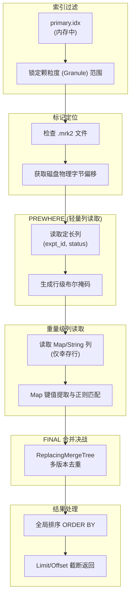

#  ClickHouse 实现 cozeloop 实验结果过滤

## 1. 表结构设计

该表采用 `ReplacingMergeTree` 引擎，通过版本号（`updated_at`）处理数据更新。利用 `Map` 类型实现实验评估数据和人工标注数据的灵活存储。

```sql
CREATE TABLE IF NOT EXISTS expt_turn_result_filter
(
    `space_id` String,
    `expt_id` String,
    `item_id` String,
    `item_idx` Int32,
    `turn_id` String,
    `status` Int32,

    -- 业务元数据
    `eval_target_data` Map(String, String),    -- 存储模型输入/输出，用于搜索
    `evaluator_score` Map(String, Float64),   -- 存储自动评估器的打分
    
    -- 人工标注 Map
    `annotation_float` Map(String, Float64),   -- 连续数值评分
    `annotation_bool` Map(String, Int8),      -- 布尔标记 (0/1)
    `annotation_string` Map(String, String),  -- 分类标签或备注文字

    `evaluator_score_corrected` Int32,
    `eval_set_version_id` String,
    `created_date` Date,
    `created_at` DateTime,
    `updated_at` DateTime,

    -- 用于索引过滤的二级索引
    INDEX idx_space_id space_id TYPE bloom_filter() GRANULARITY 1,
    INDEX idx_expt_id expt_id TYPE bloom_filter() GRANULARITY 1,
    INDEX idx_item_id item_id TYPE bloom_filter() GRANULARITY 1,
    INDEX idx_turn_id turn_id TYPE bloom_filter() GRANULARITY 1
)
ENGINE = ReplacingMergeTree(updated_at)
PARTITION BY created_date
ORDER BY (expt_id, item_id, turn_id)
SETTINGS index_granularity = 8192;
```

---

## 2. 写入链路：数据分区

### 高效写入

单条 `INSERT` 语句无论包含多少行数据，ClickHouse 都会将其在内存中排好序，并最终生成**一个**新的 Data Part 目录。

```sql
INSERT INTO expt_turn_result_filter (
    space_id, expt_id, item_id, item_idx, turn_id, status, 
    eval_set_version_id, created_date, eval_target_data, 
    evaluator_score, annotation_float, annotation_bool, 
    annotation_string, evaluator_score_corrected, updated_at
) VALUES (?, ?, ?, ?, ?, ?, ?, ?, ?, ?, ?, ?, ?, ?, ?);
```

### 状态演进（示例）

`ReplacingMergeTree` 允许我们通过版本化追踪一个实验项的生命周期：

- **版本 1 (排队中)**：`status: 0`，Map 为空。
- **版本 2 (处理中)**：`status: 1`，包含中间元数据。
- **版本 3 (成功)**：`status: 2`，包含完整的评估/标注数据。

---

## 3. 读取链路：查询执行深度剖析

### 优化查询示例

```sql
SELECT
    item_id,
    status
FROM expt_turn_result_filter
FINAL -- 关键：执行多版本合并，确保状态准确
WHERE expt_id = '7597428938863804417'
  AND status = 2
  AND evaluator_score['key1'] > 0.5
  AND eval_target_data['actual_output'] LIKE '%报错%'
ORDER BY item_idx
LIMIT 20 OFFSET 0;
```

### 执行流程图



### 阶段详解

#### 阶段 1：(primary.idx)

**目标：** 不读数据，直接利用 `primary.idx` 排除掉 99.9% 绝对不可能包含该 `expt_id` 的颗粒度（Granule）。

1. **加载索引：** ClickHouse 常驻内存加载 `primary.idx`。
    
2. **二分查找：**
    
    - `ORDER BY` 是 `(expt_id, item_id, turn_id)`。
        
    - WHERE 条件正好命中了 **第一主键** `expt_id = '7597428938863804417'`。
        
    - **效果：** 这是最高效的命中方式。系统迅速定位到：“这个实验ID只可能存在于第 5000 到 5005 号 Granule 之间”。
        
3. **Bloom Filter (被跳过)：**
    
    - 虽然你给 `expt_id` 建了 `idx_expt_id` (bloom filter)，但因为主键索引（Primary Index）已经精确命中了，**系统会直接忽略 Bloom Filter**，因为它没有主键快。
        
#### 阶段 2：定位物理位置 (.mrk2)

**目标：** 拿着刚才找到的“第 5000-5005 号 Granule”，去问 `.mrk2` 文件：这几个颗粒度在磁盘的第几个字节？

1. **读取 `expt_id.mrk2`：**
    
    - 系统查询标记文件，找到第 5000 号 Granule 对应的 `(BlockOffset, GranuleOffset)`。
        
    - 这告诉系统：去 `.bin` 文件的 `10MB` 处开始读，解压后从第 `50` 行开始拿。
        

#### 阶段 3：轻量级列读取 (.bin)

**ClickHouse 不会傻到先把 Map 读出来。** 它会利用 `PREWHERE` 策略（即使你没写，它自动优化），先读**小且快**的列。

1. **读取 `expt_id.bin`**：
    
    - 解压对应的压缩块。
        
    - **再次核对**：确认这些行确实是 `7597428938863804417`。拿到这些行的行偏移量
        
2. **读取 `status.bin`**：

	在 `expt_bin` 里面查到 id 的时候，会定位到这一行在 granule 里面是第几行（行偏移量是多少，就能直接定位到 `status.bin` 中要找的 status 对应的值）
        
    - **位图标记：** 此时，系统在内存里生成一个掩码（Mask），标记出哪些行是“幸存者”。
        

> **结果：** 假设一个 Granule 有 8192 行，经过这一步，可能只剩下 50 行是该实验且成功的记录。

#### 阶段 4：重量级列读取 (.bin)

只对上一步幸存的那 50 行，去读取昂贵的 Map 列。

1. **读取 `evaluator_score` (Map<String, Float64>)**
2. **读取 `eval_target_data` (Map<String, String>) 

#### 阶段 5：FINAL

前 4 个阶段是发生在 **每一个 Data Part 内部** 的。现在，要把所有涉及到的 Data Part 的结果汇总。

由于你加了 **`FINAL`**：

1. **多路加载：**
    
    - 系统不仅要读 `eval_target_data`，还必须读取 **`updated_at`**（版本列）以及所有的 **主键列**（`item_id`, `turn_id`）。
        
2. **内存归并 (Vertical Merge)：**
    
    - ClickHouse 构建一个优先队列。
        
    - 把所有 Part 里筛选出来的行，按 `(expt_id, item_id, turn_id)` 放在一起比对。
        
    - **去重逻辑：** 发现同一个 `item_id` 有 3 个版本（Queueing, Processing, Success），只保留 `updated_at` 最大的那个。
        
    - **关键点：** 如果最大的那个版本 `status != 2`（比如最新状态变成了 Failed），那么这行数据在这一步会被**剔除**（尽管它在阶段 3 曾经因为旧版本 status=2 被选中过，但 FINAL 保证了正确性）。
        

#### 阶段 6：排序与截断

1. **读取 `item_idx.bin`**：
    
    - 对最终幸存下来的、去重后的数据，读取它们的 `item_idx`。
        
2. **全局排序**：
    
    - 在内存中按 `item_idx` 排序。
        
3. **LIMIT 20**：
    
    - 切取前 20 条，抛弃剩下的，返回结果。

---

## 4. avg 计算

```sql
SELECT * FROM expt_turn_result_filter
WHERE 
  -- 1. 取出 map 的所有 values 变成数组 [0.8, 0.6]
  -- 2. 计算数组平均值
  arrayAvg(mapValues(evaluator_score)) > 0.5
  
  AND expt_id = '7597428938863804417' -- 配合主键过滤
```

在 ClickHouse 中，`Map(String, Float64)` 在物理磁盘上实际上被拆分成了 **2 个独立的列文件**（再加上偏移量文件）：

1. **`evaluator_score.keys.bin`**：存储所有的 Key（String 数组）。
    
2. **`evaluator_score.values.bin`**：存储所有的 Value（Float64 数组）。

> [!tip]
> Map结构详解：[2.2.5.1 稀疏索引主键点查](010-ClickHouse%20核心数据结构与存储架构.md#2.2.5.1%20稀疏索引主键点查) 后面的《Map补充部分》

当你计算 `Avg` 时，ClickHouse **根本不需要读取 Key 的文件**。它只需要读取 `values.bin` 这个全是浮点数的文件，这极大地减少了磁盘 I/O。

**ClickHouse 是怎么执行的？**

1. **主键索引过滤 (Primary Key Pruning)**： 你的表 `ORDER BY (expt_id, ...)`。CK 首先利用稀疏索引（`.idx` 文件）快速定位到 `expt_id = '759...'` 所在的那几个 **Data Part**（数据块）。
    
    - _效果_：直接过滤掉 99.9% 的无关数据块。
        
2. **列裁剪 (Column Pruning)**： 在剩下的数据块中，CK **只读取** `evaluator_score.values` 这一列的数据。其他列（如 `input`, `created_at`）完全不碰。
    
3. **向量化计算 (SIMD Vectorization)**： 这是 CK 的杀手锏。它加载一坨数据（比如 65536 行）进入 CPU 缓存。
    
    - 调用 `mapValues`：其实就是直接拿到了底层那个 Float 数组。
        
    - 调用 `arrayAvg`：利用 CPU 的 SIMD 指令（单指令多数据流），一次性计算多个数组的平均值。
        
    - **速度**：这种计算是在内存中纯数字的运算，没有 JSON 解析，没有对象反序列化，速度接近内存带宽极限。


## 5. 多维过滤维度总结

除了基础的状态检查，该架构支持丰富的多维分析：

| 维度       | 过滤逻辑                                                    | 使用场景           |
| :------- | :------------------------------------------------------ | :------------- |
| **人工标注** | `annotation_string['type'] = '逻辑错误'`                    | 审计特定错误分类       |
| **执行状态** | `status IN (3)`                                         | 隔离失败项进行重跑分析    |
| **版本控制** | `eval_set_version_id = 'v2'`                            | 对比不同数据集版本的表现   |
| **全局搜索** | `item_id = 'X' OR eval_target_data['input'] LIKE '%X%'` | 跨 ID 与上下文的全文检索 |

---

## 6. 性能优化建议

- **主键顺序**：务必将 `expt_id` 作为首个主键。它是过滤频率最高的字段。
- **Map 效率**：Map 很方便，但在颗粒度内涉及“数组扫描”。对于过滤极频繁的键，应考虑提升为独立列。
- **FINAL 开销**：`FINAL` 消耗资源。必须配合强力的 `expt_id` 过滤条件，以限制参与合并的数据分片数量。
- **索引粒度**：默认 8192。对于数据量极大的场景保持默认即可，若数据分布极稀疏可适当调小。