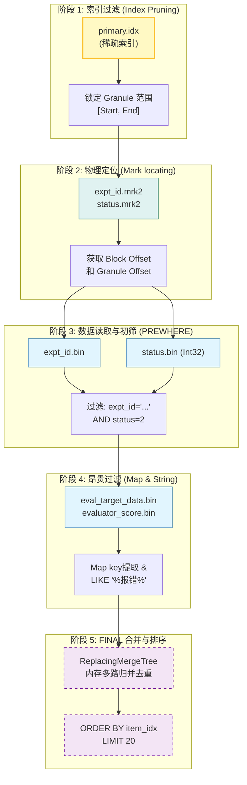

# ClickHouse 实践

有如下表结构：

```sql
CREATE TABLE IF NOT EXISTS expt_turn_result_filter
(
    `space_id` String,
    `expt_id` String,
    `item_id` String,
    `item_idx` Int32,
    `turn_id` String,
    `status` Int32,

    /*
        [业务注释] 评估对象数据 Map
        存储模型推理的输入(input)与输出(actual_output)。
        - 场景：前端“回答内容”搜索。
        - 示例：{'actual_output': '你好...', 'input': '你是谁？'}
    */
    `eval_target_data` Map(String, String),

    /*
        [业务注释] 机器评估分 Map
        存储各个自动评估器(Evaluator)打出的分数。
        - 场景：前端“分值区间”筛选。
        - 键名：通常为 evaluator_id 或定义的别名(如 key1, key2)。
        - 示例：{'key1': 0.85, 'semantic_similarity': 1.0}
    */
    `evaluator_score` Map(String, Float64),

    /*
        [业务注释] 人工标注浮点分 Map
        存储人工审核时打出的连续数值评分。
        - 场景：按人工满意度分值进行高级筛选。
        - 示例：{'human_satisfaction': 4.5}
    */
    `annotation_float` Map(String, Float64),

    /*
        [业务注释] 人工标注布尔值 Map
        存储人工审核的二值化结论（用 0/1 存储）。
        - 场景：快速过滤“回答是否正确”、“是否有有害信息”。
        - 示例：{'is_correct': 1, 'has_pii': 0}
    */
    `annotation_bool` Map(String, Int8),

    /*
        [业务注释] 人工标注字符串 Map
        存储人工审核时选择的分类标签或填写的备注。
        - 场景：按错误分类、回复风格等维度进行聚合筛选。
        - 示例：{'error_type': 'Hallucination', 'style': 'Concise'}
    */
    `annotation_string` Map(String, String),

    `evaluator_score_corrected` Int32,
    `eval_set_version_id` String,
    `created_date` Date,
    `created_at` DateTime,
    `updated_at` DateTime,

    INDEX idx_space_id space_id TYPE bloom_filter() GRANULARITY 1,
    INDEX idx_expt_id expt_id TYPE bloom_filter() GRANULARITY 1,
    INDEX idx_item_id item_id TYPE bloom_filter() GRANULARITY 1,
    INDEX idx_turn_id turn_id TYPE bloom_filter() GRANULARITY 1
)
ENGINE = ReplacingMergeTree(updated_at)
PARTITION BY created_date
ORDER BY (expt_id, item_id, turn_id)
SETTINGS index_granularity = 8192;
```

## 1. 写入

```sql
INSERT INTO `cozeloop-clickhouse`.expt_turn_result_filter (
    space_id,
    expt_id,
    item_id,
    item_idx,
    turn_id,
    status,
    eval_set_version_id,
    created_date,
    eval_target_data,
    evaluator_score,
    annotation_float,
    annotation_bool,
    annotation_string,
    evaluator_score_corrected,
    updated_at
) VALUES
(?, ?, ?, ?, ?, ?, ?, ?, ?, ?, ?, ?, ?, ?, ?),
(?, ?, ?, ?, ?, ?, ?, ?, ?, ?, ?, ?, ?, ?, ?);
```

这一条 `INSERT` 语句无论包含多少行数据，ClickHouse 都会将其在内存中排好序，并最终生成**一个**新的 Data Part 目录。

insert 结果示例：

```
Row 1: (最新插入的，代表成功状态)
──────
space_id:                  7591761752719622145
expt_id:                   7597428938863804417
item_id:                   7594089701489917953
item_idx:                  2
turn_id:                   0
status:                    2
eval_target_data:          {'actual_output':'你好，我是人工智能助手...'} 
evaluator_score:           {'key1':0.8, 'key2':1.0}
annotation_string:         {}
evaluator_score_corrected: 0
created_at:                2026-01-20 13:07:44
updated_at:                2026-01-20 13:07:44

Row 2: (之前的中间态)
──────
status:                    1                     <-- Processing
eval_target_data:          {}
evaluator_score:           {}
created_at:                2026-01-20 13:05:44

Row 3: (最初的占坑态)
──────
status:                    0                     <-- Queueing
eval_target_data:          {}
evaluator_score:           {}
created_at:                2026-01-20 13:05:24
```

## 2. 读取

例如，我们通过 `evaluator_score` 中某个 key 的分数来过滤出 `ItemId`

```sql
SELECT
    etrf.item_id,
    etrf.status
FROM `cozeloop-clickhouse`.expt_turn_result_filter etrf
FINAL -- 关键点 A：必须合并多版本，确保进度条准确
WHERE 1=1
  AND etrf.expt_id = '7597428938863804417' -- 锁定实验
  AND etrf.status = 2 -- status = 2 是指实验成功
  AND etrf.evaluator_score['key1'] > 0.5 -- 关键点 B：Map 键值过滤
  AND etrf.eval_target_data['actual_output'] LIKE '%报错%' -- 文本过滤
ORDER BY etrf.item_idx -- 关键点 C：按原始数据集顺序排列
LIMIT 20 OFFSET 0;
```

底层执行流程：




除了 actual_output 和 score，ClickHouse 实际上还支持更多的过滤维度。过滤条件可以覆盖到以下几个维度：

  1. 人工标注过滤 (Annotation Filters)

	  这是非常有用的功能。如果你的实验已经经过了人工审核，系统可以按人工打的标签进行过滤：
	  
	   * 字符串标注: AND etrf.annotation_string['error_type'] = '逻辑错误'
	   * 浮点数标注: AND etrf.annotation_float['human_score'] > 0.9
	   * 布尔值标注: AND etrf.annotation_bool['is_satisfactory'] = 1

  1. Item 状态过滤 (Run Status)

	  除了固定 status = 2 (成功)，用户也可以专门看失败的任务或处理中的任务：
	  
	   * 多状态过滤: AND etrf.status IN (3) (只看失败的)

  1. 数据集版本过滤 (Eval Set Version)

	  如果一个实验跑了多个数据集版本（虽然通常一个实验对应一个），也可以过滤：
	  
	   * AND etrf.eval_set_version_id = '...'

  4. 创建日期 (Created Date)

	  用于快速锁定某一天的评估结果：
	  
	   * AND etrf.created_date = '2026-01-20'

  5. ID 范围过滤 (Item IDs)

	  如果你已经知道某几个 ID，想单独看它们的状态：
	  
	   * AND etrf.item_id IN (...) 或 AND etrf.item_id BETWEEN ... AND ...


  6. 全文关键词搜索 (Keyword Search)

	  这是一个综合性的过滤，它会同时扫描多个字段：
	  
	   * 同时在 item_id 和 eval_target_data (包含输入 input 和输出 output) 中搜索同一个关键词。
		
```sql
SELECT
    etrf.item_id,
    etrf.status
FROM `cozeloop-clickhouse`.expt_turn_result_filter etrf
FINAL
WHERE 1=1
  AND etrf.expt_id = '7597428938863804417' -- 这是固定条件
  /* 以下就是 Keyword Search 生成的 SQL 片段 */
  AND (
      etrf.item_id = 'OrderError' -- 尝试精确匹配 ID
      OR etrf.eval_target_data['input'] LIKE '%OrderError%' -- 模糊搜索输入 Map
      OR etrf.eval_target_data['actual_output'] LIKE '%OrderError%' -- 模糊搜索输出 Map
  )
ORDER BY etrf.item_idx
LIMIT 20 OFFSET 0;
```