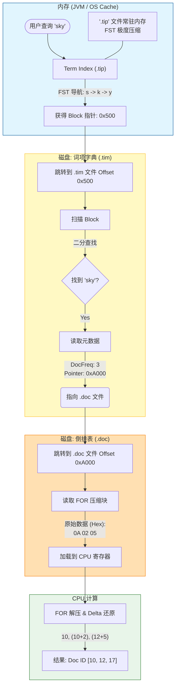
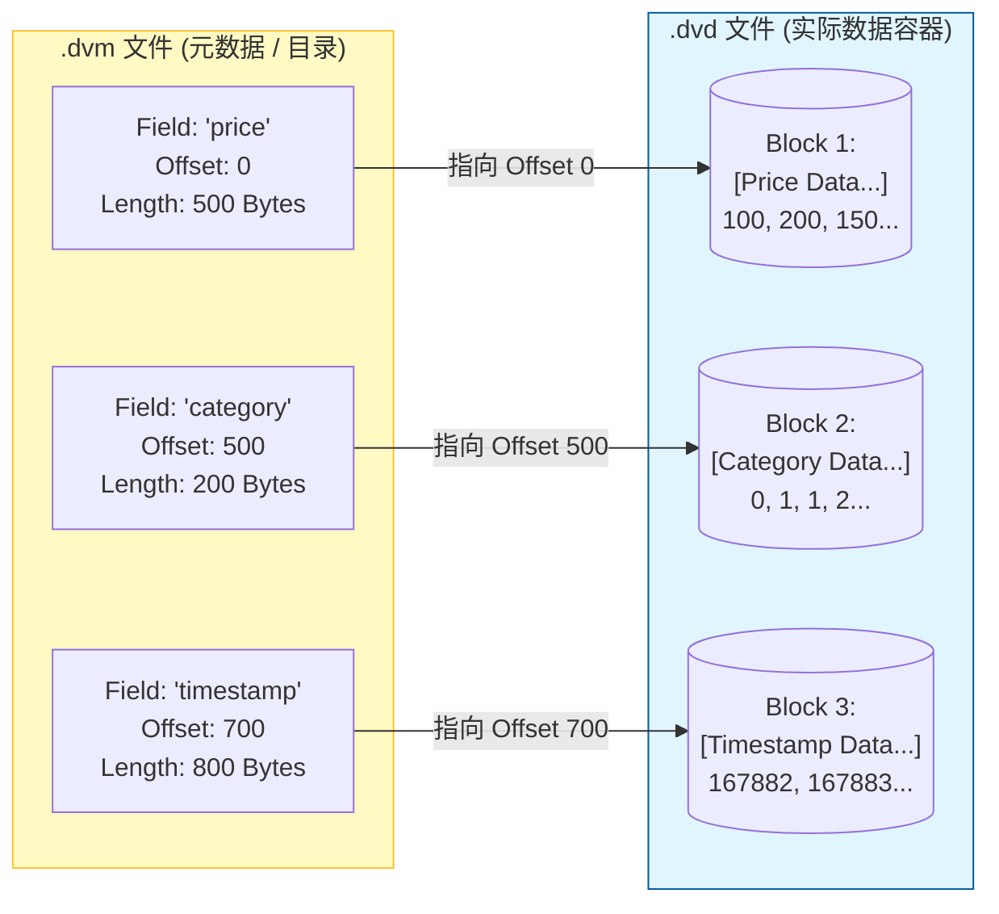
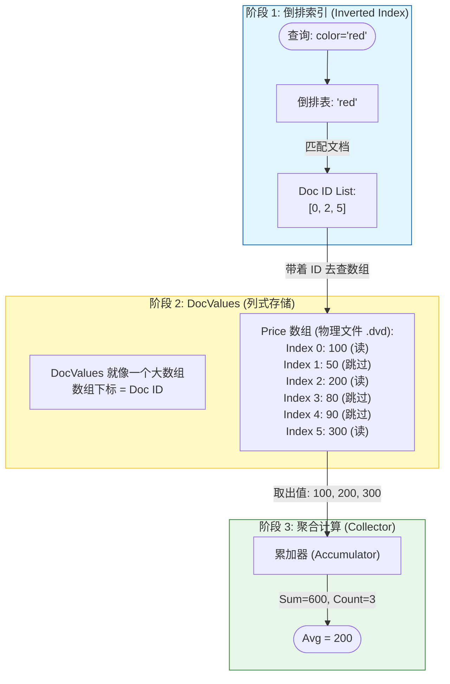
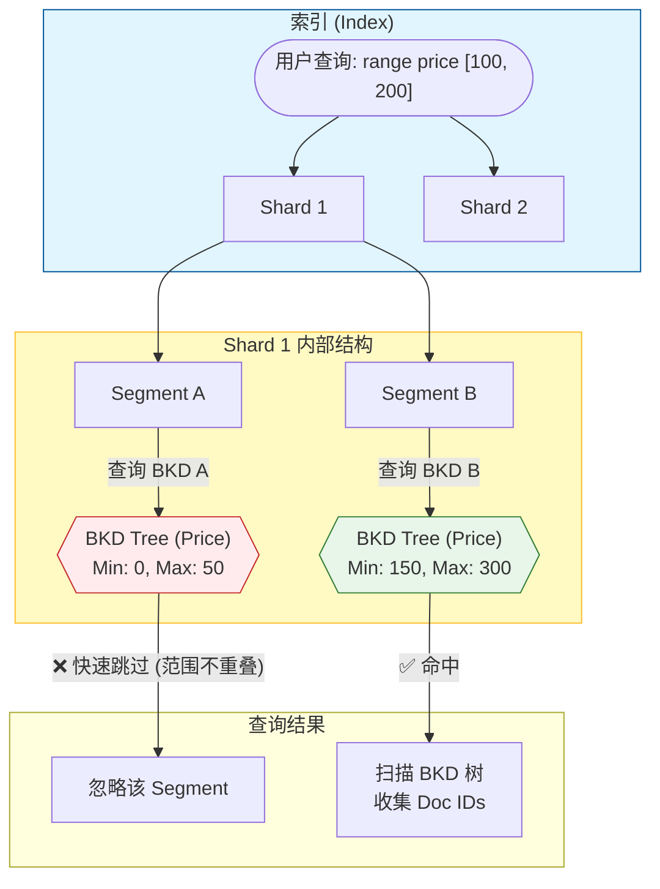
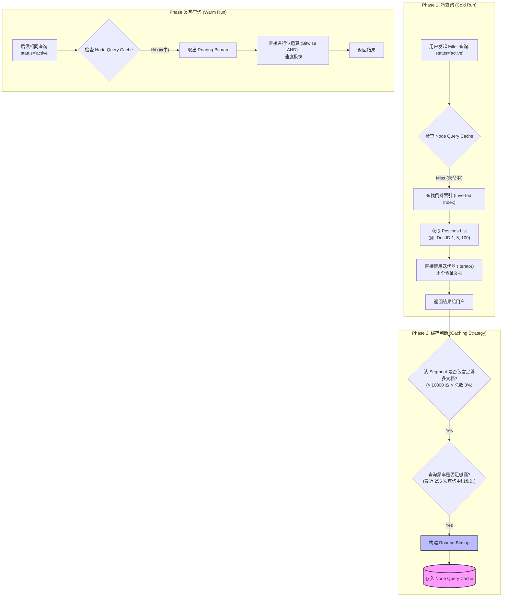

# Elasticsearch 核心数据结构

## 1. 摘要

本文档将介绍 ES 的核心数据结构，包括倒排索引、DocValues，BKD树、Roaing Mapping。

## 2. 写入路径的微观机制：缓冲区、Translog 与数据持久化

### 2.1 Indexing Buffer 内部的完整工作流

一个文档进入 Indexing Buffer 后，实际上会根据字段类型的不同，被**拆分**成四路**并行**处理。

第一步：分词与分析 (Analysis)

- **动作：** 原始文本（如 "iPhone 16 Pro"）被 Analyzer 拆解、小写化、去停用词，变成 Term 流（`[iphone, 16, pro]`）。

第二步：四路并行构建 (The Heavy Lifting)

1. **倒排索引 (Inverted Index) —— _用于全文检索_**
    
    - **映射：** `Term` $\rightarrow$ `DocID + Freq + Position`
        
    - **内存状态：** 使用 Hash Map (BytesRefHash) 快速查重 Term，然后将 DocID 等信息**追加**到内存块中。
        
2. **列式存储 (DocValues) —— _用于排序聚合_**
    
    - **映射：** `DocID` $\rightarrow$ `Value (数值/Keyword)`
        
    - **内存状态：** 维护一个以 DocID 为索引的**增长数组**。每来一个文档，就在数组对应位置填入它的值。如果是字符串类型，还会维护一个去重的字典。
        
3. **BKD 树 (Point Values) —— _用于数值/地理范围查询_**
    
    - **映射：** `Point (x, y, ...)` $\rightarrow$ `DocID`
        
    - **内存状态：** 系统不会在内存里费力去构建平衡树（太慢）。它只是单纯地将多维数值点（如 `price=100`, `date=2024-01-01`）**追加**到一个巨大的缓冲列表（HeapPointWriter）中。
        
4. **行式存储 (Stored Fields) —— _用于展示结果_**
    
    - **映射：** `DocID` $\rightarrow$ `JSON Source`
        
    - **内存状态：** 直接将原始的 JSON 或指定存储的字段值，作为字节流**追加**到内存 Buffer 的末尾。

这一阶段的数据完全存在于 RAM 中，尚未生成物理文件。如果此时发生断电或进程崩溃，Indexing Buffer 中的数据将面临丢失风险。

| **组件**                             | **Indexing Buffer**                                                                     | ** Flush/Refresh**                                       | **Segment**                                                            |
| ---------------------------------- | --------------------------------------------------------------------------------------- | -------------------------------------------------------- | ---------------------------------------------------------------------- |
| **倒排索引**                           | **Term Hash (哈希表)**：<br>乱序存储，利用 Hash 快速去重；使用 **IntBlockPool** 存储原始 DocID 列表，追求 O(1) 写入。 | **全量排序** (字典序) → **差值计算** (Delta Encoding) → **FOR 压缩**  | **.tip (FST 前缀树)**：内存常驻，极速定位 Block；<br>**.doc (倒排表)**：存储 FOR 压缩后的二进制块。 |
| **列式存储** (DocValues)               | **原始数组**：使用 `long[]` 或 `byte[]` 直接追加，数组下标即 DocID，无压缩。                                   | **统计分布** (Min/Max/GCD) → **选择算法** (GCD压缩/表编码) → **位打包**。 | **.dvd (紧凑列存)**：高度压缩的二进制流，支持通过 Offset 随机访问                             |
| **多维数据** (BKD Tree)                | **点数据列表** (HeapPointWriter)：简单的数值堆积，**无树结构**，仅做追加。                                      | **多维全量排序** → **递归切分**  → **构建平衡 K-D 树**                  | **.dii**，存储 BKD 树的**内部节点**（即非叶子节点，非常小<br>**.dim** ，存储 BKD 树的叶子节点 。     |
| **行式存储** (Stored Fields，`_source`) | **字节缓冲** (Byte Buffer)：简单的 Byte Block 追加，存储原始 JSON 字节流。                                 | **数据分块** (Chunking) → **通用压缩** (LZ4 / Deflate)。          | **.fdt (压缩数据块)**：仅支持按 ID 解压读取，无法搜索，仅做原样展示。                             |

---

## 3. 倒排索引

传统数据库（如 MySQL）采用**正向索引（Forward Index）**。想象一本书的“目录”：它按章节（文档 ID）排列，告诉你每一章讲了什么。如果你想找“为了什么”这个词在哪些章节出现，你必须从头到尾读完整本书（全表扫描），效率极低。

**倒排索引**则像书末尾的“索引页”：它按关键词（Term）排序，列出每个词出现在哪些页码（文档 ID）。

- **正向**：`文档 1 -> "The Blue Sky"`
    
- **倒排**：`"Blue" -> [文档 1]`, `"Sky" -> [文档 1]`
    

这种结构使得搜索复杂度从 $O(N)$（扫描所有文档）降低到了 $O(1)$ 或 $O(\log N)$（直接定位词项）。

### 3.1 词典问题的复杂性

在一个成熟的索引中，Term 的数量可能非常巨大。如果将所有 Term 组成的字典（Term Dictionary）直接存储在磁盘上，查询时需要多次随机 I/O 才能二分查找到目标 Term；如果全部加载到内存，又会消耗几十 GB 的堆内存，导致各种 OOM（Out Of Memory）问题。

Lucene 解决这一问题的方案是 **“词项索引（Term Index） + 词项字典（Term Dictionary）”** 的分层架构 。

| **文件扩展名**     | **名称**          | **作用与内容**                                                                                                                                        |
| ------------- | --------------- | ------------------------------------------------------------------------------------------------------------------------------------------------ |
| **.tip**      | Term Index      | **词项索引**。**存储在内存中**（FST 结构），用于快速定位.tim 文件中的位置。这是“索引的索引”。                                                                                         |
| **.tim**      | Term Dictionary | **词项字典**。这里存了完整的 Term，以及这个 Term 的**元数据 (Metadata)**，包括 **DocFreq**（有多少个文档包含这个词）、`TotalTermFreq`（这个词出现多少次）、`File Pointers`（指向.doc文件存具体id列表的地方的指针） |
| **.doc**      | Postings        | **倒排表**。存储包含该词项的文档 ID 列表（使用 FOR 压缩）。                                                                                                             |
| **.pos**      | Positions       | **位置信息**。存储词项在文档中的位置（用于短语搜索）。                                                                                                                    |
| **.fdt/.fdx** | Stored Fields   | **存储字段**。原始 JSON 文档的内容（_source），用于展示结果。                                                                                                          |

### 3.2 核心数据结构：有限状态转换器 (FST)

现代 ES（Lucene 4+）中，`.tip` 文件的核心结构不再是简单的数组或 B 树，而是 **FST (Finite State Transducer)**。FST 是一种在保证查找时间复杂度为 $O(length(term))$ 的前提下，能将内存占用压缩到极致的数据结构 。

#### 3.2.1 FST 的压缩原理：前缀与后缀共享

FST 本质上是一个有向无环图（DAG）。与 Trie 树（字典树）利用公共前缀压缩类似，FST 进一步利用了**公共后缀**的共享。

- **前缀共享**：例如 "moth" 和 "mop" 共享 "m-o" 路径。
    
- **后缀共享**：例如 "pop" 和 "top"，虽然前缀不同，但后缀 "op" 是相同的。在 FST 中，这两个单词的路径在经过首字母后，可以汇聚到相同的后续节点上。对于英语等存在大量后缀变化（-ing, -ed, -s）的语言，这种压缩效果极其显著 。
    


#### 3.2.3 内存映射与堆外加载

在物理文件 `.tip` 中，FST 被序列化为极其紧凑的字节数组。

- **VInt 编码**：所有的弧（Arc）跳转地址和 Output 值都使用变长整数（VInt）编码。
    
- **MMap**：ES 通常通过 MMap（内存映射）方式将 `.tip` 文件加载到地址空间。这意味着 FST 实际上驻留在操作系统的 Page Cache 中（即堆外内存），而不是 JVM Heap。这极大地减轻了 JVM GC 的压力，同时允许操作系统根据内存压力自动管理 FST 的换入换出 。
    

### 3.3 倒排表的压缩：Frame of Reference (FOR)

对于常用词（Stop words 或高频词），倒排表可能包含数百万个文档 ID。如果直接存储 32 位整数（4 Bytes * 1,000,000 = 4MB），空间浪费巨大且 I/O 缓慢。

Lucene 采用了 **Frame of Reference (FOR)** 技术结合 **Delta Encoding** 进行压缩 。

FOR 算法的核心思想是将数据分组，并利用“基准值”或“最大位宽”来压缩每一组数据。它分为三个步骤：

**第一步：Delta Encoding（增量编码）** 倒排表中的文档 ID 是有序递增的。例如，一个原本的 ID 列表为：**`[73, 300, 302, 332, 343, 372]`** 如果直接存储这些大整数，数值较大。通过计算相邻数值的差值（Delta），可以将列表转化为：`[73, 227, 2, 30, 11, 29]`，（注：$300-73=227$, $302-300=2$, 以此类推）。 显然，转化后的数值变小了，所需的存储位数也随之减少 。

**第二步：Block Subdivision（分块）** Lucene 将增量列表划分为固定大小的块（Block），通常为 128 或 256 个整数。每个块独立压缩。这不仅有助于压缩，还支持通过 Skip List（跳表）快速跳过不需要的块，避免解压整个列表 。

**第三步：Bit Packing（位压缩）**

这是 FOR 算法的精髓。对于每一个块，Lucene 会计算该块中**最大数值**所需的二进制位数。

假设一个块包含 Delta 值：`[2, 3, 5, 2]`（最大值为 5，二进制 `101`，需要 3 bits）。

FOR 算法会在块头记录元数据：“本块每个整数占用 3 bits”。

然后，所有数值都被强制压缩为 3 bits 存储：

- 2 -> `010`
    
- 3 -> `011`
    
- 5 -> `101`
    
    总共占用 $4 \times 3 = 12$ bits，而不是 $4 \times 32 = 128$ bits。

这种方法的优势在于解码速度极快。因为每个数值的位宽相同，CPU 可以直接通过位移操作和掩码批量读取数据，甚至利用 SIMD 指令在单个 CPU 周期内解压多个整数。相比传统的 VInt（变长整数），FOR 的解压速度提升了数倍，使得磁盘 I/O 不再是瓶颈 。

> ([https://www.elastic.co/blog/frame-of-reference-and-roaring-bitmaps](https://www.elastic.co/blog/frame-of-reference-and-roaring-bitmaps))


### 3.4 位置与载荷信息：.pos 与.pay

除了文档 ID，全文检索还需要位置信息（Positions）来支持短语查询（Phrase Query）和临近查询（Proximity Query）。

- **`.pos` 文件**：存储 Term 在文档中的出现位置。同样使用 Delta Encoding + VInt 压缩 。
    
- **`.pay` 文件**：存储 Payload（用户自定义数据）和 Offset（字符偏移量）。这些通常用于高级评分或高亮显示。

### 3.5 示例

假设我们有一个包含 **10 亿** 条文档的索引。 用户发起查询：`GET /_search { "query": { "term": { "content": "sky" } } }` 目标：找到包含单词 **"sky"** 的文档 ID。



---

## 4. DocValues

倒排索引在“通过词找文档”方面性能卓越，但在“通过文档找值”方面（例如：对 `price` 字段排序，或按 `category` 字段聚合）却效率极低。因为这需要对倒排表进行“反向查找”，这在物理上意味着大量的随机磁盘 I/O。

为了解决排序和聚合的性能问题，ES 引入了 **DocValues**，这是一种完全的**列式存储**结构 。

以这里为例，所有文档的 `price` 值在磁盘上是连续存储的。聚合计算 `avg(price)` 时，磁盘磁头可以执行连续的顺序读取，CPU 也能利用 SIMD 指令进行向量化处理，性能提升可达数个数量级。

> [!IMPORTANT]
> 除了 **`text`** 类型（分词文本）以外，绝大多数核心类型（Keywords, Numbers, Dates, Boolean）默认都会开启 DocValues。你可以通过 Mapping 显式地将 `doc_values` 设置为 `false`。

### 4.2 物理结构与压缩编码

DocValues 对应物理文件 **`.dvd` (Data)** 和 **`.dvm` (Metadata)** 。针对不同的数据类型，DocValues 采用了多种自适应压缩策略。

- **`.dvd` (DocValues Data)**：这是一个巨大的**纯数据文件**。它把字段 A 的数据、字段 B 的数据、字段 C 的数据……全部**首尾相连**拼在了一起。
    
- **`.dvm` (DocValues Metadata)**：这是一个**索引映射文件**。它记录了“哪个字段的数据在 `.dvd` 文件的哪个位置（Offset）”。

> [!TIP]
> 一个 Segment（分段）只有一套 DocValues 文件（`.dvd` 和 `.dvm`），这套文件里存储了该 Segment 下“所有字段”的列式数据。


#### 4.2.1 数值类型 (Numerics)

对于 Integer/Long/Float/Date 类型，Lucene 会先分析整个 Segment 中该列数据的分布特征，选择最优编码 ：

1. **GCD Compression（最大公约数压缩）**：
    
    - 场景：适用于时间戳或特定精度的数值。
        
    - 原理：如果一列数据是 **`[100, 200, 300, 500]`**，最大公约数是 100。Lucene 仅存储商 **`[1, 2, 3, 5]`** 和元数据 `GCD=100`。读取时通过公式 **`Value = Stored_Val * GCD`** 还原。
        
2. **Table Encoding（表编码）**：
    
    - 场景：适用于基数（Cardinality）很低的列（例如 `status` 只有 0, 1, 2）。
        
    - 原理：建立一个去重的数值表 `Table:` ，然后文档只存储该值在表中的索引（0, 1, 2）。这实际上是数值层面的字典编码。
        
3. **Delta Encoding**：
    
    - 场景：数值分布紧密。
        
    - 原理：计算最小值 `Min`，然后存储 `Value - Min` 的偏移量。
        

#### 4.2.2 字符串类型 (Keyword / SortedSet)

对于 Keyword 字段，DocValues 必须解决字符串存储冗余的问题。

- **全局字典序（Global Ordinals）**：Lucene 会将 Segment 内该字段所有唯一的字符串提取出来，按字典序排序，构建一个映射表。
    
- **Ordinal Storage**：在文档的实际列存储位置，不再存储 "US", "CN" 这样的字符串，而是存储它们在字典中的序号（Ordinal，如 0, 1）。这不仅压缩了空间，还极大地加速了 `Terms Aggregation`，因为聚合过程可以直接操作整数 Ordinal，直到最后阶段才查表换回字符串 。
    

#### 4.2.3 稀疏性与迭代器 (Sparse & Iterator)

在 Lucene 6 之前，DocValues 主要是稠密数组，对于稀疏字段（即很多文档该字段为空）会浪费空间存储“缺失标记”。现代 Lucene 引入了基于 **Iterator API** 的访问模式，允许底层使用 **IndexedDisk** 格式：只存储存在的 DocID 和 Value，通过跳表或位图快速跳过空值文档。这使得 DocValues 即使在稀疏数据集上也能保持高效 。

### 4.3 堆外内存管理

与 FST 类似，DocValues 数据通常不加载到 JVM Heap，而是通过 MMap 驻留在 Off-heap 内存（Page Cache）。

- **优势**：这意味着聚合计算时，JVM 堆内存压力极小。即便处理 100GB 的数据聚合，只要操作系统有足够的剩余内存做 Cache，性能就会非常快。
    
- **代价**：如果物理内存不足导致 Page Cache 频繁换页（Thrashing），DocValues 的性能会急剧下降。因此，监控磁盘 I/O wait 是诊断聚合性能问题的关键 。

### 4.4 示例

假设我们要计算：**“所有颜色为红色（color: red）的商品的平均价格（avg price）”**。




如果不使用 DocValues，ES 必须这样做（**慢速模式**）：

1. 找到 ID 0。
    
2. 去磁盘读取 ID 0 的完整 JSON (`_source`)。
    
3. 解析 JSON 字符串。
    
4. 找到 `"price"` 字段。
    
5. 把字符串 `"100"` 转为数字 `100`。
    
6. 对 ID 2 重复... 对 ID 5 重复...
    

**使用 DocValues（极速模式）：**

1. DocValues 文件被 **MMap** 映射在内存里。
    
2. 因为每个数字占用的字节是固定的（或者通过 GCD 压缩规则可知），ES 知道：
    
    - ID 0 的数据在位置 `Start + 0`。
        
    - ID 2 的数据在位置 `Start + 2 * (数据宽度)`。
---

## 5. BKD 树

**BKD 树 (Block K-D Tree)** 是 Elasticsearch（准确地说是底层 Lucene 6.0 之后）处理 **数值类型 (Numeric)**、**日期类型 (Date)** 和 **地理位置 (Geo-point)** 的核心数据结构。

它的引入是 Elasticsearch 性能的一个巨大飞跃，让 ES 在处理范围查询（Range Query）和多维查询时，速度比旧版本快了数倍甚至数十倍。

[020-从 KD-Tree 到 BKD-Tree](020-从%20KD-Tree%20到%20BKD-Tree.md)

### 5.1 例1 单字段查询

例如：查询 `100 <= price && price <= 200`

有多少个 Segment（分段），就要查多少棵 BKD 树。BKD 树不是“全局”的，而是**Segment 级别**的隔离结构。这意味着如果你有一个索引，它有 5 个分片（Shard），每个分片下有 10 个 Segment，那么执行一次范围查询，理论上需要访问 **50 棵 BKD 树**。



**具体解析：**

1. **Min-Max 裁剪 (Pruning)**
		
	既然有那么多棵树，如果每棵树都要遍历，性能肯定会崩。Lucene 在 BKD 树的“门口”放了一个守卫。

	在 `.dii` (BKD Index) 文件中，Lucene 存储了整个 Segment 中该字段的**最小值 (Min)** 和**最大值 (Max)**。这个数据非常小，通常直接加载在堆内存中。
	
	**逻辑：**
	
	- **你的查询**：`price: [100, 200]`
	    
	- **Segment A (守卫)**：我的 min=0, max=50。
	    
	    - **判定**：`[0, 50]` 与 `[100, 200]` 无交集。
	        
	    - **动作**：**直接跳过**。连磁盘上的 BKD 树结构都不用读，这棵树对于本次查询相当于不存在。
	        
	- **Segment B (守卫)**：我的 min=150, max=300。
	    
	    - **判定**：有交集。
	        
	    - **动作**：进入 BKD 树内部进行查找。
	        
	
	**结论**：虽然物理上有 50 棵树，但对于特定范围查询，可能真正需要“深入查询”的只有 2-3 棵。
2. **Force Merge (强制合并)**
	
	如果你的数据非常离散（例如随机 ID），Min-Max 裁剪可能失效（每个 Segment 的范围都很大）。这时候，**Segment 的数量**就成了性能杀手。
	
	这就是为什么生产环境强烈建议执行 **Force Merge**：
	
	- **操作**：将 10 个小 Segment 合并成 1 个大 Segment。
	    
	- **结果**：10 棵小 BKD 树合并成 **1 棵大 BKD 树**。
	    
	- **收益**：
	    
	    1. 查询时只需要遍历 1 棵树（$O(logN)$ 优于 $10 \times O(log(N/10))$）。
	        
	    2. 文件句柄占用减少。
	        
	    3. Min-Max 范围虽然变大了，但内部索引结构更紧凑。

### 5.2 例2 多字段查询

例如：查询` price: [100, 200] AND time: "yesterday"` 的数据

> [!TIP] 
> 时间（Date）字段也是构建 BKD 树的，时间是 1 维的，此时它退化为一种**高度优化的、甚至类似于 B+ 树的“范围树”**。

**物理上这两个字段是两棵独立的树，但在执行时，通常只需要“深度查询”其中一棵树。**

执行流程如下：

1. **双重 Min-Max 剪枝 (The Double Check)**

	在真正触碰 BKD 树结构之前，ES 会先检查这个 Segment 的元数据（Min-Max）。
	
	**规则是“一票否决制”**。
	
	- **检查 Price**：该 Segment 的 `price` 范围是 `[500, 1000]`。
	    
	    - 结果：与查询 `[100, 200]` 无交集。
	        
	    - **动作**：**直接丢弃整个 Segment**。不用查 `time` 树了，也不用查 `price` 树了。
	        
	- **如果 Price 通过，再检查 Time**：该 Segment 的 `time` 是 `[前天, 昨天]`。
	    
	    - 结果：有交集。
	        
	    - **动作**：只有当**两个字段**的 Min-Max 都满足条件时，才会进入下一步。
	        

2. **代价估算与“主导者” (Leader Election)**

	假设 Segment 没被过滤掉，现在必须找出同时满足两个条件的文档 ID。
	
	ES **不会**傻乎乎地同时遍历两棵树然后求交集（除非两个范围都极其宽泛）。它会进行**代价（Cost）估算**：
	
	1. **估算 `time`**：时间是“昨天”，非常具体。ES 估算匹配的文档数很少（Low Cost，例如 50 个文档）。
	    
	2. **估算 `price`**：价格 `100-200`，范围很宽。ES 估算匹配文档很多（High Cost，例如 10,000 个文档）。
	    
	
	**策略决定：让 `time` 做“主导者 (Lead Iterator)”。**

3. **执行流程：一棵树 + DocValues (The Hybrid Approach)**

	这是性能优化的核心。因为 `price` 字段开启了 **DocValues**（上一节提到的列式存储），ES 可以利用它来“作弊”。
	
	``` mermaid
	flowchart TD
	    subgraph Execution ["执行阶段 (Smart Execution)"]
	        direction TB
	        Decision["决策: Time 条件更严格 (Cost 小)<br/>选为 Leader"]
	        
	        Step1["遍历 Time-BKD 树"] -- "找到 Doc ID: 5" --> Verify
	        
	        subgraph Verification ["验证阶段 (不做 BKD 查询)"]
	            Verify{"检查 DocValues (Price)<br/>ID 5 的 Price 是多少?"}
	            Verify -- "Price = 150<br/>(在 100-200 之间)" --> Hit["✅ 匹配 (加入结果集)"]
	            Verify -- "Price = 900<br/>(不满足)" --> Miss["❌ 丢弃"]
	        end
	        
	        Step1 -- "找到 Doc ID: 12" --> Verify
	        
	        note1[".dii/.dim (BKD树)"] -.- Step1
	        note2[".dvd (DocValues)"] -.- Verify
	    end
	    
	    style Execution fill:#e1f5fe,stroke:#01579b
	    style Verification fill:#fff9c4,stroke:#fbc02d
	    style Decision fill:#e8f5e9,stroke:#2e7d32
	```
	
	**为什么这样做更快？**
	
	- **遍历 BKD 树**（寻找 `price` 在 100-200 的 ID）是一个 $O(logN)$ 的过程，需要多次随机 I/O 跳转。
	    
	- **查 DocValues**（已知 ID 5，看它的 price 是多少）是一个接近 $O(1)$ 的随机访问（Random Access），而且很可能在 OS Page Cache 里。
	    
	
**结论**：
	
	在这个场景下，ES **只查询了 `time` 的 BKD 树**。对于 `price`，它没有去遍历树，而是利用了 DocValues 进行快速验证。

**特殊情况：没有 DocValues 怎么办？**

如果你的 `price` 字段竟然**关闭了 DocValues**（`doc_values: false`），或者它是 `text` 类型，那么 ES 就别无选择：

1. 查询 `time` BKD 树 -> 得到 BitSet A。
    
2. 查询 `price` BKD 树 -> 得到 BitSet B。
    
3. 对两个 BitSet 做位运算交集 (Bitwise AND)。
    
    这就是为什么建议保留 DocValues，它不仅用于聚合排序，还是多条件查询时的重要加速器。


---

## 6. 位图索引与 Filter 缓存：Roaring Bitmaps

在 ES 中，Filter 查询（如 `term query` 在 `filter` 上下文中）不计算评分，只关心“匹配与否”。为了高效地处理这些集合运算（交集、并集、差集），ES 广泛使用了 **Roaring Bitmaps** 。

> [!TIP] TIP
> Roaring Bitmap 存储的是符合条件的 **文档 ID (Doc ID)**，而 Doc ID 本质上就是 Integer。
> 例如：**查询：** `status: "active"`。先用倒排索引找到符合条件的`docID`，然后再将ID存入Roaring Bitmaps

### 6.1 Roaring Bitmap 的微观设计

传统的 BitSet（位图）在数据稀疏时非常浪费内存（例如只存了 ID 1 和 ID 100,000,000，传统 BitSet 需要创建 100M bits 的空间）。Roaring Bitmap 采用了一种混合容器（Hybrid Container）的设计来解决这个问题。

它将 32 位的 Integer 空间划分为高 16 位（Key）和低 16 位（Value）。根据低 16 位数据的密度，动态选择底层的 **Container**：

| **容器类型**             | **触发条件 (阈值)** | **数据结构**                  | **空间复杂度**   | **适用场景**           |
| -------------------- | ------------- | ------------------------- | ----------- | ------------------ |
| **Array Container**  | 元素数 < 4096    | 有序数组 `short`              | 2 Bytes * N | 极其稀疏的数据            |
| **Bitmap Container** | 元素数 >= 4096   | 固定位图 (BitSet)             | 固定 8 KB     | 稠密数据               |
| **Run Container**    | 连续序列较多        | RLE (Run-Length Encoding) | 变长          | 连续 ID (如 10..1000) |

#### 6.1.1 阈值 4096 的数学推导

为什么是 4096？因为 Bitmap Container 固定占用 8KB ($2^{16}$ bits / 8 = 8192 Bytes)。而 Array Container 存储每个 short 需要 2 Bytes。

$$4096 \times 2 \text{ Bytes} = 8192 \text{ Bytes}$$

当元素数量超过 4096 时，Array Container 的体积就会超过 8KB，此时转换为 Bitmap Container 更节省空间且查询更快（O(1) vs O(logN)）。

### 6.2 Node Query Cache

这种高效的位图结构被用于 ES 的 **Node Query Cache**。当一个 Segment 上的某个 Filter 查询被频繁访问时，ES 会计算其结果集并缓存为 Roaring Bitmap。后续相同的查询直接进行位运算（Bitwise AND），速度极快且 CPU 缓存友好。

Elasticsearch 不会对所有 Filter 进行缓存，因为构建 Roaring Bitmap 也有成本（CPU 和 内存）。它采用了一种“频率优先”的策略。



**初始阶段：迭代器 (Iterator)**

当你第一次执行 `filter` 时，ES 实际上是在扫描倒排索引。

- 它拿到的是一个 **Postings List**（有序的 Doc ID 列表）。
    
- 此时，ES 使用轻量级的 **Iterator** 遍历这个列表来判断匹配。
    
- **为什么不马上转成 Bitmap？** 如果这个查询只运行一次（例如包含随机 ID 的查询），构建 Bitmap 的 CPU 开销和内存占用是浪费的。直接遍历 Postings List 通常更快。

**晋升阶段：Roaring Bitmap**

只有当 ES 监测到某个 Filter 查询在某个 Segment 上**频繁出现**（默认是最近 256 次查询中，由于历史原因通常会有个计数器），且该 Segment **足够大**（小 Segment 很快就会被合并，缓存它们没意义）时，ES 才会决定：

> “这个查询很热，值得花成本把它‘固化’下来。”

此时，ES 会将对应的 Postings List 读取出来，转换成 **Roaring Bitmap** 格式，并常驻内存（Node Query Cache）。

**缓存后：位运算加速**

一旦缓存建立，下次再查 `status: "active"` AND `category: "tech"` 时：

1. 取出 `"active"` 的 Roaring Bitmap。
    
2. 取出 `"tech"` 的 Roaring Bitmap。
    
3. 执行 **Bitwise AND** 操作。
    
4. 这比遍历两个数组求交集要快得多（CPU 指令集优化）。