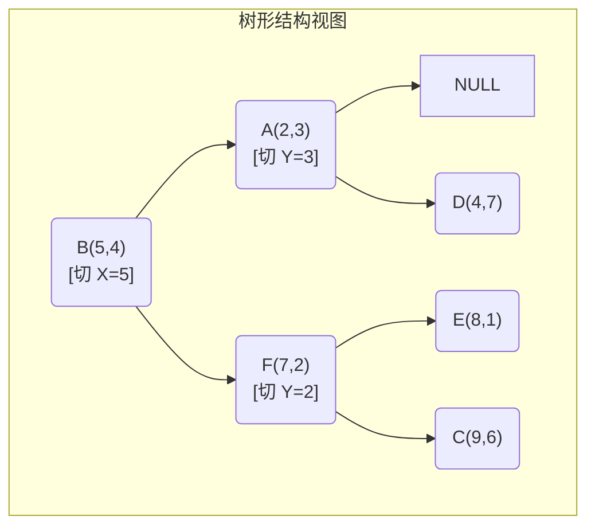
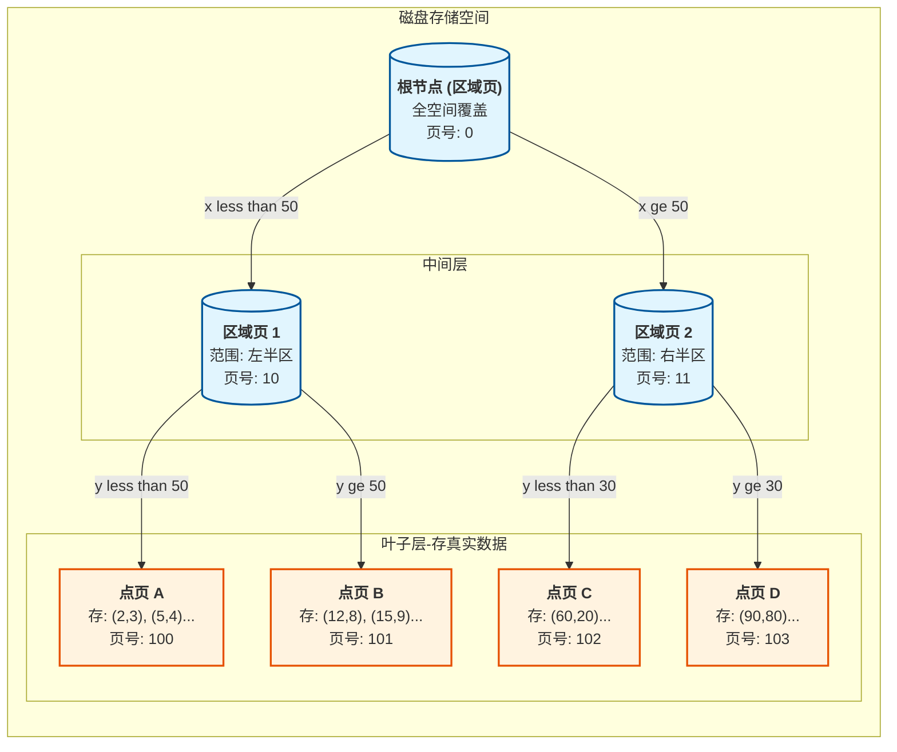
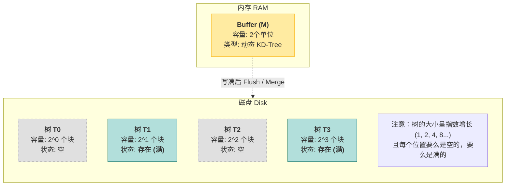
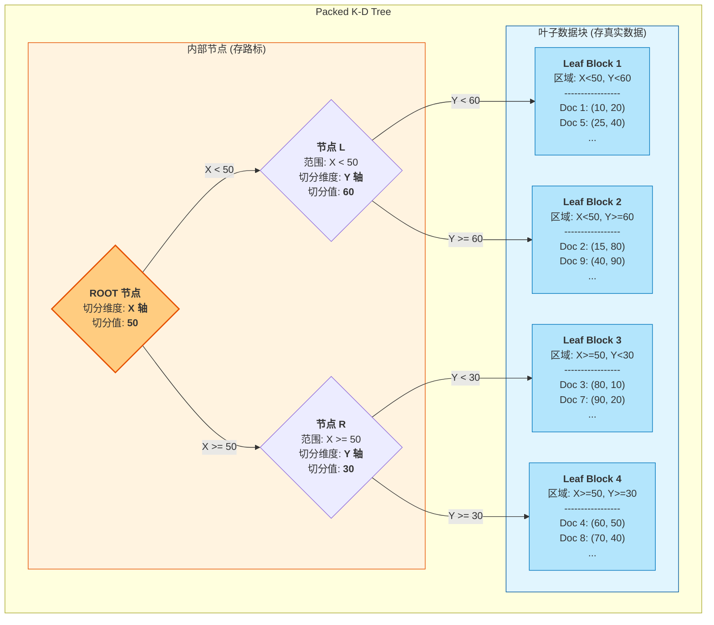
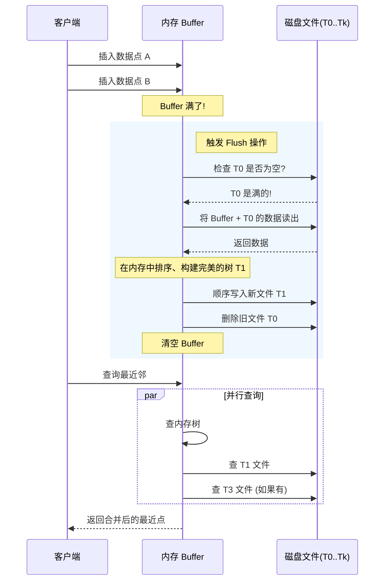
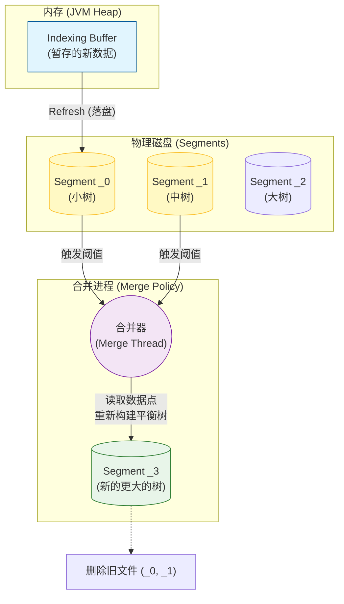

# 从 KD-Tree 到 BKD-Tree

## KD-Tree (K-Dimensional Tree)

### 概念

可以把它想象成：**在一个多维空间里切蛋糕**。每一刀都把剩下的空间一分为二，直到每个小块里只剩下一个“数据点”或者达到某种条件。

KD-Tree 是一种**二叉树**，用于在 $k$ 维空间中组织点的数据。

- **非叶子节点**：代表一个分割平面（Splitting Plane）。
    
- **叶子节点**：代表最终的一个区域或数据点。
    

它的核心思想是：**轮流使用坐标轴来划分空间**。

#### 示例

假设我们有一组 **2维** 数据点（X, Y）： `[(2,3), (5,4), (9,6), (4,7), (8,1), (7,2)]`

构建过程是**递归**的：

- **选择切分维度**：通常轮流选择。
    
    - 深度 0（根节点）：切 **X** 轴。
        
    - 深度 1：切 **Y** 轴。
        
    - 深度 2：切 **X** 轴……以此类推。
        
- **寻找切分点（中位数）**：
    
    - 为了保持树的平衡，我们按照当前维度的值对所有点进行排序，取**中位数**作为当前节点。
        
- **递归分裂**：
    
    - 比中位数小的点 -> 放左子树。
        
    - 比中位数大的点 -> 放右子树。

 **具体演示：**

- **第 1 层（切 X 轴）：**
    
    - 数据按 X 排序：`(2,3), (4,7), (5,4), (7,2), (8,1), (9,6)`
        
    - 中位数是 **(7,2)** （或者选 5,4 也可以，看具体实现）。我们选 `(7,2)` 作为**根节点**。
        
    - **左子树**（X < 7）：`[(2,3), (4,7), (5,4)]`
        
    - **右子树**（X >= 7）：`[(8,1), (9,6)]`
        
- **第 2 层（切 Y 轴）：**
    
    - **左边**处理 `[(2,3), (4,7), (5,4)]`：按 Y 排序 `(2,3), (5,4), (4,7)`。中位数 **(5,4)** 成为节点。
        
        - (2,3) 去左边（因为 Y: 3 < 4）。
            
        - (4,7) 去右边（因为 Y: 7 > 4）。
            
    - **右边**处理 `[(8,1), (9,6)]`：按 Y 排序。中位数 **(9,6)** 成为节点。
        
        - (8,1) 去左边（因为 Y: 1 < 6）。

最终这就形成了一棵树。在几何上，空间被切成了一个个矩形（2维时）或超长方体（高维时）。



对应于空间中：


### 最近邻搜索 (Nearest Neighbor Search)

这是 KD-Tree 最著名的用途。我们不仅要往下找，还要往回看，判断是否需要“穿墙”。

**搜索算法步骤（回溯法）：**

假设我们要找距离目标点 $P$ 最近的点：

1. **二叉查找（下潜）**：
    
    从根节点开始，根据维度比较大小，一路向下走到叶子节点。
    
    - 将该叶子节点视作“**当前最近点 (Current Best)**”。
        
    - 计算 $P$ 到这个点的距离，记为 $D_{min}$。
        
2. **回溯（Backtracking）与 剪枝（Pruning）**：
    
    沿着路径往回走（回到父节点）。对于每个经过的节点，做两件事：
    
    - **更新最近点**：如果当前节点比 $D_{min}$ 更近，更新“当前最近点”和 $D_{min}$。
        
    - **判断是否需要通过“墙”**：
        
        - 我们要画一个以 $P$ 为圆心，半径为 $D_{min}$ 的圆（超球体）。
            
        - **关键判断**：这个圆是否与当前节点的**分割平面**相交？
            
            - **相交**：说明分割平面的**另一侧**可能存在更近的点。必须进入另一侧子树进行搜索。
                
            - **不相交**：说明另一侧所有的点都肯定比 $D_{min}$ 远。**剪枝**（Prune），直接忽略另一侧子树。

示例：

假设：目标点是 (6,5)

**阶段 1：下潜（寻找初始候选人）**

像查字典一样，从根节点一路向下比对，直到走到叶子。

1. **在根 B(5,4)：** 比较 X。目标 T 的 X=6 >= 5。向右走。
    
2. **在节点 F(7,2)：** 比较 Y。目标 T 的 Y=5 >= 2。向右走。
    
3. **到达节点 C(9,6)：** 这差不多是个叶子了。
    

- **当前结果：** 暂时认为 C(9,6) 是最近的。
    
- **当前最短距离 ($R$)：** 计算 T(6,5) 到 C(9,6) 的距离。
    
    $R = \sqrt{(9-6)^2 + (6-5)^2} = \sqrt{3^2+1^2} = \sqrt{10} \approx 3.16$
    

**阶段 2：回溯与关键判断（"画圆测试"）**

现在开始往回走（向上爬树），验证刚才的结论是否正确。这正是 KD-Tree 高效的原因：它通过“画圆测试”来剪枝。

- **回溯步骤 A：** 回到父节点 F(7,2)，计算距离发现 F 也是 3.16，暂定 F 为最近点。做画圆测试，发现圆与 Y=2 分割线相交

	

	需要检查 F 的另一侧子树（点 E），但 E 更远。继续回溯。
    
- **回溯步骤 B：** 回到根节点 **B(5,4)**。
    
    - **计算距离：** T(6,5) 到 B(5,4) 的距离是 $\sqrt{(6-5)^2 + (5-4)^2} = \sqrt{1^2+1^2} = \sqrt{2} \approx 1.414$。
        
    - **重大发现！** 根节点 B 比之前的 F 和 C 都近得多。
        
    - **更新状态：** 当前最近点变为 **B(5,4)**，当前最短距离 $R$ 缩小为 **1.414**。
        
	以T为圆心，|BT|为半径画圆，发现会超过分割线，所以要检查B的左子树
    
	


### KD-Tree 的致命弱点：维度灾难

KD-Tree 在低维（如 2维、3维）时效率极高。但是，**当维度 $k$ 增加时（例如超过 20维），性能会急剧下降，退化为线性扫描 $O(N)$**。

**为什么？**

在高维空间中，点与点之间的距离变得越来越“平均”。

当你要画那个“半径为 $D_{min}$ 的超球体”时，你会发现它几乎总是和分割平面相交。

结果就是：**剪枝失效了**。你需要回溯并访问几乎所有的子树。

> **经验法则**：如果维度 $k > 20$，或者 $N < 2^k$，建议直接使用暴力扫描，或者使用近似最近邻算法（ANN，如 HNSW 或 Faiss），不要用 KD-Tree。


## KDB-Tree (k-Dimensional B-tree) 

为什么需要 KDB-Tree？

回顾一下 KD-Tree，它的节点是这样的：

- 每个节点只存**一个**数据点。
    
- 节点与节点之间通过指针连接。
    
**在磁盘上这简直是灾难**： 磁盘读写是按“页（Page）”（通常 4KB）来的。如果你为了读一个节点（几十字节），就得加载整个 4KB 的页，然后为了读它的子节点，可能又要去加载另一个随机位置的 4KB 页。 这就是**随机 I/O**，速度极慢。

**KDB-Tree 的解决思路**： 像 B-Tree 一样，把树弄得“矮胖”。每个节点不是存 1 个点，而是存**几百个**点，填满整个 4KB 的页。

**KDB 树** 是一种用于管理多维数据的平衡查找树。它结合了 **K-D 树**（多维空间切分能力）和 **B 树**（磁盘友好的平衡结构）的优点。

**核心目标：** 

在保持 K-D 树的空间检索效率的同时，像 B 树一样实现页面的平衡存储，减少磁盘 I/O，非常适合处理大规模地理信息系统（GIS）或多维索引。

### 宏观架构

**节点类型**：

- **区域页 (Region Page / Internal Node)**：
    
    - 相当于书的**目录**。
        
    - 它不存具体数据，只存**“路标”**。
        
    - 路标的形式是：`(区域范围, 指向子页的页号)`。
        
    - 例如：`{ x:[0,50], y:[0,100] } -> 指向第 5 号页`。
        
- **点页 (Point Page / Leaf Node)**：
    
    - 相当于书的**正文**。
        
    - 它存储真实的**数据点** `(x, y)` 以及对应的 ID 或属性。





### 微观结构

在磁盘的 4KB 页面里，数据具体长什么样？

#### 区域页 (Region Page) 的内部结构

它像一本电话簿的目录。它存储的是 `(区域范围, 子页页号)` 对。

```Plaintext
+-------------------------------------------------------+
|  区域页 (Page ID: 10)  [磁盘块 4KB]                    |
+-------------------------------------------------------+
| Header: 存了多少个条目 (N=3)                           |
+-------------------------------------------------------+
| 条目 1:                                                |
|   范围: x=[0, 25], y=[0, 100]  -----> 指向子页 ID: 100 |
+-------------------------------------------------------+
| 条目 2:                                                |
|   范围: x=[25, 50], y=[0, 60]  -----> 指向子页 ID: 101 |
+-------------------------------------------------------+
| 条目 3:                                                |
|   范围: x=[25, 50], y=[60, 100] ----> 指向子页 ID: 102 |
+-------------------------------------------------------+
| ... (剩余空白空间) ...                                 |
+-------------------------------------------------------+
```

#### 点页 (Point Page) 的内部结构

这是真正存数据的地方。

```Plaintext
+-------------------------------------------------------+
|  点页 (Page ID: 100)   [磁盘块 4KB]                    |
+-------------------------------------------------------+
| Header: 存了多少个点 (N=200)                           |
+-------------------------------------------------------+
| 数据点 1: (x=10, y=5)   | 属性: "餐厅A"                |
+-------------------------------------------------------+
| 数据点 2: (x=12, y=8)   | 属性: "加油站B"              |
+-------------------------------------------------------+
| ...                                                   |
+-------------------------------------------------------+
```

---

### 空间几何视图

这可能是理解 KDB-Tree 最重要的部分。每一层树结构对应着对空间的一次**完全划分**。

假设我们有一个 100x100 的 2D 平面。

#### 根节点的视角 (划分整个世界)

根节点决定第一刀怎么切（比如切 X=50）。

```Plaintext
      (Page 10 的管辖区)           (Page 11 的管辖区)
      x < 50                      x >= 50
100 +---------------------------+---------------------------+
    |                           |                           |
    |                           |                           |
    |                           |                           |
    |        左半球             |          右半球            |
    |                           |                           |
    |                           |                           |
    |                           |                           |
0   +---------------------------+---------------------------+
    0                          50                         100
```

#### 下一层的视角 (细分区域)

Page 10 和 Page 11 各自决定自己内部怎么切。注意：**左右两边的切法可以完全不同！** 这就是 KDB-Tree 灵活的地方。

```Plaintext
      (Page 10 内部再切一刀)       (Page 11 内部切两刀)
      x < 50                      x >= 50
    +------------+--------------+-------------+-------------+
100 |   点页 A   |              |   点页 D    |   点页 F    |
    | (x<25,y全) |   点页 B     | (y>70)      | (y>70)      |
    |            | (25<x<50)    +-------------+-------------+ 70
    |            |              |                             |
    |     |      |              |          点页 E             |
    |     |      |              |         (y <= 70)           |
    |     v      |              |                             |
0   +------------+--------------+-----------------------------+
    0     25     50             50            80            100
```

- **左边 (Page 10)**：它是竖着切的（X=25）。
    
- **右边 (Page 11)**：它是横着切的（Y=70），而且右下角可能没再切。
    

---

### 强制分裂 (Forced Split)

这是 KDB-Tree 最大的痛点，也是理解它为什么没有统领世界的关键。

**场景**： 我们需要切分根节点（因为根节点的目录项满了，或者为了平衡）。 假设我们决定在 **Y=50** 处横着切一刀，把根节点分成“上半区”和“下半区”。

**灾难现场图示**：

```Plaintext
       原本的布局 (3个子页)
100 +----------+----------+
    |          |          |
    |  子页 1  |  子页 2  |
    |          |          |
 40 +----------+----------+  <-- 子页1和2的边界在 Y=40
    |                     |
    |       子页 3         |
    |                     |
 0  +---------------------+
    0          50        100
```

现在，**根节点**强制要求在 **Y=50** 处一刀切到底：


```Plaintext
       新的布局 (强制分裂后)
100 +----------+----------+
    | 子页 1上 | 子页 2上 |
 50 |==========|==========| <--- 根节点的切割线 (Y=50)
    | 子页 1下 | 子页 2下 |
 40 +----------+----------+ <--- 原本的边界 (Y=40)
    |                     |
    |       子页 3         |
    |                     |
 0  +---------------------+
```

**问题出在哪？**

1. **子页 1** 被切开了：它原本是 `Y=[40, 100]`。现在被迫分成了 `Y=[50,100]` 和 `Y=[40,50]`。
    
2. **子页 2** 也被切开了：同理。
    
3. **但是！** 也许 **子页 1** 里的数据很少，根本不需要分裂！仅仅是因为根节点想切这一刀，子页 1 就被迫分裂，导致我们多了两个半空的磁盘页（Page utilization 下降）。
    
4. 如果是递归分裂，这种切割会像闪电一样向下传导，修改大量的磁盘页，造成极大的 **写放大 (Write Amplification)**。

---

## BKD-Tree (Blocked KD-Tree)

**BKD-Tree (Blocked KD-Tree)** 是为了解决 KDB-Tree “写入性能极差”和“空间浪费”而诞生的。

它的核心理念极其暴力且有效：**既然在磁盘上“动态修改”一棵大树很痛苦，那我就不修改了。我只“新建”完美的静态树，然后把它们合并起来。**

BKD-Tree 的思想几乎等同于 **LSM-Tree**（Log Structured Merge Tree），只不过 LSM 是为了 Key-Value 设计的，而 BKD 是为了多维空间设计的。

### 核心架构

BKD-Tree 不是一个单一的数据结构，它由两部分组成：

1. **内存 Buffer ($M$)**：一个完全在内存里的二叉树（比如 KD-Tree），用于接收最新的写入数据。
    
2. **磁盘树集合 ($T_0, T_1, ...$)**：一组存在磁盘上的文件。每一个文件内部都是一棵**完全静态、高度优化、满填充**的 KD-Tree。（**Packed (Static) K-D Tree**（紧凑存储的静态 K-D 树），类似于kdb树，但是kdb树可以写入多次，而这里的树只能写入一次）
    

**结构图示**



每个树内部：



对于叶子节点，BKD 树的叶子节点（Leaf Block）就像是一个**高度压缩的、微型的 Excel 表格**。

假设我们有一个叶子节点（Block 2），它负责的区域是 `X < 50, Y >= 60`。 逻辑上，它里面存的数据就是一张简单的**列表**：

| **行号** | **维度 1 (X)** | **维度 2 (Y)** | **关联的文档 (DocID)** |
| ------ | ------------ | ------------ | ----------------- |
| 1      | 15.0         | 80.0         | **Doc 2**         |
| 2      | 40.0         | 90.0         | **Doc 9**         |
| 3      | 42.5         | 65.0         | **Doc 15**        |
| ...    | ...          | ...          | ...               |

**它的核心作用是：** 当你拿着“坐标范围”找过来时，它能告诉你 **“是哪些 DocID 命中了”**。

> [!tip]
> 对于倒排索引，最后拿到的也是文档ID

---

### 写入流程：二进制进位

这是 BKD-Tree 最天才的地方。它管理磁盘文件的方式，和**二进制计数**一模一样。

假设内存 Buffer 能存 1 个单位的数据。

- **状态 0 (空)**：
    
    - Buffer: 0
        
    - Disk: `[T0: 空, T1: 空, T2: 空]`
        
- **写入第 1 批数据**：
    
    - Buffer: 满
        
    - **动作**：Buffer 满了，落盘到 T0。
        
    - Disk:` [T0: 满, T1: 空, T2: 空] `(二进制: 001)
        
- **写入第 2 批数据**：
    
    - Buffer: 满
        
    - **动作**：Buffer 满了，想落盘到 T0，但 T0 也有人。
        
    - **合并**：把 Buffer + T0 合并，生成一个更大的 **T1**。清空 Buffer 和 T0。
        
    - Disk: `[T0: 空, T1: 满, T2: 空]` (二进制: 010)
        
- **写入第 3 批数据**：
    
    - Buffer: 满 -> 落盘 T0。
        
    - Disk: `[T0: 满, T1: 满, T2: 空]` (二进制: 011)
        
- **写入第 4 批数据**：
    
    - Buffer 满 + T0 满 + T1 满 -> 全部合并 -> 生成 **T2**。
        
    - Disk: `[T0: 空, T1: 空, T2: 满]` (二进制: 100)
        

#### 为什么这么做？

1. **顺序写 (Sequential Write)**：每次生成 $T_i$ 都是在内存里排好序，一次性顺序写入磁盘。没有 KDB-Tree 那种随机读写。
    
2. **空间利用率 100%**：因为 $T_i$ 是静态生成的，我们可以让每个磁盘页都填得满满当当，没有任何空隙。
    
3. **避免强制分裂**：我们不再修改老树，而是直接建立新树。

> [!TIP] TIP
> ElasticSearch 中的实现并不是用理想的二进制进位，而是`TieredMergePolicy`（分层合并策略）

---

### 内部结构：T 是什么？

虽然外层是“森林”，但每一棵具体的树 $T_i$ 内部通常是一个**Packed KDB-Tree**（打包的 KDB 树）。

因为数据是静态的，我们可以构建一个完美的结构：

```Plaintext
[磁盘文件 T_i 的布局]

+---------------------+
| 区域页 (根)          | <--- 存路标
+---------------------+
| 区域页 (第2层)       | <--- 存路标
| ...                 |
+---------------------+
| 点页 (叶子)          | <--- 紧密排列的数据点
| (Point 1, Point 2..)|
| ...                 |
+---------------------+
```

Lucene/Elasticsearch 在这里做了极致优化，使用差值编码（Delta Encoding）和位压缩，使得体积非常小。

---

### 查询流程

当你查询“最近邻”或者“范围搜索”时：

1. **查询内存 Buffer**。
    
2. **查询所有存在的磁盘树** ($T_0, T_1, ...$)。
    
3. **合并结果**：取所有结果中的最优解。
    

**疑问：查这么多棵树，不会慢吗？**

- **不会太慢**。因为树的数量是 $O(\log N)$ 级别的。比如 10亿条数据，大概也就只需要查询 10-15 棵树。
    
- 而且每棵树都是高度优化的，查询非常快。

**示例：**

因为 BKD-Tree 是由**多棵树**组成的，如果我们每一棵树都去翻一遍，效率就太低了。所以重点在于“如何快速判断哪棵树不用查”

我们要查找的目标数据：**点 $P(30, 80)$**。

**BKD-Tree 的当前状态（一片森林）：**

1. **内存 Buffer ($M$)**：
    
    - 范围：$x \in [0, 10], y \in [0, 10]$
        
    - 内容：只有点 $(5, 5)$。
        
2. **磁盘树 $T_1$**：
    
    - **全局范围 (Min/Max)**：$x \in [100, 200], y \in [100, 200]$
        
    - 内容：包含 $(150, 150)$ 等远处的点。
        
3. **磁盘树 $T_2$**：
    
    - **全局范围 (Min/Max)**：$x \in [20, 60], y \in [50, 90]$
        
    - 内容：包含我们的目标 $(30, 80)$ 以及其他点。

**详细步骤模拟**

**第一步：检查内存 (RAM Check)**

- **动作**：在内存的 KD-Tree 中搜索 $(30, 80)$。
    
- **结果**：内存里只有 $(5, 5)$。
    
- **结论**：内存中不存在。**继续。**
    

**第二步：树级别的快速过滤 (The Bounding Box Check)**

这是 BKD-Tree 最省时间的一步。每个磁盘文件头都写着这棵树里所有数据的**最大/最小坐标值**。我们只读这个头部（极小，通常缓存），不读正文。

1. **检查树 $T_1$**：
    
    - $T_1$ 的门牌号写着：`x: 100~200, y: 100~200`。
        
    - 我们的目标：`x=30, y=80`。
        
    - **判断**：$30$ 根本不在 $[100, 200]$ 之间。
        
    - **动作**：**直接跳过 $T_1$**。完全不产生后续的磁盘 I/O。
        
2. **检查树 $T_2$**：
    
    - $T_2$ 的门牌号写着：`x: 20~60, y: 50~90`。
        
    - 我们的目标：`x=30` 在 $[20, 60]$ 里，`y=80` 在 $[50, 90]$ 里。
        
    - **判断**：目标**可能**在里面。
        
    - **动作**：**必须进入 $T_2$ 内部查找**。
        

**第三步：深入磁盘树 $T_2$ (Drill Down)**

现在我们打开了 $T_2$ 文件，它是一个 KDB-Tree。我们需要从根节点走到叶子节点。

**假设 $T_2$ 的内部结构图示 (ASCII)：**

```
磁盘文件 T2 的结构
+-------------------------------------------------------+
| 根节点 (Page 0) - 区域划分                            |
| 规则: x < 40 往左走 (Page 1) | x >= 40 往右走 (Page 2) |
+-------------------------------------------------------+
           |
           v (目标 x=30 < 40，走左边)
+-------------------------------------------------------+
| 节点 (Page 1) - 叶子节点 (存真实数据)                 |
| 数据列表:                                             |
| 1. (25, 60) - ID: A                                   |
| 2. (30, 80) - ID: B  <-- 匹配成功!                    |
| 3. (35, 70) - ID: C                                   |
+-------------------------------------------------------+
```

1. **读取根节点 (Page 0)**：
    
    - 看到规则：`x < 40` 指向 `Page 1`。
        
    - 目标 $x=30$，所以我们要去 `Page 1`。
        
2. **读取叶子节点 (Page 1)**：
    
    - 发起一次随机 I/O，加载 4KB 数据。
        
    - 在内存中遍历这个页里的所有点。
        
3. **比对**：
    
    - 发现 `(30, 80)` 存在。
        
4. **返回结果**：Found!
    

**总结：为什么 BKD-Tree 查找也很快？**

虽然数据分散在很多个文件（树）里，但查询并没有变成 $O(N)$ 的线性扫描，因为：

1. **内存树**：极快，微妙级。
    
2. **Min/Max 索引 (Bounding Box)**：绝大多数不相关的磁盘树（比如 $T_1$）都在这一步被**秒杀**（过滤）掉了。
    
3. **树结构**：对于剩下的那几棵相关的树，利用 KDB-Tree 的索引结构，只需要极少的几次 I/O（通常深度只有 3-4 层）就能找到数据。
    

所以，即使你有几百个磁盘文件，查询某个特定 ID 或坐标的速度依然是毫秒级的。


---

### BKD-Tree 运作流




这就是 **BKD-Tree**：它承认了磁盘“讨厌随机写”的物理特性，通过牺牲一点点读取时的复杂度（查多棵树），换取了极致的写入性能和空间压缩率。

---

### 对应于 ES

| **抽象数据结构**    | **ES 实现 (物理文件)**                                         | **作用与特性**                                                                              |
| ------------- | -------------------------------------------------------- | -------------------------------------------------------------------------------------- |
| **内存 Buffer** | **JVM Heap** (Indexing Buffer)                           | **暂存区**：构建临时的动态树，用于接收实时写入。                                                             |
| **树的骨架/导航**   | **`.dii` 文件** (Data Index Index)                         | **导航区**：存放`Min-Max`以及所有的**内部节点**和**分支判断条件** (BPV)。<br><br>它会被**加载到内存**，用于快速定位目标在哪个叶子块。 |
| **树的数据/肉体**   | **`.dim` 文件** (Data Index Map)                           | **数据区**：存放所有的**叶子节点** (Packed Points)。<br><br>它**驻留在磁盘**，只有确认包含目标数据时才发生 IO 读取。         |
| **树的合并**      | **Segment Merge**<br>[030-段合并](030-段合并.md) | **后台维护**：将多个 `.dim/.dii` 组合并成一套更大的文件。                                                  |




---

## 总结

我们对比一下三种树，就能明白为什么 Elasticsearch 最终选择了 BKD-Tree。

| **特性**    | **KD-Tree** | **KDB-Tree**            | **BKD-Tree**                       |
| --------- | ----------- | ----------------------- | ---------------------------------- |
| **主要位置**  | 内存          | 磁盘                      | 磁盘 + 内存Buffer                      |
| **写入模式**  | 插入节点        | 随机读写页 (Update in-place) | **批量顺序写 (Append/Merge)**           |
| **写入性能**  | 快 (内存)      | 差 (级联分裂)                | **极快** (LSM机制)                     |
| **空间利用率** | N/A         | 低 (50%-70%)             | **近乎 100%**                        |
| **查询性能**  | 极快          | 快                       | 稍慢 (要查多棵树)，但可接受                    |
| **工业应用**  | 游戏、图形学      | 早期数据库                   | **Lucene, Elasticsearch, MongoDB** |