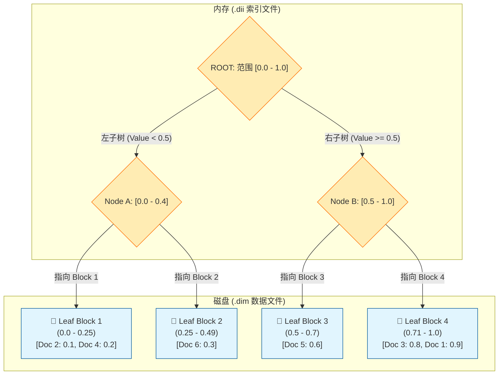

# Elasticsearch 实现 cozeloop 实验结果过滤

本文档深入探讨了在 Elasticsearch (ES) 中实现 cozeLoop 动态元数据过滤的方案，包括基于动态模板的索引设计、写入流程以及针对高性能列式读取的查询优化。

## 1. 索引结构

针对 cozeLoop 的业务特性，我们设计了如下支持动态 Map 映射的索引结构：

```json
PUT /expt_turn_result_filter
{
  "settings": {
    "number_of_shards": 3, 
    "number_of_replicas": 1,
    "refresh_interval": "1s"
  },
  "mappings": {
    "dynamic": "strict", 
    "_source": { "enabled": true },
    "properties": {
      -- 1. ID 类字段 (对应 CK String)
      "space_id": { "type": "keyword" },
      "expt_id":  { "type": "keyword" }, 
      "item_id":  { "type": "keyword" },
      "turn_id":  { "type": "keyword" },
      
      -- 2. 数值与状态 (对应 CK Int32)
      "item_idx": { "type": "integer" },
      "status":   { "type": "integer" },
      "evaluator_score_corrected": { "type": "integer" },

      -- 3. 核心难点：文本内容的 Map
      "eval_target_data": {
        "type": "object", 
        "dynamic": true,
        "properties": {
          "input": { 
            "type": "text", 
            "analyzer": "ik_max_word",
            "search_analyzer": "ik_smart",
            "fields": { "keyword": { "type": "keyword" } }
          },
          "actual_output": { 
            "type": "text", 
            "analyzer": "ik_max_word",
            "fields": { "keyword": { "type": "keyword" } }
          }
        }
      },

      -- 4. 核心难点：动态分数的 Map
      "evaluator_score": {
        "type": "object",
        "dynamic": true 
      },
      "annotation_float": {
        "type": "object",
        "dynamic": true
      },

      -- 5. 标注类 Map
      "annotation_bool": {
        "type": "object",
        "dynamic": true
      },
      "annotation_string": {
        "type": "object",
        "dynamic": true
      },

      -- 6. 时间字段
      "created_date": { "type": "date", "format": "yyyy-MM-dd" },
      "created_at":   { "type": "date", "format": "yyyy-MM-dd HH:mm:ss||strict_date_optional_time" },
      "updated_at":   { "type": "date", "format": "yyyy-MM-dd HH:mm:ss||strict_date_optional_time" },
      "eval_set_version_id": { "type": "keyword" }
    },

    -- 7. 动态模板
    "dynamic_templates": [
      {
        "scores_as_float": {
          "path_match": "evaluator_score.*",
          "mapping": { "type": "float" }
        }
      },
      {
        "annotations_as_float": {
          "path_match": "annotation_float.*",
          "mapping": { "type": "float" }
        }
      },
      {
        "bools_as_byte": {
          "path_match": "annotation_bool.*",
          "mapping": { "type": "byte" }
        }
      },
      {
        "strings_as_keyword": {
          "path_match": "annotation_string.*",
          "mapping": { "type": "keyword" }
        }
      },
      {
        "target_data_as_text": {
          "path_match": "eval_target_data.*",
          "mapping": {
            "type": "text",
            "analyzer": "ik_max_word",
            "fields": {
              "keyword": { "type": "keyword", "ignore_above": 256 }
            }
          }
        }
      }
    ]
  }
}
```

可以注意到：

1. `expt_id` 的类型是 `keyword`，方便等值查询，底层数据结构是倒排索引。
2. `evaluator_score`是 `object` 类型，并且 `"dynamic": true` 即可以往里面加未定义的key。每个key的类型都必须是 `float`，动态模板规定的。

---

## 2. 写入流程

写入时，ES 会根据 `dynamic_templates` 自动识别容器内的 key 并激活对应的底层数据结构。

```json
POST /expt_turn_result_filter/_doc/doc_correct_01
{
  "item_id": "item_1001",
  "expt_id": "2026020620370008",
  "status": 2,
  
  -- 容器 A: 文本内容（分词，支持全文检索）
  "eval_target_data": {
    "input": "请计算 1+1 等于几？",
    "actual_output": "答案是 2",
    "trace_log": "Calculation module invoked..."
  },

  -- 容器 B: 数值分数（BKD Tree，支持范围查询）
  "evaluator_score": {
    "accuracy": 1.0,
    "fluency": 0.95
  },

  -- 容器 C: 标签（Keyword，支持精确过滤与聚合）
  "annotation_string": {
    "category": "Math",
    "model_version": "v3"
  }
}
```

---

## 3. 查询与优化深度剖析

### 3.1 查BKD树

```json
GET /expt_turn_result_filter/_search
{
  "_source": ["item_id", "evaluator_score"], 
  "query": {
    "bool": {
      "filter": [
        {
          "range": {
            "evaluator_score.key1": { "gt": 0.5 }
          }
        }
      ]
    }
  }
}
```

#### 第一阶段：Query Phase (召回)

**任务**：找出符合 `gt: 0.5` 的文档 ID。

1.  **定位索引**：定位到 `evaluator_score.key1` 对应的物理索引文件（`.dim` / `.dii`）。
    
2.  **BKD Tree 加速**：ES 检查树节点，直接跳过最大值小于 0.5 的块，迅速提取目标 **Doc ID** 列表（如 `[1, 5, 8]`）。
    
3.  **高性能过滤**：由于在 `filter` 上下文中执行，此阶段无需计算相关性得分，且结果可缓存。
    

#### 第二阶段：Fetch Phase (取回)

**任务**：根据 ID 获取 `item_id` 和 `evaluator_score`。

1.  **物理定位**：拿着 Doc ID 查找 `_source` 字段索引，定位到磁盘偏移量。
    
2.  **加载数据块 (关键瓶颈)**：`_source` 以 Blob 压缩形式存储。ES 必须读取并解压包含该 Doc ID 的**整个压缩块**。
    
3.  **内存过滤**：在内存中解析完整的 JSON，提取目标字段，丢弃无关字段。
    

---

### 3.2 性能对比：ES vs ClickHouse

| 动作 | ClickHouse (列式存储) | Elasticsearch (行式存储 _source) |
| :--- | :--- | :--- |
| **筛选 (WHERE)** | 查稀疏索引，极快 | 查 BKD Tree，极快 |
| **读取指定列** | **仅读取对应列文件** | **必须解压整行 JSON** |
| **I/O 开销** | 极小 (按需加载) | 较大 (加载整行压缩块) |
| **网络开销** | 小 (仅传输所需列) | 小 (Server 端过滤后传输) |

---

### 3.3 进阶优化：模拟列式读取行为

为了解决 `_source` 带来的磁盘 I/O 冗余，我们可以绕过行存，直接读取列存文件（Doc Values）。

#### 优化后的查询 (模仿 ClickHouse)

```json
GET /expt_turn_result_filter/_search
{
  "_source": false, -- 彻底不读 _source (节省磁盘随机 I/O)
  "docvalue_fields": [ 
    "item_id",       
    "evaluator_score.key1",
    "evaluator_score.semantic" 
  ],
  "query": { ... }
}
```

**原理**： 通过 `docvalue_fields`，ES 在 Fetch 阶段不再解压大 JSON，而是直接从对应的 **Doc Values** 文件中读取数据。这真正实现了类似 ClickHouse 的列式读取行为，极大地提升了在高并发、大数据量场景下的查询性能。

---

### 3.4 查BKD树与倒排索引

> [!important] 
> Elasticsearch 最强大的机制之一：**多索引结构的并行求交集 (Index Intersection)**

```json
GET /expt_turn_result_filter/_search
{
  "_source": ["item_id", "evaluator_score"],
  "query": {
    "bool": {
      "filter": [
        { 
          "term": { "expt_id": "7597428938863804417" } 
        },
        { 
          "range": { "evaluator_score.key1": { "gt": 0.5 } } 
        }
      ]
    }
  }
}
```

#### 底层实现

这里发生了一件很有趣的事：查询不再是单线的，而是两条线同时进行（或者由代价更小的驱动）。

- (Inverted Index)： `expt_id` 是 `keyword` 类型。ES 去倒排索引里找 "7597..."，得到文档列表 A（比如 `Doc 1, Doc 2, Doc 3`）。
- BKD Tree)：key1 是 `float` 类型。ES 去 BKD 树里切分空间，得到文档列表 B（比如 `Doc 1, Doc 5`）。
- ES 对 A 和 B 做 **位图交集运算 (Bitwise AND)**。

---

### 3.5 性能为什么快？(Cost Optimization)

Elasticsearch 非常聪明，它不会傻傻地把两边的所有 ID 都找出来再做交集。它有一个 **Cost Estimator (代价估算器)**。

假设数据分布如下：
- 全表：1 亿条数据。
- `expt_id = '7597...'`：只有 **100 条**。
- `score > 0.5`：有 **5000 万条**。

**ES 的执行策略：**

1. **估算**：它发现 `expt_id` 的选择性（Selectivity）极高，过滤掉的数据最多。
2. **驱动**：它会先执行 `expt_id` 的倒排索引查找，拿到那 100 个 Doc ID。
3. **验证**：它**不会**去遍历那个 5000 万的 BKD 树结果。相反，它拿着这 100 个 ID，去 BKD 树里（或者 Doc Values 里）**验证**一下：
    - "Doc 1，你的分大于 0.5 吗？" -> 是 -> 保留。
    - "Doc 2，你的分大于 0.5 吗？" -> 否 -> 丢弃。
4. **结果**：计算量从“两个大集合求交集”瞬间降级为“小集合的验证”。

关于验证：

在doc_value里面验证我们很好理解，如果通过倒排索引或者bkd树拿到id的集合，可以直接利用doc_value的`id->value`的结构取出value进行验证。

但是**BKD 树（`.dim` 文件）** 本质上是一个“范围搜索”结构，它**不支持**直接问：“喂，Doc 1 的值是多少？”（它没有反向索引的能力）

那么，如果 Lucene 决定用 BKD 树来做验证（通常发生在没开 Doc Values 的情况下），它是怎么做到的呢？

答案是：**它不是在做“查值验证”，而是在做“快速集合求交” (Leapfrog / Advance)。**

BKD 树提供了一个**迭代器 (Iterator)**，这个迭代器只能输出满足 `> 0.5` 的文档 ID。Lucene 会让这个迭代器**“跳 (Advance)”** 到目标 ID。

---

### 3.6 BKD 树的验证过程：跳跃游戏 (Skip & Advance)

假设：
1. **候选集 (来自 expt_id)**：`[1, 100, 200]`（只有 3 个文档）。
2. **BKD 树范围**：`> 0.5`。

Lucene **不会**去遍历 BKD 树所有的叶子节点（那可能有几千万个 ID）。它会利用 BKD 树的**内部节点索引 (`.dii`)** 来加速寻找。

#### 具体步骤演示：

**目标**：验证 `Doc 1` 是否在 BKD 树的 `> 0.5` 集合里。

1. **查询 BKD 索引**：Lucene 拿到 BKD 树的迭代器，告诉它：“我要找 `> 0.5` 的文档”。
2. **尝试跳跃 (Advance to 1)**：Lucene 对 BKD 迭代器说：“你能不能跳到 **Doc 1**（或者第一个大于等于 1 的 ID）？”
3. **BKD 内部查找**：
    - BKD 树查看自己的根节点和中间节点（索引）：
        - “左子树（Block A）的值范围是 `0.0 - 0.4`” -> **不可能包含 > 0.5 的结果** -> **直接整枝剪掉**（不读取磁盘）。
        - “右子树（Block B）的值范围是 `0.6 - 1.0`” -> **可能包含**。
    - 它进入 Block B 的叶子节点。
    - 读取 Block B（磁盘 I/O），发现里面包含的 ID 列表是 `[1, 5, 8...]`。
4. **命中**：迭代器发现当前位置确实是 `1`。
    - **验证成功！** Doc 1 保留。

**目标**：验证 `Doc 100`。

1. **继续跳跃 (Advance to 100)**：Lucene 对 BKD 迭代器说：“下一个，跳到 **Doc 100**”。
2. **快速跳过**：
    - BKD 树利用索引结构，发现中间有一大堆 Block（比如 ID 2 到 99 的）虽然满足 `> 0.5`，但我们不需要。直接跳过这些 Block 的读取。
    - 它定位到可能包含 100 的 Block C。
    - 读取 Block C，发现 ID 列表是 `[98, 99, 101, 102]`。
3. **未命中**：迭代器跳到了 `101`（第一个大于等于 100 的值）。
    - 因为 `101 != 100`，所以 **Doc 100 不在 BKD 树的结果集里**。
    - **验证失败！** Doc 100 丢弃。


