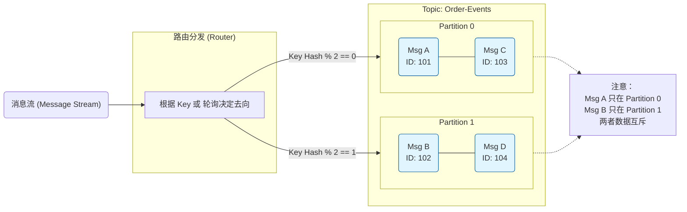

# Apache Kafka 深度剖析

## 1. 绪论：流式架构的范式转移与日志抽象

在现代分布式系统架构的演进历程中，数据处理的范式已经从传统的“静态数据处理”（Data at Rest）向“动态流式处理”（Data in Motion）发生了根本性的转移。Apache Kafka 作为这一范式转移的核心引擎，早已超越了其作为高吞吐量消息队列的初始定位，演变为一个云原生的分布式事件流平台。其核心设计哲学的根本性突破在于将“日志”（Log）这一看似原始的存储抽象提升为架构的一等公民，重新定义了分布式系统之间的数据交换方式。

本报告将以深度技术视角，对 Apache Kafka 进行全方位的解构。我们将不仅仅停留在其作为消息中间件的功能层面，而是深入到其存储引擎的二进制文件结构、操作系统内核级的 I/O 优化、基于 Raft 变种的共识机制以及复杂的分布式事务协议。通过对核心架构组件（Broker, Topic, Partition）、底层原理（零拷贝、页缓存、分层时间轮）、分布式一致性保障（ISR, LEO/HW, Leader Epoch）以及架构演进（从 ZooKeeper 到 KRaft，从本地存储到分层存储）的详尽分析，揭示 Kafka 如何在保证 ACID 特性的同时实现每秒百万级吞吐的工程奇迹，并客观剖析其设计中的内在局限性。

---

## 2. 核心拓扑架构与组件交互模型

Kafka 的架构设计实现了极致的水平扩展能力与高可用性，主要由 Controller、Broker、Producer 和 Consumer 四大核心组件构成。

> [!tip]
> Kafka 选择的是 CP

### 2.1 Controller：集群的大脑与元数据管理

在传统的 Zookeeper 模式下，Controller 是由集群中某一个 Broker 选举担任的；而在现代的 KRaft 模式下，Controller 演变为独立的 Quorum 节点。

Kafka 集群中会指定几个节点作为 **Controller Quorum**（控制器仲裁团）。这几个节点之间运行标准的 **Raft 算法**。它们选出一个 **Active Controller**。所有的元数据（Metadata Log）通过 Raft 复制给其他 Controller 节点。

- **职责定位**：负责管理集群元数据，包括分区 Leader 选举、Topic 增删、副本状态机维护等。
- **设计哲学**：Kafka 的元数据管理（Controller）是 **"强一致性 + CP模型 (强一致)"**。

> [!TIP] 
> 我们知道，RabbitMQ 的仲裁队列以及RocketMQ的 DLedger 模式都是基于 Raft 算法来实现“选主”和“数据同步”。而 Kafka 的 选主由 Controller 负责，数据同步由 ISR 负责。
> 但是，其实 Kafka 也有 Raft 算法的应用，即 Controller 的 Leader 的选举基于 Raft算法

### 2.2 Broker：消息存储与中转站

Broker 是 Kafka 集群的物理节点，负责数据的持久化与副本同步。

**补充：broker 与 分区的关系**

- **同一个 Broker 可以放同一个 Topic 的不同分区**
    - **场景：** 当 Topic 的分区数（Partition Count）大于集群的 Broker 数量时，必然会出现这种情况。例如：Topic 有 10 个分区，但只有 3 台 Broker，那么每台 Broker 平均会承载 3-4 个分区。
    - **目的：** 为了提高吞吐量（Throughput）。更多的分区意味着更高的并发读写能力，即使硬件资源（Broker 数量）有限。
- **同一个 Broker 不可以放同一个分区的多个副本（Replicas）**
    - **原因：** 副本是为了容灾（High Availability）。如果 Partition 0 的 Leader 和 Follower 都在 Broker 1 上，一旦 Broker 1 宕机，这个分区的两个副本同时丢失，容灾机制就失效了。Kafka 会强制将同一个分区的不同副本分散到不同的 Broker 上。

> [!TIP]
> 客户端只读 Leader
### 2.3 Producer：消息生产者

Producer 负责构建业务消息并发送给 Broker。

#### 2.3.1 发送模式与缓冲池

Kafka Producer 是线程安全的，其内部包含一个主线程和一个后台 I/O 线程（Sender Thread）。

- **Record Accumulator**：主线程将消息写入 `RecordAccumulator`（记录累加器）。这是一个以 TopicPartition 为 Key 的双端队列（Deque）集合。
    - **Batching（批处理）：** 消息被追加到对应分区的 `ProducerBatch` 中。当 Batch 达到 `batch.size`（默认 16KB）或等待时间超过 `linger.ms` 时，Batch 被视为“就绪”。
    - **BufferPool：** 为了避免频繁的 GC，Accumulator 使用 `BufferPool` 管理内存。它维护了一组固定大小（等于 `batch.size`）的 ByteBuffer，复用内存块。
- **Sender Thread**：Sender 线程不断轮询 Accumulator，找出就绪的 Batch。
    - **节点聚合：** 虽然 Batch 是按分区组织的，但 Sender 会将发往同一个 Broker 的多个 Batch 聚合成一个请求（ProduceRequest），大幅减少网络开销。
    - **In-flight Requests：** Sender 维护了每个 Broker 的 `max.in.flight.requests.per.connection`，控制并发度。如果开启幂等性，该值限制为 5 或更低以保证顺序 。

#### 2.3.2 分区策略与负载均衡

Producer 通过分区策略决定消息落入哪个 Partition。

- **Key-based Partitioning（按键分区）：** 生产者根据消息 Key 的哈希值选择分区。这对于需要保证特定实体（如用户 ID、订单 ID）的消息严格有序的业务场景至关重要。所有具有相同 Key 的消息将被路由到同一个 Partition，从而保证其处理顺序 。
- **Sticky Partitioning（粘性分区）：** 在没有 Key 的情况下，为了减少批次碎片化，Kafka 生产者会使用粘性分区策略，即在一段时间内将消息发送到同一个分区，待该批次填满或超时后再切换到下一个分区。这种策略显著提升了批处理效率和压缩率 。

### 2.4 Consumer：消息消费者

> [!TIP]
> Dumb Broker, Smart Consumer

对于 Kafka，消费者消费信息是通过**拉模式**

Consumer Group 是 Kafka 实现发布-订阅与队列模型统一的关键。**组内的 Consumer 协作消费 Topic 的所有分区**。

多个消费者组成一个消费者组，**消费者组内的所有消费者要消费完负责的 topic 里面的所有分区**。**一个分区只会被一个消费组内的某个消费者所消费**，防止出现重复消费的问题！但是**不同的组，可以消费同一个分区的数据**！

**补充：消费者组中的数量与分区的关系**

| **关系**                     | **状态描述**          | **建议**                                                         |
| -------------------------- | ----------------- | -------------------------------------------------------------- |
| **Consumers < Partitions** | **正常**。个别消费者负载更重。 | 如果消费跟不上（Lag 增加），优先增加消费者数量。                                     |
| **Consumers = Partitions** | **最优**。最高并发。      | 生产环境的理想目标配置。                                                   |
| **Consumers > Partitions** | **浪费**。多余的消费者空转。  | **不要这样配置**，除非作为备用节点（Standby）防止单点故障，但通常不需要（因为 Rebalance 会自动接管）。 |

#### 2.4.1 消费拉取模型与长轮询

**第一阶段：发起轮询 (Initiation)**
- 应用程序调用 `consumer.poll(Duration timeout)`。这是一个阻塞调用。
- 消费者首先检查自己的 **内部缓存（CompletedFetches）**。为了提高效率，消费者通常会预取（Prefetch）数据。

**第二阶段：发送拉取请求 (The Fetch Request)**
- 如果缓存为空，**Fetcher** 组件会根据当前分区的 **Last Consumed Offset**（上次消费到的偏移量）构建一个 `FetchRequest`。

**第三阶段：Broker 处理与长轮询**
- **长轮询机制:** 如果当前Offset之后没有新消息，Broker 不会立刻返回空结果，而是会**持有（Hold）** 这个请求，直到有新消息写入该分区（满足 `fetch.min.bytes`）或等待时间超过了设定的 `fetch.max.wait.ms`。

**第四阶段：反序列化与更新 (Deserialization)**
- 消费者收到 `FetchResponse` 后，会将二进制数据反序列化为对象。
- 消费者更新内存中的 **position**（下一次拉取的起始Offset），并将记录放入内部缓冲区，最终由 `poll()` 方法批量返回给用户代码。

#### 2.4.2 Rebalance 协议演进

**Rebalance 是将分区所有权从一个 Consumer 转移到另一个的过程**。

- **组协调器 (Group Coordinator)**：每个 Consumer Group 在服务端对应一个 Broker 作为 Coordinator。Consumer 通过发送 Heartbeat 维持成员资格。如果超时（`session.timeout.ms`）或未及时 Poll（`max.poll.interval.ms`），Coordinator 会将其踢出，触发 Rebalance 。
- **协议演进**：其协议经历了从“Eager”到“Incremental Cooperative”的重大演进 。现代的增量 Rebalance 协议允许在 Rebalance 过程中，消费者继续消费那些未被重新分配的分区，大大减少了 "Stop-the-World" 的时间。

**示例：**

1. **断开连接：** 消费者进程崩溃或网络断开。
2. **停止心跳：** 消费者不再向 Broker 的 **Group Coordinator（组协调器）** 发送心跳。
3. **等待超时 (`session.timeout.ms`)：** Coordinator 不会立即行动，它会等待，直到超时时间（默认 10秒或 45秒，取决于版本）过去。
4. **判定死亡：** Coordinator 判定该消费者已死。
5. **触发重平衡 (Rebalance)：**
    - Coordinator 通知组内其他存活的消费者：“有人挂了，大家重新分配分区（Partition）”。
    - 挂掉的消费者负责的 Partition 被分配给新的消费者。
6. **消息重发（重复消费）：**
    - 新的消费者从 Broker 获取该 Partition 的 **Last Committed Offset**（最后提交的偏移量）。
    - 因为挂掉的消费者还没来得及提交 Offset，新消费者会**重新拉取**那批消息并重新消费。

---

## 3. 消息存储引擎底层原理

Kafka 的高性能在于其独特且精细优化的存储设计。它将“日志”这一抽象提升为存储的一等公民。理解 Topic、Partition 与 Log Segment 的层级关系及其底层的二进制布局，是掌握 Kafka 数据流转机制的前提。

### 3.1 逻辑模型：Topic 与 Partition 的设计哲学

在逻辑层面，**Topic 是数据流的分类容器**，而 **Partition（分区）则是并行处理与物理分布的基本单元** 。这种设计体现了分治思想在分布式存储中的典型应用。

#### 3.1.1 仅追加日志（Append-Only Log）

Kafka 将 Topic 抽象为一个无限增长的、仅追加的日志序列。Topic 本身是一个逻辑概念，实际上由多个 Partition 组成。每个 Partition 是一个有序的、不可变的消息序列，新消息总是被追加到日志的末尾 。

- **有序性保证：** Kafka 仅保证 Partition 内部的消息顺序（Offset 顺序），而不保证跨 Partition 的全局顺序。Offset 是一个单调递增的 64 位整数，唯一标识分区内的一条消息 。
- **不可变性：** 一旦写入，消息即不可变。这种设计极大地简化了并发控制，因为读写操作可以解耦：写操作只发生在尾部，而读操作可以发生在任意位置，无需复杂的锁机制 。

### 3.2 物理存储：日志段（Log Segment）的内部结构

在物理磁盘层面，Partition 并非作为一个单一的大文件存储，因为这将导致文件过大而难以维护（如清理过期数据）。Kafka 采用分段存储策略，将一个 Partition 的日志切分为多个 Segment（段）。

#### 3.2.1 目录层级与文件命名

每个 Partition 在 Broker 的数据目录下对应一个子目录，命名规则为 `<topic_name>-<partition_id>`。在该目录下，日志被分割为**一系列**的 Log Segment 文件。每个 Segment 由一组文件组成，文件名通常是该 Segment 中第一条消息的 Base Offset（基准偏移量），左补零至 20 位数字 。 例如，如果一个 Segment 从 Offset 1000 开始，其文件名可能为 `00000000000000001000.log`。这种命名方式使得 Broker 可以通过文件名快速定位任意 Offset 所在的 Segment。

#### 3.2.2 核心文件类型详解

一个 Log Segment 主要包含以下几类文件 ：

| **文件扩展名**      | **作用与内容**                                           | **数据结构特点**                              |
| -------------- | --------------------------------------------------- | --------------------------------------- |
| **.log**       | 存储实际的消息数据（Record Batch）。                            | 顺序追加的二进制流，包含 Header 和 Payload。          |
| **.index**     | **Offset 索引**：映射 Offset 到.log 文件中的物理字节位置（Position）。 | 稀疏索引，固定 8 字节条目（4B 相对 Offset + 4B 物理位置）。 |
| **.timeindex** | **时间索引**：映射时间戳到 Offset。                             | 稀疏索引，固定 12 字节条目（8B 时间戳 + 4B 相对 Offset）。 |
| **.snapshot**  | **生产者状态快照**：存储幂等性生产者的序列号（PID, Sequence Number）状态。   | 用于 Broker 重启后恢复去重状态，防止重复消息。             |
| **.txnindex**  | **事务索引**：存储中止事务（Aborted Transaction）的 Offset 范围。    | 仅在开启事务功能时存在，消费者据此过滤未提交消息。               |

### 3.3 索引机制：稀疏索引与二分查找

Kafka 的索引设计体现了空间换时间与 I/O 效率的极致权衡。不同于数据库的 B+ 树或哈希索引，Kafka 采用**稀疏索引（Sparse Index）** 机制 。

#### 3.3.1 稀疏索引设计原理

Kafka 并不为每条消息都建立索引条目，而是由 `log.index.interval.bytes` 参数（默认 4KB）控制索引密度。每当 `.log` 文件写入的数据量跨越 4KB 边界时，才会向 `.index` 和 `.timeindex` 文件追加一条索引记录 。

- **内存友好：** 由于是稀疏的，索引文件非常小（例如 1GB 的日志可能仅对应几 MB 的索引）。这意味着在生产环境中，所有的索引文件几乎可以完全驻留在操作系统的页缓存（Page Cache）中，避免了索引查询时的磁盘 I/O。
- **相对偏移量：** `.index` 文件中存储的是**相对 Offset**（Relative Offset = 真实 Offset - Base Offset）。这使得 4 字节的整数即可表示 Segment 内的偏移量，节省了 50% 的空间（相比 8 字节绝对 Offset）。

#### 3.3.2 消息查找流程

当消费者请求读取 Offset 为 $X$ 的消息时，Broker 执行以下步骤 ：

1. **定位 Segment：** 在内存中的 `ConcurrentSkipListMap`（或其他类似结构）中，根据 Base Offset 查找 $X$ 所属的 Segment。
2. **查找索引：** 在该 Segment 的 `.index` 文件中，使用二分查找算法找到小于或等于 $X$ 的最大索引条目。假设找到的条目为 `(Offset: Y, Position: P)`。
3. **顺序扫描：** Broker 从 `.log` 文件的物理位置 $P$ 开始，顺序扫描并反序列化消息头，直到找到 Offset 为 $X$ 的消息。由于稀疏间隔通常很小（4KB），这段顺序扫描的开销在内存或磁盘顺序读中几乎可以忽略不计。

### 3.4 极致的 IO 优化与内存管理

Kafka 之所以能达到单节点每秒百万级的写入吞吐量，并非依赖于复杂的内存数据结构（如堆内缓存），而是深入利用了操作系统内核的特性，将磁盘 I/O 和网络传输优化到了极致。

#### 3.4.1 顺序 I/O 与磁盘机制

传统数据库或消息队列常面临随机 I/O 的瓶颈（磁头频繁寻道）。Kafka 强制采用 **Append-Only** 模式，将所有的写操作转化为磁盘的顺序 I/O 。

- **物理性能差异：** 在机械硬盘（HDD）上，顺序写的速度（约 600MB/s）比随机写速度（约 100KB/s）快数千倍，甚至可以**媲美随机内存访问的速度** 。即便是 SSD，顺序写也能避免写放大（Write Amplification）效应，延长设备寿命并保持稳定的高性能。
- **写路径优化：** Broker 在接收到 Producer 的数据后，将其顺序追加到当前活跃 Segment 的末尾。这种访问模式完美契合了现代磁盘控制器的预读（Read-Ahead）和写缓存（Write-Back）策略。

#### 3.4.2 Page Cache 与内存管理

Kafka 的设计中有一个反直觉的决策：不在 JVM 堆内维护数据缓存。相反，它**完全依赖操作系统的 Page Cache** 。

1. **避免 GC 开销：** 如果 Kafka 在 JVM 堆内缓存几十 GB 的数据，垃圾回收（GC）将成为噩梦，导致严重的 STW 停顿。利用 Page Cache，数据由 OS 管理，不占用 JVM 堆内存，完全没有 GC 负担 。
2. **内存利用率：** JVM 对象头和填充会带来巨大的内存膨胀（通常对象大小是实际数据的 2 倍以上）。Page Cache 直接存储紧凑的二进制页，利用率极高。
3. **进程重启不丢缓存：** 如果服务重启，进程内缓存会消失，需要预热。而 Page Cache 属于操作系统，只要服务器不重启，Kafka 进程重启后依然可以直接利用热缓存 。

#### 3.4.3 零拷贝 (Zero-Copy) 网络传输

在消费者拉取数据或 Follower 同步数据时，Kafka 利用 Linux 的 `sendfile` 系统调用实现了零拷贝，彻底消除了 CPU 在用户态和内核态之间的数据拷贝开销 。

这种机制使得 Kafka 的数据传输不消耗 CPU 资源（CPU 利用率极低），吞吐量仅受限于磁盘带宽和网络带宽。

> [!tip] 零拷贝机制
> - **传统模式：** `read()` (Disk -> Kernel Buf -> User Buf) + `write()` (User Buf -> Socket Buf -> NIC)。涉及 4 次上下文切换和 4 次数据拷贝。
> - **零拷贝模式（sendfile）：** `sendfile()` 系统调用指令内核直接将数据从 Page Cache（Read Buffer）传输到网卡缓冲区（NIC Buffer）。
>     - **DMA 参与：** 数据通过 DMA 从磁盘加载到 Page Cache。
>     - **Scatter-Gather DMA：** 如果网卡支持 SG-DMA，CPU 甚至不需要将数据从 Read Buffer 拷贝到 Socket Buffer，只需拷贝文件描述符和长度信息。数据直接由 DMA 从 Page Cache 传输到网卡 。

### 3.5 消息二进制布局：RecordBatch

Kafka 的消息存储格式经历了多次迭代，目前的 V2 格式（引入于 Kafka 0.11）采用了 **Record Batch**（记录批次）的设计，显著提升了处理效率 。

#### 3.5.1 Record Batch 二进制结构

在 V2 格式中，消息不再被单独存储，而是总是以 Batch 的形式存在。即便只有一条消息，也是一个包含一条记录的 Batch。

- **Batch Header（61 字节）：** 包含 Base Offset、Base Timestamp、Partition Leader Epoch、Producer ID (PID)、Producer Epoch、Base Sequence 等元数据。
- **Records：** 批次内的消息体。每条消息使用变长整数（Varint）编码，并存储相对于 Batch Header 的 Delta Offset 和 Delta Timestamp。

这种设计的优势在于：

1. **公共字段提取：** 以前每条消息都重复存储的元数据（如 CRC、绝对 Offset、绝对时间戳）现在被提升到 Batch Header 中，大幅减少了小消息的存储开销。
2. **整体压缩：** 压缩是针对整个 Batch 的 Payload 进行的。由于批次内的数据通常具有上下文相关性，整体压缩的压缩比远高于单条消息压缩 。
3. **零拷贝兼容：** 磁盘上的二进制格式与网络传输格式完全一致，为零拷贝技术的应用奠定了基础。

---

## 4. 高可用与分布式协调架构演进

作为分布式系统，Kafka 必须在节点故障、网络分区等不确定性中保证数据的一致性（Consistency）和持久性（Durability）。本章将深入剖析数据平面（副本同步）与控制平面（元数据管理）的演进。

### 4.1 数据一致性协议：ISR、HW 与 LEO

Kafka 的数据平面采用基于主从复制模型，但引入了 ISR (In-Sync Replicas) 机制来平衡可用性与一致性 。

#### 4.1.1 LEO 与 HW

- **LEO (Log End Offset):** 每个 Follower 的日志末端下一条将要写入消息的 Offset。
- **HW (High Watermark):** 高水位标记。$HW = \min(\text{All ISR LEOs})$。HW 之前的数据被认为是“已提交”（Committed）的，对消费者可见。

假设没有 HW，消费者直接读 LEO：

1. **Leader (LEO=10)**：写入了消息 10，还没同步给 Follower。
2. **Consumer**：读取了消息 10。
3. **Leader 挂了**。
4. **Follower (LEO=9)**：当选为新 Leader（因为它只有 9 条数据）。
5. **Consumer**：再次请求数据，发现消息 10 没了！
    - _后果：_ 刚才还读得到的数据，突然消失了。这就是“数据回滚/丢失”**，对于金融或订单系统是灾难。

> [!TIP]
> Kafka 规定：**Consumer 只能读到 HW 之前的数据。** HW 的位置 = ISR 中所有副本的**最小 LEO**

#### 4.1.2 ISR 动态伸缩

ISR 是一个动态集合，包含 Leader 和所有与 Leader 保持同步的 Follower。

- **收缩：** 如果 Follower 落后太多（`replica.lag.time.max.max.ms`），Leader 会将其踢出 ISR。
- **扩展：** 当 Follower 追上 Leader 的 LEO 后，重新加入 ISR。
- **写语义：** 当 `acks=all` 时，只有 ISR 中**所有**副本都写入成功，Leader 才会向 Producer 确认。这保证了只要 ISR 中至少有一个节点存活，数据就不会丢失。

### 4.2 架构修补：Leader Epoch

在 Leader Epoch 出现之前，Follower 判断“该保留多少数据，该删多少数据”完全依赖 HW。

**逻辑漏洞在于：HW 的更新是滞后的（异步的）。** Leader 只有在所有 ISR 都写完后，才会更新 HW，并在下一次响应 Follower 时把新的 HW 告诉它。如果 Leader 在这两个动作之间**突然暴毙**，Follower 手里的 HW 就是**旧的**。

**场景复现：数据丢失（截断过多）**

假设有两个节点：Partition A（Leader）和 Partition B（Follower）。

1. **正常状态：** A 和 B 都有消息 `[Msg0, Msg1]`。
    
    - 但 B 的 HW 还停留在 0（因为 A 还没来得及通知 B HW=1）。
        
2. **B 宕机又重启：**
    
    - B 重启后，发现自己硬盘上有 `Msg1`，但自己的 HW 是 0。
    - 按照老规则：**“HW 之后的数据都是不可信的”**。
    - B 只要一重启，就会**立刻把 HW（0）后面的 `Msg1` 删掉（截断）**。
        
3. **同时 A 宕机：**
    
    - 这时候 B 成了唯一的幸存者，被迫当选 Leader。
    - 但是 B 刚才已经把 `Msg1` 删了！
    - **结果：`Msg1` 永久丢失。

**解决方案：引入 Leader Epoch**

Kafka 从 0.11 版本开始引入了 Leader Epoch。你可以把它理解为“皇帝的年号”。

它不再单纯看“Offset 到了多少”，而是看“在这个年号（Epoch）里，你写到了多少”。 结构变成了这样：`(Epoch, StartOffset)`。

- **Epoch 0**: 从 Offset 0 开始。
- **Epoch 1**: 从 Offset 100 开始。
    

**Leader Epoch 如何解决上面的问题？**

我们回到刚才的场景，看看有了 Epoch 会发生什么：

1. **正常状态：**
    
    - Leader A (Epoch 0) 写了 `Msg1`。
    - Follower B (Epoch 0) 也有 `Msg1`。
    - B 的 HW 依然是 0（滞后）。
        
2. **B 宕机又重启：**
    
    - B 不再查看 HW 了！它看了一眼自己的 Leader Epoch 缓存文件，发现自己处于 **Epoch 0**。
    - 它**不会**盲目删除数据。
    - 它向当前的 Leader（假设 A 还在）发请求：**“请问皇上（A），Epoch 0 这一朝代，最后一条数据是第几条？”**
        
3. **A 回复：**
    
    - “Epoch 0 还在继续呢，我现在写到了 Offset 1（LEO）。”
        
4. **B 的决定：**
    
    - B 发现自己也有 Offset 1。
    - **结论：** “原来我的数据是合法的，不需要删除。”
    - **结果：`Msg1` 被保住了。**

### 4.3 控制平面革命：从 ZooKeeper 到 KRaft (KIP-500)

长期以来，Kafka 依赖 ZooKeeper (ZK) 进行元数据存储和控制器选举。KIP-500 引入的 KRaft 模式是 Kafka 历史上最大的架构变革，旨在彻底移除 ZK 依赖 。

#### 4.3.1 传统元数据管理的瓶颈

在 ZK 模式下，Controller 负责监听 ZK 变更并将其推送到所有 Broker。

1. **扩展性受限：** Controller 成为单点瓶颈。当集群分区数超过 20 万时，Controller 的元数据加载和推送延时变得不可接受，导致 Broker 启动缓慢 。
2. **脑裂风险：** Controller 内存状态与 ZK 持久化状态可能因网络问题出现不一致。
3. **运维复杂：** 需要维护两套异构系统。

#### 4.3.2 KRaft 架构：元数据即日志 (Metadata as a Log)

KRaft 将集群元数据（Broker 列表、Topic 配置、ISR 等）视为一个**事件流**，存储在内部 Topic `__cluster_metadata` 中 。

- **Quorum Controller：** 一组 Controller 节点（通常 3 个）组成 Raft Quorum，选举出一个 Active Controller。它们负责维护元数据 Log 的一致性。
- **Broker 行为：** 普通 Broker 不再被动等待 Controller 推送（Push）更新，而是作为 **Observer** 主动从 Active Controller 拉取（Fetch）元数据 Log。这利用了 Kafka 原生高效的日志复制机制 。

**性能质变：**
- **极速恢复：** 当 Controller 故障切换时，新 Controller 已经在内存中拥有最新的元数据（因为它是 Raft Follower），无需从磁盘重新加载，切换时间达到毫秒级。
- **百万级分区：** 消除 ZK 瓶颈后，KRaft 集群支持的分区数可轻松突破百万级别 。
- **快照机制：** 为了防止元数据 Log 无限增长，KRaft 定期生成快照（Snapshot），仅保存当前状态的影像，便于新节点快速同步 。

---

## 5. 高级消息特性实现原理

Kafka 不仅仅是管道，其事务与延时调度机制在底层也有精妙设计。

### 5.1 幂等性与 Exactly-Once 语义 (EOS)

Kafka 的事务机制实现了流处理中梦寐以求的“端到端精确一次”（End-to-End Exactly-Once）语义 。

#### 5.1.1 幂等生产者 (Idempotent Producer)

通过分配 PID (Producer ID) 和序列号（Sequence Number），Broker 可以自动去重。如果收到重复序列号（例如网络重试导致），Broker 会直接丢弃，并不向 Log 写入。但这仅限于单分区、单会话的幂等。

**例如：**

当 Broker 收到一条消息 `(PID=100, Seq=5)` 时，它会检查内存中记录的 `PID=100` 的当前序列号：

- **情况 A（正常）：** 内存里记录的是 `4`。
    - `Received(5) == Last(4) + 1`
    - **通过**。写入消息，更新内存为 `5`。
- **情况 B（重复 - 对应上面的网络故障，生产者底层SDK重试）：** 内存里记录的已经是 `5` 了（因为上次其实写成功了）。
    - `Received(5) <= Last(5)`
    - **拒绝写入**。Broker 直接返回 `Ack`（告诉生产者：“我知道了，别发了”），但**不**往磁盘里写重复数据。
- **情况 C（乱序/漏发）：** 内存里记录的是 `3`。
    - `Received(5) > Last(3) + 1`
    - **报错**。说明中间缺了 `Seq=4` 的消息，发生了乱序。

**限制 1：单分区 (Single Partition)**

- **原因**：序列号是跟着分区走的。
- **解释**：如果你发消息给 Partition A，序列号是 0, 1, 2；发给 Partition B，序列号也是 0, 1, 2。Broker 无法跨分区判断“这条发给 A 的消息”和“那条发给 B 的消息”是不是重复的。
- **后果**：幂等性只能保证在**同一个分区**内不重复。
    

**限制 2：单会话 (Single Session)**

- **原因**：PID 是临时的。
- **解释**：如果你的生产者**进程挂了**（重启），它重新启动后，会向 Broker 申请一个新的 PID（比如从 `100` 变成了 `200`）。
- **后果**：Broker 并不认识这个新的 `PID=200`，它会把 `PID=200` 发来的 `Seq=0` 当作新消息处理。
    - 如果之前 `PID=100` 已经发过同样的内容，Broker 无法识别出它们是重复的，因为“身份证”变了。

如果我希望**即使生产者重启**，Broker 也能去重，怎么办？

这就需要 **Kafka 事务（Transactions）**，也就是 `Transactional ID`。

- 你需要手动配置一个固定的 `transactional.id`（比如 "order-service-01"）。
- 这样，即使生产者重启，它会告诉 Broker：“我是之前那个 order-service-01”。
- Broker 会把旧的 PID 和新的进程关联起来，从而恢复之前的序列号上下文，实现**跨会话的幂等性**。

### 5.2 分布式事务协议 (Transaction Protocol)

Kafka 事务允许 Producer 将跨多个 Topic、多个 Partition 的写入操作原子化：要么全部成功可见，要么全部不可见。这基于改进的**两阶段提交（2PC）** 协议 。

**核心组件：**
- **Transaction Coordinator:** 每个 Transactional ID 绑定一个 Broker 上的 Coordinator。
- **Transaction Log (`__transaction_state`):** 一个内部 Compacted Topic，持久化事务状态。

**协议流程详解：**
1. **开启事务：** Producer 调用 `initTransactions()` 注册 ID，获取 PID 和 Epoch。
2. **消费-处理-生产：**
    - Producer 发送 `AddPartitionsToTxn` 将目标分区注册到 Coordinator。
    - Producer 正常发送消息到目标分区，但这些消息在 Log 中带有“未提交”标记。
    - Producer 发送 `AddOffsetsToTxn` 将源 Topic 的消费 Offset 提交请求也纳入事务。
3. **提交/回滚 (EndTxn)：** Producer 发起 `EndTxnRequest`。
4. **两阶段提交：**
    - **Phase 1 (Prepare):** Coordinator 将 `PREPARE_COMMIT` 记录写入 `__transaction_state`。一旦写入成功，事务即不可逆转。
    - **Phase 2 (Commit):** Coordinator 向所有参与的分区（包括业务分区和 `__consumer_offsets`）写入 **Transaction Marker**（控制消息）。
    - **Complete:** 写入 Marker 后，事务结束。

**读隔离：** `read_committed` 模式的 Consumer 会缓存消息，直到读取到 Commit Marker 才将数据交给应用；如果读到 Abort Marker，则丢弃对应数据 。

### 5.3 延时任务管理：分层时间轮 (Timing Wheels)

Kafka 内部有大量需要延时处理的操作，例如 Delayed Produce 和 Delayed Fetch。为了高效管理成千上万个并发的延时请求，Kafka 摒弃了传统的 `DelayQueue`（插入/删除复杂度 $O(\log N)$），而是实现了 **分层时间轮（Hierarchical Timing Wheels）** 算法 。

#### 5.3.1 算法原理

时间轮类似于一个时钟表盘，由一个环形数组组成，每个槽位（Bucket）代表一个时间跨度（如 1ms）。

- **O(1) 复杂度：** 插入任务只需计算 `(Expiration / TickMs) % WheelSize` 即可定位槽位，时间复杂度为 $O(1)$。
- **分层设计：** 当任务的到期时间超过当前时间轮的范围时（溢出），该任务会被放入上一层时间粒度更粗的时间轮（如第一层 1ms/格，第二层 20ms/格）。
- **降级（Reinsertion）：** 随着时间推移，高层时间轮中的任务会逼近到期时间，此时它们会被取出并重新插入到底层时间轮中进行精确调度。
- **驱动机制：** 只有当时间轮的指针发生移动（即有 Bucket 到期）时，才会有线程唤醒处理，避免了空轮询 。

---

## 7. 系统局限性与工程挑战

尽管 Kafka 架构强大，但在特定场景下仍存在明显的局限性。深入理解这些边界对于系统设计至关重要。

### 7.1 延时消息的架构缺失

Kafka 的设计核心是 FIFO 队列，原生不支持“发送一条消息，10分钟后对消费者可见”的功能 。Log 结构的不可变性和连续性使得在 Log 中间插入“跳过”或“隐藏”逻辑极其复杂且影响零拷贝性能。 

**常见变通方案：** 使用外部时间轮服务、多级延时 Topic 或结合 Redis 进行调度 。

### 7.2 冷读与页缓存污染 (Page Cache Pollution)

这是 Kafka 性能最脆弱的一环。当有滞后严重的消费者（Lagging Consumer）开始大量读取旧数据时，操作系统为了加载旧数据，会将页缓存中的热数据（Producer 刚写入的数据）淘汰 。

- **后果：** 紧跟 Leader 的实时消费者被迫去读磁盘，写入线程也因磁盘 I/O 争抢被阻塞。整个集群的吞吐量可能瞬间暴跌，引发雪崩效应。
- **应对：** 尽管 `madvise` 等系统调用可用于优化，但目前 Kafka 原生尚无完美的冷热隔离机制（除了 Tiered Storage 能将冷读 I/O 转移到网络）。新一代流系统（如 AutoMQ）尝试通过 Direct I/O 绕过页缓存来解决此问题 。

### 7.3 资源限制与大集群挑战

尽管 KRaft 提升了逻辑扩展性，但物理资源仍有上限。

- **文件描述符：** 每个 Partition 至少占用 3 个文件句柄。3 万个分区即意味着近 10 万个句柄，需大幅调整 OS 的 `ulimit` 。
- **mmap 限制：** 索引文件使用内存映射。Linux 的 `vm.max_map_count` 默认限制较小（约 65530），这是单机分区数的硬伤，必须调优 。

---

## 8. 结论

Apache Kafka 通过对“日志”这一抽象的极致运用，结合操作系统内核级的 I/O 优化，定义了现代流处理的工业标准。从 ZooKeeper 向 KRaft 的演进，标志着其向支撑百万级分区的云原生架构迈出了决定性的一步。尽管在冷热隔离和原生延时功能上仍有挑战，但 Kafka 依然是处理每秒百万级事件流的首选基石。