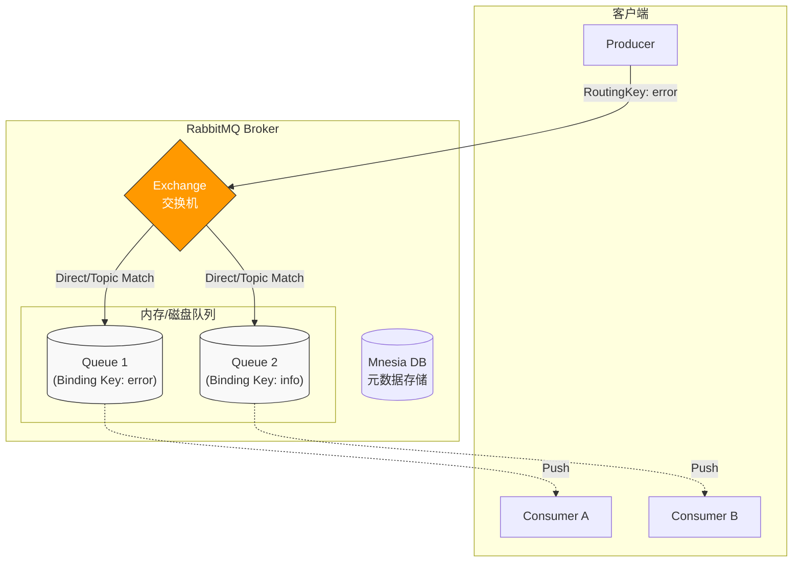
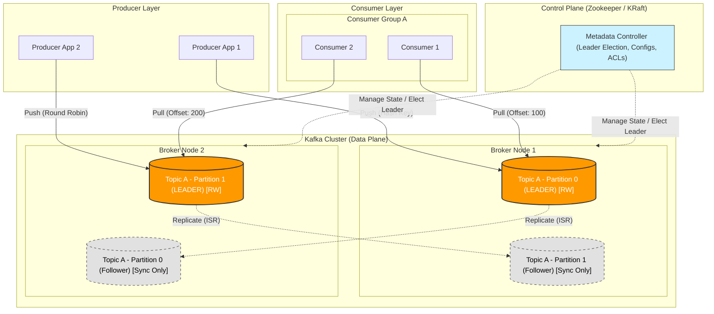

# MQ 对比

# 1. 核心差异

- **RabbitMQ** 像一个精密的**路由器**（侧重逻辑与即时响应）。
- **Kafka** 像一根巨大的**输油管**（侧重吞吐与流处理）。
- **RocketMQ** 像一个**金融级账本**（侧重业务稳定性、事务与 Java 生态）。

| **特性**   | **RabbitMQ**          | **RocketMQ**          | **Kafka**             |
| -------- | --------------------- | --------------------- | --------------------- |
| **开发语言** | Erlang (黑盒，难定制)       | **Java** (适合你，源码可控)   | Scala/Java            |
| **设计定位** | 高并发、低延迟、复杂路由          | 金融级高可靠、分布式事务          | 超高吞吐、日志收集、流计算         |
| **消息模式** | 智能 Broker，傻瓜 Consumer | 傻瓜 Broker，智能 Consumer | 傻瓜 Broker，智能 Consumer |
| **单机吞吐** | 万级 (~1-2w)            | 十万级 (~10w+)           | 百万级 (极限吞吐)            |
| **延迟**   | **微秒级** (极低)          | 毫秒级                   | 毫秒级                   |
| **可用性**  | 主从架构 (非强一致)           | 主从/Dledger (支持强一致)    | 分区副本机制 (强一致)          |
| **功能特色** | Exchange 灵活路由、优先队列    | **事务消息**、延时消息、重试      | 批处理、流式处理              |

## 2. 架构对比

- **RabbitMQ (模型: Exchange + Queue):** 消息先发给“交换机”，交换机根据规则（Routing Key）把消息**Push**（推）给内存中的队列。消费者通常是被动接收。一旦消费确认，消息即删除（不做持久化存储供回溯）。
- **RocketMQ/Kafka (模型: Log + Offset):** 消息直接**Append**（追加）到磁盘文件的末尾（顺序写）。消费者主动**Pull**（拉）消息，并记录自己读到了哪里（Offset）。消息消费后不会删除，而是过期清除。

rabbimq：

逻辑重于存储。它假设消息应该被快速消费掉，而不是堆积。 **类似于：** 传统的网络交换机（Switch）。

- **Exchange (交换机)：** 这是 RabbitMQ 最大的特色。生产者**不直接**把消息发给队列，而是发给交换机。交换机没有任何存储能力，它只负责“查表路由”（类似于 Hash Map 查找）。因此如果没有任何队列与Exchange绑定，或者没有符合路由规则的队列，那么消息会丢失！
	- 交换机的类型有四种：
	- **Fanout**：广播，将消息交给所有绑定到交换机的队列
	- **Direct**：订阅，基于RoutingKey（路由key）发送给订阅了消息的队列
	- **Topic**：通配符订阅，与Direct类似，只不过RoutingKey可以使用通配符
	- **Headers**：头匹配，基于MQ的消息头匹配，用的较少
	    
	- **Mnesia：** RabbitMQ 使用 Erlang 自带的分布式数据库 Mnesia 来维护集群元数据（用户、vhost、队列绑定关系）。
    
- **流转路径：** 消息 -> Exchange -> (匹配 Binding Key) -> Queue。
    
- **瓶颈：** 队列是基于 Erlang 轻量级进程的。如果消息大量堆积，RabbitMQ 会将消息换页（Page Out）到磁盘，性能会断崖式下跌。

Kafka 架构：基于文件的“分布式日志系统”

**核心理念：** 吞吐量至上。一切为了利用磁盘的**顺序读写（Sequential I/O）**。

Kafka 的宏观架构由 **Control Plane（控制面）** 和 **Data Plane（数据面）** 组成。

- **Broker：** Kafka 集群中的一台服务器，存储数据的物理节点。
- **Topic (逻辑概念)：** 消息的分类（比如 `ticker_data`，`order_logs`）。Topic 有两个核心属性。**分区数量 (Partition Count)：** 决定了 Topic 如何“切片”。**副本因子 (Replication Factor)：** 决定了每个切片在集群中有多少个备份。如果有一个拥有 10 个 Broker 的集群，并创建一个有 10 个分区的 Topic，Kafka 会尽可能将这 10 个分区均匀分布在 10 台机器上。
- **Partition（物理概念）：**
	- 一个 Topic 被切分为多个 Partition（分片）。
	- **这是并行度的单位**。如果你有 10 个 Partition，理论上你可以有 10 个 Consumer 同时消费，互不干扰。
	- 每个 Partition 对应操作系统上的一个**目录**。
- Consumer Group (消费组)：组内的消费者通过**抢占 Partition** 来实现负载均衡。同一个 Partition 只能被同一个组内的一个 Consumer 消费（防止乱序）
- **Leader/Follower：** 高可用机制。Leader 负责读写，Follower 负责同步数据。
- **Zookeeper / KRaft：**
	- 旧版 Kafka 强依赖 ZK 做元数据管理（Controller 选举、Topic 配置）。
	- 新版（2.8+）引入了 **KRaft**（Kafka Raft），移除了 ZK 依赖，由 Kafka 内部节点通过 Raft 协议自己选主，元数据管理更高效。

交叉分布 (Cross Distribution)：
- `Broker 1` 持有 **Partition 0 的 Leader**，同时它是 **Partition 1 的 Follower**。
    
- 这种设计保证了如果 `Broker 1` 宕机，`Broker 2` 上的 `Partition 0 (Follower)` 会被 Controller 迅速提升为 Leader，服务不中断。

- **读路径 (实线箭头)：**
    
    - Consumers（消费者）默认也只从 **橙色的 Leader 节点** 拉取数据。
        
    - _注：Kafka 2.4+ 引入了 Follower Fetching，允许从 Follower 读，但默认仍是 Leader。_
        
- **复制路径 (虚线箭头)：**
    
    - 灰色的 **Follower** 节点是被动的。它们不断向 Leader 发送 Fetch 请求，把数据拉回到本地磁盘。
        
    - 只有跟得上 Leader 的 Follower 才能留在 **ISR (In-Sync Replicas)** 集合中。