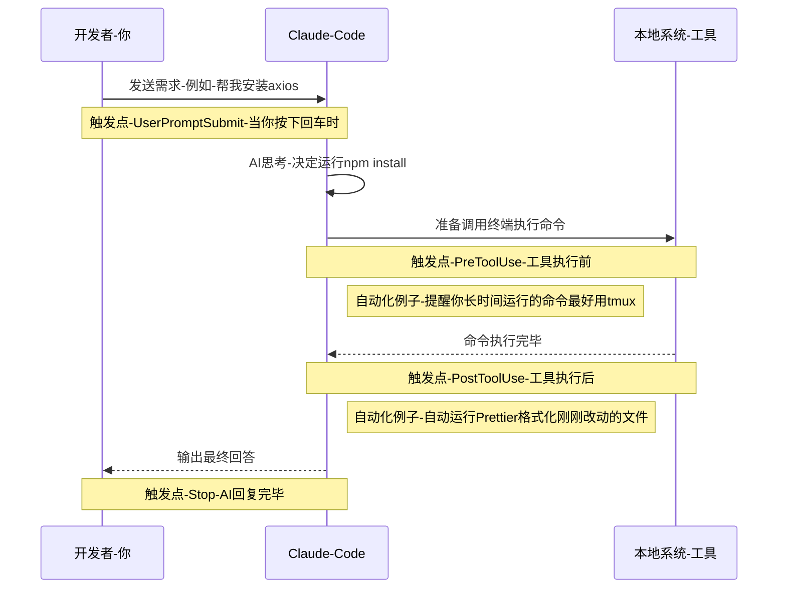

skill 和 command 什么区别？

简单来说，**Skill（技能）是 AI 的“被动触发工作流”，而 Command（命令）是你的“主动快捷按键”。**

### 1. 触发方式 (Trigger)

- **Skills (技能)**：**由 Claude 自动感知并触发。** 你把它放在 `~/.claude/skills` 目录下，相当于给了 Claude 一本“操作手册”。在对话过程中，当 Claude 觉得当前的上下文适合使用某项技能时（比如你完成了某个模块的开发），它会**自行决定**调用这个技能去执行任务。
- **Commands (命令)**：**由你手动、显式地触发。** 它们存储在 `~/.claude/commands` 目录下，通常以斜杠开头（比如 `/refactor` 或 `/test`）。只有当你真正在输入框敲下这个命令时，Claude 才会立刻按照预设的提示词去执行。
    

### 2. 核心定位 (Scope & Purpose)

- **Skills (更宏观、更复杂)**：它定义的是一整套 **Workflow（工作流）**。
    - _结合你读到的例子：_ `codemap-updater` 是一个技能。这意味着你告诉了 Claude：“当你完成一个阶段的代码编写后（at checkpoints），你应该去更新一下代码地图（codemaps），这样你就不会在乱找代码时浪费 tokens。” —— Claude 会在后台默默记住并执行这个流程，不需要你每次都提醒它。
- **Commands (更微观、更直接)**：它定义的是一个 **Quick Prompt（快速提示词宏）**。
    - _举个例子：_ 如果你做了一个 `/update-map` 的命令，那么 Claude 平时不会管代码地图的事，直到你敲出 `/update-map`，它才会去执行更新操作。

| **特性**   | **Skills (技能)**               | **Commands (命令)**        |
| -------- | ----------------------------- | ------------------------ |
| **主导者**  | **AI (Claude Code)** 根据上下文判断  | **开发者 (你)** 手动输入斜杠指令     |
| **存储位置** | `~/.claude/skills/`           | `~/.claude/commands/`    |
| **作用范围** | 复杂的业务逻辑、长期的开发规范、自动化后台流程       | 单次的特定任务、快捷的代码操作          |
| **比喻**   | 员工的**《岗位SOP手册》**（遇到情况员工自己照着做） | 老板的**办公桌按钮**（按下去员工立刻去干活） |

## 

Hooks

Hooks are trigger-based automations that fire on specific events. Unlike skills, they're constricted to tool calls and lifecycle events.

- **UserPromptSubmit**：当你敲下回车发送消息的那一瞬间触发。
- **PreToolUse**：在 Claude 真正执行某个本地工具（比如读文件、跑终端命令）**之前**触发。文档里的例子很有意思：如果你让 Claude 跑一个编译或者压测的大型命令，可以在这里加个 Hook，系统会自动跳出来提醒你：“这个命令可能跑很久，你要不要套一个 `tmux` 再跑？”
- **PostToolUse**：在 Claude 用完工具**之后**触发。比如 Claude 帮你写完了一段 Go 或 Java 代码并保存了文件，你可以用这个 Hook 自动触发 `gofmt` 或 `Spotless` 格式化代码，形成一个闭环反馈。
- **Stop**：Claude 回答完毕，停止输出时触发。
- **PreCompact**：Claude Code 会在上下文（Context）太长时自动压缩历史记录，这个 Hook 会在压缩**前**触发（比如你可以在这里让它先总结一下核心变更，免得压缩时丢失关键信息）。
- **Notification**：当需要你授权（比如询问是否允许执行 `rm -rf`）时触发。

> Pro tip: Use the `hookify` plugin to create hooks conversationally instead of writing JSON manually. Run /hookify and describe what you want.