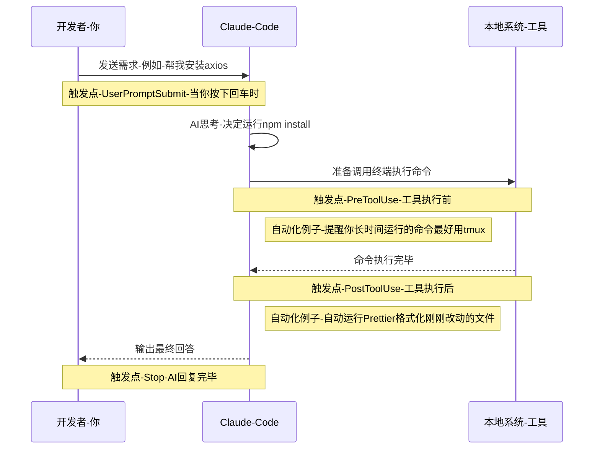

# Everything Claude Code

## Skill & Command

简单来说，**Skill（技能）是 AI 的"被动触发工作流"，而 Command（命令）是你的"主动快捷按键"。**

### Skills（技能）

存储路径：`~/.claude/skills/`

Claude 自己决定什么时候用，也可以通过`/ skill name`手动触发。你把 SKILL.md 放进去，它就成了 Claude 的操作手册——Claude 在判断当前上下文合适时，会主动调用，不需要你开口。

适合：复杂工作流、长期开发规范、需要在特定时机自动触发的后台任务。

### Commands（命令）

存储路径：`~/.claude/commands/`

你敲下去才执行。以斜杠开头（`/refactor`、`/test`），是预设好的提示词宏——Claude 平时不管这件事，直到你显式触发。

适合：单次操作、按需执行、不想让 Claude 自作主张的任务。

### 对比总览

| **特性**   | **Skills（技能）**               | **Commands（命令）**        |
| -------- | ----------------------------- | ------------------------ |
| **主导者**  | **AI（Claude Code）** 根据上下文判断  | **开发者（你）** 手动输入斜杠指令     |
| **存储位置** | `~/.claude/skills/`           | `~/.claude/commands/`    |
| **作用范围** | 复杂的业务逻辑、长期的开发规范、自动化后台流程       | 单次的特定任务、快捷的代码操作          |
| **比喻**   | 员工的**《岗位 SOP 手册》**（遇到情况员工自己照着做） | 老板的**办公桌按钮**（按下去员工立刻去干活） |

---

## Hooks

Hooks are trigger-based automations that fire on specific events. Unlike skills, they're restricted to tool calls and lifecycle events.



### Hook 事件说明

| **事件**             | **触发时机**                         | **典型用途**                            |
| ------------------ | -------------------------------- | ----------------------------------- |
| `UserPromptSubmit` | 你敲下回车发送消息的瞬间                     | 记录问题、预处理输入                          |
| `PreToolUse`       | Claude 执行本地工具（读文件、跑命令等）**之前**    | 提醒长时间命令建议用 `tmux`、拦截危险操作            |
| `PostToolUse`      | Claude 用完工具**之后**                | 自动触发 `gofmt` / `Prettier` 格式化刚改动的文件 |
| `Stop`             | Claude 回答完毕、停止输出时                | 记录问题到 `questions.md`、会话收尾检查         |
| `PreCompact`       | 上下文过长、Claude Code 自动压缩历史记录**之前** | 先总结核心变更，避免压缩时丢失关键信息                 |
| `Notification`     | 需要你授权时（如询问是否允许执行 `rm -rf`）       | 自定义授权提示、发送系统通知                      |
|                    |                                  |                                     |

**更多信息**：[everything-claude-code示例](https://github.com/Lysssyo/everything-claude-code/tree/main/hooks)

---

## Subagents（子代理）

存储路径：`~/.claude/agents/`（自定义）；内置类型无需文件

主代理在需要时显式启动。Subagent 不会自动触发——只有主代理调用 Agent 工具时才会出现。

**内置类型**：

| 类型 | 用途 |
|---|---|
| `general-purpose` | 通用，有完整工具权限（默认） |
| `Explore` | 专门探索代码库 |
| `Plan` | 设计实现方案 |
| `claude-code-guide` | 回答 Claude Code 相关问题 |

**两种执行模式**：

- **前台（默认）**：主代理等待所有 subagent 完成后才继续。多个 subagent 在同一条消息里发出，会并行执行——总耗时取决于最慢的那个。
- **后台**（`run_in_background: true`）：主代理不等待，继续响应用户。subagent 完成后自动通知主代理。


---

## MCP（Model Context Protocol）

MCP 是 Claude Code 的外部能力扩展机制，允许你为 Claude 接入第三方工具、数据源、API 等。子代理（Subagent）也可以调用 MCP 工具——前提是 MCP 服务已正确配置且对应 agent 类型有权限访问。

### 配置位置

MCP 服务器在 `~/.claude.json`（用户级全局配置）或项目的 `.claude/settings.json` 中配置，结构如下：

```json
{
  "mcpServers": {
    "<服务名称>": {
      "command": "<启动命令>",
      "args": ["<参数1>", "<参数2>"],
      "env": {
        "API_KEY": "your-key"
      },
      "description": "该 MCP 服务的用途说明"
    }
  }
}
```

### 示例：context7（文档查询）

context7 是一个实用的 MCP 服务，可以让 Claude 实时查询各类库的最新官方文档。对应的内置 subagent 类型是 `docs-lookup`。

```json
{
  "mcpServers": {
    "context7": {
      "command": "cmd",
      "args": ["/c", "npx", "-y", "@upstash/context7-mcp@latest"],
      "description": "Live documentation lookup — use with /docs command and documentation-lookup skill."
    }
  }
}
```

配置完成后，重启 Claude Code 即可生效。可通过 `/doctor` 命令检查 MCP 服务是否正常加载。

---

## Tips and Tricks

### /branch：对话分支

`/branch` 命令可以从当前对话状态创建一个独立副本，两条对话互不影响。

```
原始对话 ──────────────────────→
              │
           /branch
              │
              └──→ 分支对话（独立副本）
```

**使用场景：**

- 想尝试某个不确定的方案，不想影响主对话
- 在关键节点保留"存档"，出错可以回退
- 同时探索两个不同方向

**回到原始对话：**

执行 `/branch` 后，终端会输出原始会话 ID：

```
To resume the original: claude -r <session-id>
```

在终端**前台交互式**运行该命令即可回到原始对话（不能后台执行，因为 Claude Code 需要交互式终端）。

