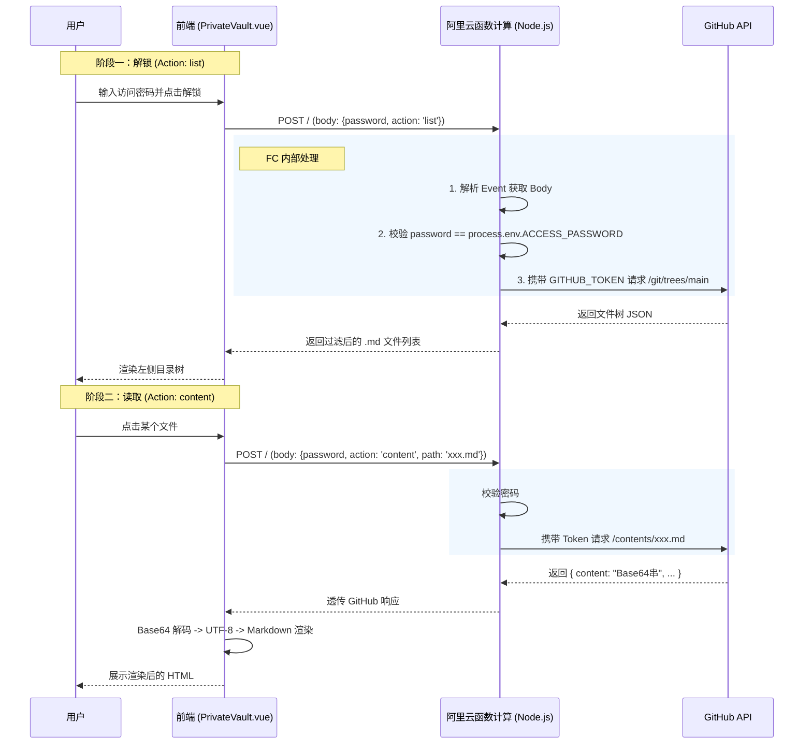

# 基于云函数 (FC) 构建后端服务

## 1. 背景与痛点

在基于 VitePress 或其他静态站点生成器（SSG）构建的博客中，页面是纯静态 HTML/JS，部署在 GitHub Pages 等公开环境。

如果我们需要展示**私有内容**（如个人日记、敏感笔记），面临以下矛盾：
1.  **数据安全性**：不能直接将私有 `.md` 文件编译到静态资源中，否则任何人都能通过查看源码或目录扫描看到。
2.  **密钥安全性**：不能在前端代码中直接使用 GitHub Personal Access Token (PAT) 来请求私有仓库，因为前端代码是公开的，Token 一旦泄露，仓库将完全暴露。

**解决方案**：引入一个**Serverless 后端（阿里云函数计算 FC）**作为“中间人代理”。
- 前端只持有访问 FC 的普通密码（即便是泄露也只是泄露了查看权，不影响仓库安全）。
- FC 后端持有真正的 GitHub Token（存储在环境变量中，不对外暴露）。
- FC 负责鉴权、转发请求并处理响应。

## 2. 核心交互流程

前端（Vue组件）与后端（Node.js FC）通过 HTTP 协议进行交互。核心逻辑分为两步：**身份验证**与**数据代理**。

### 交互时序图



## 3. 前端实现原理 (Client)

前端主要通过 `fetch` API 发起 `POST` 请求。

**请求特征：**
*   **URL**: 阿里云 FC 的 HTTP 触发器地址。
*   **Method**: `POST` (为了将密码放在 Body 中，避免 URL 参数泄露)。
*   **Payload**: 统一 JSON 格式。

```typescript
// 伪代码示例
const payload = {
  password: "用户输入的口令", // 用于 FC 层面的鉴权
  action: "list" | "content", // 告诉后端我要干嘛
  path: "docs/Private/secret.md" // 如果是 content 操作，需要传路径
};

const res = await fetch(API_URL, {
  method: 'POST',
  headers: { 'Content-Type': 'application/json' },
  body: JSON.stringify(payload)
});
```

**响应处理：**
GitHub API 返回的文件内容是 **Base64** 编码的（为了支持二进制文件），前端拿到后需要解码：

```typescript
// 1. 获取 Base64 字符串
const contentBase64 = data.content.replace(/\s/g, '');
// 2. 解码为二进制字符串
const binaryString = window.atob(contentBase64);
// 3. 转为 UTF-8 文本 (解决中文乱码关键)
const bytes = new Uint8Array(binaryString.length);
for (let i = 0; i < binaryString.length; i++) {
  bytes[i] = binaryString.charCodeAt(i);
}
const decoder = new TextDecoder('utf-8');
const markdownText = decoder.decode(bytes);
```

## 4. 后端实现原理 (Serverless)

阿里云函数计算（FC）接收到请求后，通过事件驱动的方式调用 `handler` 函数。

### 4.1 请求的封装 (Event Object)

当使用 HTTP 触发器时，**FC 会将标准的 HTTP 请求封装成一个 `event` buffer**。我们需要解析它：

```javascript
exports.handler = (event, context, callback) => {
  // 1. event 是一个 Buffer，需要转字符串再转 JSON
  let eventObj = JSON.parse(event.toString());
  
  // 2. 获取 HTTP Method
  const method = eventObj.requestContext?.http?.method;
  
  // 3. 处理 Body (可能被 FC 自动 Base64 编码)
  let rawBody = eventObj.body;
  if (eventObj.isBase64Encoded) {
    rawBody = Buffer.from(rawBody, 'base64').toString();
  }
  const body = JSON.parse(rawBody);
  
  // ... 后续逻辑
}
```

> [!IMPORTANT] FC会把标准的 HTTP 请求封装成一个 `event` buffer**
> 注意到FC的入口是`exports.handler = (event, context, callback)`，`event`即为封装后的HTTP请求（具体结构见[Event 结构](060-基于FC构建后端服务.md#Event%20结构)）
> 此外，阿里云FC的【测试函数】实际上是 mock `event`的值
### 4.2 响应的封装 (Response Object)

函数计算要求返回值必须符合特定的 JSON 结构，以便网关能将其转换回 HTTP 响应（状态码、Header、Body）：

```javascript
function createResponse(statusCode, data) {
  return {
    isBase64Encoded: false,
    statusCode: statusCode,
    headers: {
      'Content-Type': 'application/json',
      // 关键：允许跨域，因为前端域名和 FC 域名不一致
      'access-control-allow-origin': '*', 
      'Access-Control-Allow-Methods': 'POST, GET, OPTIONS',
      'Access-Control-Allow-Headers': '*'
    },
    body: JSON.stringify(data) // Body 必须是字符串
  };
}
```

> [!IMPORTANT]
> 不一定要写入`'access-control-allow-origin': '*'`，因为阿里云在封装返回结果时，可能也写入了`access-control-allow-origin`，两个`access-control-allow-origin`会导致**CORS校验失败**（参考[3. 什么是 CORS](030-跨域.md#3.%20什么是%20CORS)）

### 4.3 核心业务逻辑

后端脚本其实是一个简单的**逻辑路由**：

1.  **鉴权**：检查 `body.password === process.env.ACCESS_PASSWORD`。
2.  **分支处理**：
    *   **Action: list** -> 调用 GitHub Tree API (`GET /repos/.../git/trees/main?recursive=1`)。这是一个非常高效的 API，能一次性拉取整个仓库的目录结构。
    *   **Action: content** -> 调用 GitHub Contents API (`GET /repos/.../contents/{path}`)。
3.  **GitHub 调用**：使用 Node.js 原生 `https` 模块，Header 中必须携带 `Authorization: token <GITHUB_TOKEN>`。

## 5. 部署配置清单

要成功运行此服务，需要在[阿里云控制台](https://fcnext.console.aliyun.com/)进行如下配置：

**创建服务与函数**：
- 区域：香港（GitHub 与香港的网络通信不会被墙，且香港地区申请 SSL 证书不用备案，以备后期扩展）
- 创建WEB函数：运行环境为内置运行时，Node.js16

## 6. 总结

通过这种架构，我们实现了：
1.  **低成本**：利用 Serverless 的按量付费特性，个人博客这种低频访问几乎免费。
2.  **安全性**：GitHub Token 永不出库，前端只暴露低价值的访问密码。
3.  **灵活性**：前端保留了 VitePress 的优良体验，后端通过 API 动态赋能。

# 附代码

### 前端代码

```
<script setup lang="ts">

import { ref, watch, computed, onMounted } from 'vue'

import MarkdownIt from 'markdown-it'

import { privateStore, type PrivateFile } from '../store'

import FileTreeNode from './FileTreeNode.vue'

import { useRoute, useRouter } from 'vitepress'

  

const route = useRoute()

const router = useRouter()

  

const password = ref('')

const loading = ref(false)

const errorMsg = ref('')

const API_URL = 'https://privatege-proxy-uypbjhvwjb.cn-hongkong.fcapp.run/'

const sidebarWidth = ref(250)

const isResizing = ref(false)

const isSidebarCollapsed = ref(window.innerWidth < 768)

const sidebarRef = ref<HTMLElement | null>(null)

// 按钮位置状态 (默认向下偏移 60px 以避开二级导航)

const btnPos = ref({ top: 60, left: 16 })

const isBtnDragging = ref(false)

const pendingAnchor = ref('') // 待跳转的锚点

  

// 按钮拖拽逻辑

function initBtnDrag(e: MouseEvent | TouchEvent) {

  // 阻止默认滚动与鼠标事件透传 (修复移动端双重触发问题)

  if (e.type === 'touchstart') {

    e.preventDefault()

  }

  

  const startX = e instanceof MouseEvent ? e.clientX : e.touches[0].clientX

  const startY = e instanceof MouseEvent ? e.clientY : e.touches[0].clientY

  const startLeft = btnPos.value.left

  const startTop = btnPos.value.top

  let hasMoved = false

  

  const onMove = (moveEvent: MouseEvent | TouchEvent) => {

    const clientX = moveEvent instanceof MouseEvent ? moveEvent.clientX : moveEvent.touches[0].clientX

    const clientY = moveEvent instanceof MouseEvent ? moveEvent.clientY : moveEvent.touches[0].clientY

    const deltaX = clientX - startX

    const deltaY = clientY - startY

    // 放宽判定阈值：只有移动超过 5px 才算拖拽

    if (Math.abs(deltaX) > 5 || Math.abs(deltaY) > 5) {

      hasMoved = true

      isBtnDragging.value = true

    }

    if (hasMoved) {

      moveEvent.preventDefault() // 拖拽时阻止滚动

      let newLeft = startLeft + deltaX

      let newTop = startTop + deltaY

      // 边界限制

      const maxLeft = window.innerWidth - 40 // 按钮宽约40

      const maxTop = window.innerHeight - 40

      if (newLeft < 0) newLeft = 0

      if (newLeft > maxLeft) newLeft = maxLeft

      if (newTop < 0) newTop = 0

      if (newTop > maxTop) newTop = maxTop

      btnPos.value = { left: newLeft, top: newTop }

    }

  }

  

  const onUp = () => {

    if (!hasMoved) {

      toggleSidebar()

    }

    isBtnDragging.value = false

    window.removeEventListener('mousemove', onMove)

    window.removeEventListener('mouseup', onUp)

    window.removeEventListener('touchmove', onMove)

    window.removeEventListener('touchend', onUp)

  }

  

  window.addEventListener('mousemove', onMove, { passive: false })

  window.addEventListener('mouseup', onUp)

  window.addEventListener('touchmove', onMove, { passive: false })

  window.addEventListener('touchend', onUp)

}

  

// 监听窗口大小

window.addEventListener('resize', () => {

  // 可选：移动端自动折叠逻辑

})

  

function toggleSidebar() {

  isSidebarCollapsed.value = !isSidebarCollapsed.value

  if (sidebarRef.value) {

    sidebarRef.value.style.width = ''

  }

  if (!isSidebarCollapsed.value && sidebarWidth.value < 150) {

    sidebarWidth.value = 250

  }

}

  

// 拖拽逻辑 (rAF 优化版：实时跟手)

function initResize(e: MouseEvent) {

  if (isSidebarCollapsed.value) return

  isResizing.value = true

  document.body.classList.add('vp-resizing')

  document.body.style.cursor = 'col-resize'

  document.body.style.userSelect = 'none'

  const startX = e.clientX

  const startWidth = sidebarWidth.value

  const sidebarEl = sidebarRef.value

  let animationFrameId: number

  

  const onMouseMove = (moveEvent: MouseEvent) => {

    if (animationFrameId) cancelAnimationFrame(animationFrameId)

    animationFrameId = requestAnimationFrame(() => {

      const delta = moveEvent.clientX - startX

      let newWidth = startWidth + delta

      if (newWidth < 150) newWidth = 150

      if (newWidth > 500) newWidth = 500

      if (sidebarEl) {

        sidebarEl.style.width = `${newWidth}px`

      }

    })

  }

  

  const onMouseUp = (upEvent: MouseEvent) => {

    isResizing.value = false

    document.body.classList.remove('vp-resizing')

    document.body.style.cursor = ''

    document.body.style.userSelect = ''

    if (animationFrameId) cancelAnimationFrame(animationFrameId)

    const delta = upEvent.clientX - startX

    let newWidth = startWidth + delta

    if (newWidth < 150) newWidth = 150

    if (newWidth > 500) newWidth = 500

    sidebarWidth.value = newWidth

    window.removeEventListener('mousemove', onMouseMove)

    window.removeEventListener('mouseup', onMouseUp)

  }

  

  window.addEventListener('mousemove', onMouseMove)

  window.addEventListener('mouseup', onMouseUp)

}

  

// 初始化 Markdown-it 实例

const md = new MarkdownIt({

  html: true,

  linkify: true,

  typographer: true,

  highlight: function (str, lang) {

    // @ts-ignore

    if (lang && window.hljs) {

      try {

        // @ts-ignore

        return '<pre class="hljs"><code>' +

               // @ts-ignore

               window.hljs.highlight(str, { language: lang, ignoreIllegals: true }).value +

               '</code></pre>';

      } catch (__) {}

    }

    return '<pre class="hljs"><code>' + md.utils.escapeHtml(str) + '</code></pre>';

  }

})

  

// 为标题添加 ID 以支持锚点跳转

md.renderer.rules.heading_open = (tokens, idx, options, env, self) => {

  const token = tokens[idx]

  // 获取标题文本内容 (下一个 token 是 inline)

  const titleToken = tokens[idx + 1]

  let title = ''

  if (titleToken && titleToken.content) {

    title = titleToken.content

  }

  // 生成 ID: 简单处理，直接使用文本作为 ID (支持中文)

  if (title) {

    token.attrSet('id', title)

  }

  return self.renderToken(tokens, idx, options)

}

  

// 动态加载 Highlight.js

function loadHighlight() {

  if (document.getElementById('hljs-script')) return

  

  const script = document.createElement('script')

  script.id = 'hljs-script'

  script.src = 'https://cdnjs.cloudflare.com/ajax/libs/highlight.js/11.9.0/highlight.min.js'

  document.head.appendChild(script)

}

  

onMounted(() => {

  loadHighlight()

})

  

// Helper: Build Tree from Flat GitHub Paths

function buildFileTree(flatFiles: any[]): PrivateFile[] {

  const root: PrivateFile[] = []

  const map = new Map<string, PrivateFile>()

  

  flatFiles.forEach(f => {

    const isDir = f.type === 'tree'

    const node: PrivateFile = {

      name: f.path.split('/').pop() || '',

      path: f.path,

      type: isDir ? 'dir' : 'file',

      children: isDir ? [] : undefined

    }

    map.set(f.path, node)

  })

  

  flatFiles.forEach(f => {

    const node = map.get(f.path)!

    const parts = f.path.split('/')

    if (parts.length === 1) {

      root.push(node)

    } else {

      const parentPath = parts.slice(0, -1).join('/')

      const parent = map.get(parentPath)

      if (parent && parent.children) {

        parent.children.push(node)

      } else {

        root.push(node)

      }

    }

  })

  const sortFn = (a: PrivateFile, b: PrivateFile) => {

    if (a.type === b.type) return a.name.localeCompare(b.name)

    return a.type === 'dir' ? -1 : 1

  }

  const sortRecursive = (nodes: PrivateFile[]) => {

    nodes.sort(sortFn)

    nodes.forEach(n => {

      if (n.children) sortRecursive(n.children)

    })

  }

  sortRecursive(root)

  

  return root

}

  

// 递归查找文件节点，并设置路径上所有父节点的 expanded = true

function findAndExpand(nodes: PrivateFile[], targetPath: string): PrivateFile | null {

  for (const node of nodes) {

    // 检查是否匹配：全路径匹配 或 后缀匹配

    if (node.type === 'file' && (node.path === targetPath || node.path.endsWith(targetPath))) {

      return node

    }

    if (node.type === 'dir' && node.children) {

      const found = findAndExpand(node.children, targetPath)

      if (found) {

        // 如果子节点被找到了，说明当前节点是父级路径的一部分，需要展开

        node.expanded = true

        return found

      }

    }

  }

  return null

}

  

async function unlock() {

  loading.value = true

  errorMsg.value = ''

  try {

    const res = await fetch(API_URL, {

      method: 'POST',

      headers: { 'Content-Type': 'application/json' },

      body: JSON.stringify({

        password: password.value,

        action: 'list'

      })

    })

    if (!res.ok) {

       throw new Error(`Server Error: ${res.status}`)

    }

    const data = await res.json()

    const realData = data.data || data

    if (realData.files) {

      const tree = buildFileTree(realData.files)

      privateStore.token = password.value

      privateStore.setData(tree)

      // 处理自动跳转

      const targetPath = new URLSearchParams(window.location.search).get('target')

      if (targetPath) {

        let rawPath = decodeURIComponent(targetPath)

        // 提取锚点

        const hashMatch = rawPath.match(/#.+$/)

        if (hashMatch) {

          pendingAnchor.value = hashMatch[0]

        }

  

        // 1. 提取有效路径：截取 '98-Private/' 之后的部分

        const keyword = '98-Private/'

        let cleanPath = ''

        const idx = rawPath.indexOf(keyword)

        if (idx !== -1) {

          cleanPath = rawPath.substring(idx + keyword.length)

        } else {

          // 移除所有 ../ 和 ./

          cleanPath = rawPath.replace(/^(\.\.\/)+/, '').replace(/^(\.\/)+/, '')

        }

  

        // 1.5 移除 URL 锚点

        cleanPath = cleanPath.split('#')[0]

  

        // 2. 修正扩展名

        cleanPath = cleanPath.replace(/\.html$/, '.md')

  

        console.log('[Debug] 原始Target:', targetPath)

        console.log('[Debug] 修正后Path:', cleanPath)

        console.log('[Debug] 锚点:', pendingAnchor.value)

  

        // 递归查找并展开

        const foundNode = findAndExpand(privateStore.fileList, cleanPath)

        console.log('[Debug] 查找结果:', foundNode)

        if (foundNode) {

          await selectFile(foundNode)

        }

      }

    } else {

      throw new Error('返回数据格式不对，找不到 files 字段')

    }

  } catch (e: any) {

    errorMsg.value = e.message || '网络请求失败'

  } finally {

    loading.value = false

  }

}

  

async function selectFile(file: PrivateFile) {

  if (file.type === 'dir') return

  privateStore.currentDoc = file

  if (!file.content) {

    try {

      const res = await fetch(API_URL, {

        method: 'POST',

        headers: { 'Content-Type': 'application/json' },

        body: JSON.stringify({

          password: privateStore.token,

          action: 'content',

          path: file.path

        })

      })

      const data = await res.json()

      if (data.error) throw new Error(data.error)

      const contentBase64 = data.content.replace(/\s/g, '')

      const binaryString = window.atob(contentBase64)

      const bytes = new Uint8Array(binaryString.length)

      for (let i = 0; i < binaryString.length; i++) {

        bytes[i] = binaryString.charCodeAt(i)

      }

      const decoder = new TextDecoder('utf-8')

      file.content = decoder.decode(bytes)

    } catch (e) {

      console.error(e)

      file.content = '> ❌ Error loading content'

    }

  }

}

  

const renderedContent = computed(() => {

  if (!privateStore.currentDoc) return ''

  if (privateStore.currentDoc.content === undefined) return '*(Loading...)*'

  const raw = privateStore.currentDoc.content || ''

  const cleanContent = raw.replace(/^---[\s\S]*?---\n/, '')

  return md.render(cleanContent)

})

  

// 监听内容渲染完成，处理锚点跳转

watch(renderedContent, () => {

  if (pendingAnchor.value) {

    // 给予 Markdown 渲染和 DOM 更新一点时间

    setTimeout(() => {

      let selector = pendingAnchor.value

      try {

         const id = decodeURIComponent(selector.replace(/^#/, ''))

         const el = document.getElementById(id)

         if (el) {

           el.scrollIntoView({ behavior: 'smooth' })

           pendingAnchor.value = '' // 清除状态

         } else {

            console.warn('[PrivateVault] Anchor not found:', id)

         }

      } catch (e) {

        console.error(e)

      }

    }, 300) // 300ms 延迟确保 DOM 挂载

  }

})

</script>

  

<template>

  <div class="vault-wrapper">

    <!-- State 1: Locked -->

    <div v-if="!privateStore.isUnlocked" class="lock-screen">

      <div class="lock-card">

        <div class="icon-lock">🔐</div>

        <h2>私有保险箱</h2>

        <p class="subtext">连接至 Private Cloud</p>

        <div class="input-box">

          <input

            type="password"

            v-model="password"

            placeholder="请输入访问密码..."

            @keyup.enter="unlock"

          />

          <button @click="unlock" :disabled="loading">

            {{ loading ? '连接中...' : '解锁' }}

          </button>

        </div>

        <div v-if="errorMsg" class="error-msg">{{ errorMsg }}</div>

      </div>

    </div>

  

    <!-- State 2: Unlocked -->

    <div v-else class="vault-ui" :class="{ 'sidebar-collapsed': isSidebarCollapsed }">

      <!-- Toggle Button (Draggable) -->

      <button

        class="mobile-sidebar-toggle"

        :style="{ top: btnPos.top + 'px', left: btnPos.left + 'px', cursor: isBtnDragging ? 'grabbing' : 'pointer' }"

        @mousedown="initBtnDrag"

        @touchstart="initBtnDrag"

        title="切换文件列表 (可拖动)"

      >

        <span class="icon">📂</span>

      </button>

  

      <!-- Sidebar -->

      <div class="vault-sidebar"

           ref="sidebarRef"

           :style="{ width: isSidebarCollapsed ? '0px' : sidebarWidth + 'px' }">

        <div class="vault-header">

          <span class="vault-title">📦 远程文件库</span>

        </div>

        <div class="file-tree">

           <FileTreeNode

             v-for="node in privateStore.fileList"

             :key="node.path"

             :node="node"

             :currentPath="privateStore.currentDoc?.path"

             @select="selectFile"

           />

        </div>

      </div>

  

      <!-- Resizer Handle (Always visible to allow expanding) -->

      <div class="vault-resizer" @mousedown="initResize"></div>

  

      <!-- Content -->

      <div class="vault-content">

        <div v-if="privateStore.currentDoc" class="vp-doc">

           <div v-html="renderedContent"></div>

        </div>

        <div v-else class="empty-state">

          <div class="empty-icon">👋</div>

          <h3>已安全连接</h3>

          <p>从左侧选择文件以从 GitHub 私有仓库加载内容</p>

        </div>

      </div>

  

    </div>

  

  </div>

</template>

  

<style scoped>

.vault-wrapper {

  /* Fixed positioning to fill the remaining area */

  position: fixed;

  top: var(--vp-nav-height);

  right: 0;

  bottom: 0;

  /* Start after the sidebar */

  left: var(--vp-sidebar-width, 0);

  width: calc(100vw - var(--vp-sidebar-width, 0));

  /* 【修改点 2】：提升层级 */

  /* VitePress 的 LocalNav 层级通常是 20，我们将这里提升到 30 以覆盖它 */

  z-index: 30;

  background: var(--vp-c-bg);

  border-top: 1px solid var(--vp-c-divider);

  border-left: 1px solid var(--vp-c-divider);

  border-radius: 0;

  overflow: hidden;

  display: flex;

  flex-direction: column;

}

  

/* On mobile, the sidebar is usually hidden or overlayed, so we take full width */

@media (max-width: 959px) {

  .vault-wrapper {

    left: 0;

    width: 100vw;

    border-left: none;

    /* 同样使用标准导航栏高度 */

    top: var(--vp-nav-height);

    height: calc(100vh - var(--vp-nav-height));

  }

}

  

.lock-screen {

  flex: 1;

  display: flex;

  align-items: center;

  justify-content: center;

  background: var(--vp-c-bg);

}

.lock-card {

  text-align: center;

  padding: 40px;

  background: var(--vp-c-bg);

  border-radius: 12px;

  border: 1px solid var(--vp-c-divider);

  box-shadow: 0 4px 24px rgba(0,0,0,0.05);

  width: 100%;

  max-width: 400px;

}

.icon-lock { font-size: 48px; margin-bottom: 16px; }

.lock-card h2 { margin: 0 0 8px; font-weight: 600; }

.subtext { color: var(--vp-c-text-2); margin-bottom: 24px; font-size: 14px; }

.input-box { display: flex; gap: 8px; }

.input-box input {

  flex: 1;

  padding: 8px 12px;

  border: 1px solid var(--vp-c-divider);

  border-radius: 6px;

  background: var(--vp-c-bg);

}

.input-box button {

  padding: 8px 16px;

  background: var(--vp-c-brand);

  color: white;

  border-radius: 6px;

  font-weight: 600;

  cursor: pointer;

}

.error-msg { color: var(--vp-c-danger); margin-top: 12px; font-size: 13px; }

  

.vault-ui {

  display: flex;

  height: 100%;

  position: relative;

}

  

.vault-sidebar {

  border-right: 1px solid var(--vp-c-divider);

  background: var(--vp-c-bg);

  display: flex;

  flex-direction: column;

  overflow-y: auto;

  flex-shrink: 0;

  transition: width 0.3s ease, transform 0.3s ease;

  overflow-x: hidden;

}

  

/* 拖拽时禁用过渡，消除滞后感 */

:global(body.vp-resizing) .vault-sidebar {

  transition: none !important;

}

  

/* 切换按钮 (左上角) */

.mobile-sidebar-toggle {

  position: absolute;

  top: 12px;

  left: 12px;

  /* 【修改点 4】：确保按钮层级最高 */

  z-index: 100;

  background: var(--vp-c-bg);

  border: 1px solid var(--vp-c-divider);

  border-radius: 4px;

  padding: 6px 10px;

  cursor: pointer;

  box-shadow: 0 2px 4px rgba(0,0,0,0.05);

  transition: background 0.2s, box-shadow 0.2s;

}

.sidebar-collapsed .mobile-sidebar-toggle {

  background: var(--vp-c-bg-alt);

}

  

/* 拖拽手柄样式 */

.vault-resizer {

  width: 1px; /* 默认为一条细线 */

  background: var(--vp-c-divider);

  cursor: col-resize;

  position: relative;

  z-index: 10;

  flex-shrink: 0;

  transition: background 0.2s, width 0.2s;

}

  

/* 增加隐形热区 */

.vault-resizer::after {

  content: '';

  position: absolute;

  top: 0;

  bottom: 0;

  left: -6px;

  right: -6px;

  z-index: 20;

}

  

.vault-resizer:hover,

.vault-resizer:active {

  background: var(--vp-c-brand);

  width: 4px; /* 激活时变宽 */

}

  

.vault-header {

  padding: 16px;

  padding-left: 50px; /* 给 toggle 按钮留出空间 */

  /* 【修改点 3】：增加顶部内边距 */

  padding-top: 24px;

  border-bottom: 1px solid var(--vp-c-divider);

  font-weight: 600;

  color: var(--vp-c-text-1);

}

.file-tree { padding: 8px; }

.tree-group { margin-bottom: 4px; }

  

.tree-folder-label {

  display: flex;

  align-items: center;

  padding: 8px;

  font-size: 13px;

  font-weight: 700;

  color: var(--vp-c-text-2);

  text-transform: uppercase;

}

  

.tree-children {

  padding-left: 16px;

}

  

.tree-item {

  display: flex;

  align-items: center;

  padding: 6px 8px;

  margin-left: 4px;

  font-size: 14px;

  color: var(--vp-c-text-1);

  cursor: pointer;

  border-radius: 4px;

  white-space: nowrap;

  overflow: hidden;

  text-overflow: ellipsis;

}

  

.tree-item .icon {

  margin-right: 6px;

}

  

.tree-folder-label .icon {

  margin-right: 6px;

}

  

.tree-item:hover {

  background: var(--vp-c-bg-mute);

}

  

.tree-item.active {

  background: var(--vp-c-brand-dimm);

  color: var(--vp-c-brand);

  font-weight: 600;

}

  

.vault-content {

  flex: 1;

  overflow-y: auto;

  padding: 24px 40px;

  padding-top: 50px; /* 给按钮留出空间 */

  background: var(--vp-c-bg);

}

.empty-state {

  height: 100%;

  display: flex;

  flex-direction: column;

  align-items: center;

  justify-content: center;

  color: var(--vp-c-text-2);

}

.empty-icon { font-size: 48px; margin-bottom: 16px; }

  

/* 移动端适配逻辑 */

@media (max-width: 768px) {

  .vault-sidebar {

    position: absolute;

    top: 0;

    left: 0;

    bottom: 0;

    width: 80% !important;

    max-width: 300px;

    z-index: 15;

    box-shadow: 4px 0 16px rgba(0,0,0,0.1);

    transform: translateX(0); /* 默认显示 */

  }

  /* 折叠时移出屏幕 */

  .vault-ui.sidebar-collapsed .vault-sidebar {

    transform: translateX(-100%);

    width: 80% !important;

    border-right: none;

  }

  /* 遮罩层 */

  .vault-ui::before {

    content: '';

    position: absolute;

    inset: 0;

    background: rgba(0,0,0,0.3);

    z-index: 14;

    opacity: 0;

    pointer-events: none;

    transition: opacity 0.3s;

  }

  .vault-ui:not(.sidebar-collapsed)::before {

    opacity: 1;

    pointer-events: auto;

  }

  .vault-resizer {

    display: none;

  }

}

  

/* === Syntax Highlighting Theme (VitePress-like) === */

.vp-doc :deep(.hljs) {

  background: var(--vp-c-bg-alt);

  color: var(--vp-c-text-1);

  padding: 20px 24px;

  margin: 16px 0;

  border-radius: 8px;

  overflow-x: auto;

  font-family: var(--vp-font-family-mono);

  font-size: 14px;

  line-height: 1.5;

}

  

.vp-doc :deep(.hljs-keyword), .vp-doc :deep(.hljs-function) { color: var(--vp-c-brand-1); font-weight: 600; }

.vp-doc :deep(.hljs-string) { color: #10b981; }

.vp-doc :deep(.hljs-comment) { color: var(--vp-c-text-3); font-style: italic; }

.vp-doc :deep(.hljs-number), .vp-doc :deep(.hljs-literal) { color: #f59e0b; }

.vp-doc :deep(.hljs-title) { color: #3b82f6; }

  

/* 3. 针对特定的页面类 */

.vp-doc {

  max-width: 100% !important;

}

</style>
```


### FC代码

``` js
const https = require('https');

  

// --- 1. 配置信息 ---

const GITHUB_OWNER = 'lysssyo';

const GITHUB_REPO = 'private-knowledge-base';

const GITHUB_BRANCH = 'main';

  

exports.handler = (event, context, callback) => {

  console.log('--- 🚀 新请求进来 (Event模式) ---');

  

  // 1. 解析 Event 对象

  let eventObj = {};

  try {

    eventObj = JSON.parse(event.toString());    

    console.log('获取到的event:', JSON.stringify(eventObj, null, 2));

  } catch (e) {

    console.error('❌ Event 解析失败:', e);

    return callback(null, createResponse(400, { error: 'Invalid Event Format' }));

  }

  

  // 2. 识别请求方法 (兼容 FC 3.0 HTTP Trigger 的封装结构)

  // 也就是你日志里看到的 requestContext.http.method

  const method = eventObj.requestContext?.http?.method;

  console.log(`ℹ️ 请求方法: ${method}`);

  

  // 3. 处理 CORS 预检请求 (OPTIONS)

  if (method === 'OPTIONS') {

    console.log('✅ 响应 OPTIONS 预检');

    return callback(null, createResponse(200, {}));

  }

  

  // 4. 获取并解析 Body

  // FC 有时会对 Body 进行 Base64 编码，需要检测并解码

  let rawBody = eventObj.body;

  if (eventObj.isBase64Encoded && rawBody) {

    rawBody = Buffer.from(rawBody, 'base64').toString();

  }

  

  // 5. 进入核心业务逻辑

  processLogic(rawBody, (code, data) => {

    callback(null, createResponse(code, data));

  });

};

  

// ==========================================

// 核心业务逻辑

// ==========================================

function processLogic(bodyStr, done) {

  let body = {};

  try {

    body = JSON.parse(bodyStr || '{}');

  } catch (e) {

    console.error('❌ Body JSON 解析失败:', e);

    return done(400, { error: 'JSON Parse Error' });

  }

  

  // 简单鉴权

  if (body.password !== process.env.ACCESS_PASSWORD) {

    console.warn('⛔ 密码错误');

    return done(401, { error: '密码错误' });

  }

  

  const action = body.action;

  console.log(`🔧 执行操作: ${action}`);

  

  if (action === 'list') {

    const apiPath = `/repos/${GITHUB_OWNER}/${GITHUB_REPO}/git/trees/${GITHUB_BRANCH}?recursive=1`;

    callGitHub(apiPath, (data) => {

       if (data.message === 'Not Found') return done(404, { error: '仓库未找到' });

       // 过滤只显示 .md 文件或文件夹

       const tree = data.tree ? data.tree.filter(item => item.path.endsWith('.md') || item.type === 'tree') : [];

       console.log(`📂 获取文件列表成功，共 ${tree.length} 项`);

       done(200, { files: tree });

    });

  } else if (action === 'content') {

    const filePath = body.path || '';

    if (!filePath) return done(400, { error: '缺少 path' });

    const apiPath = `/repos/${GITHUB_OWNER}/${GITHUB_REPO}/contents/${encodeURIComponent(filePath)}`;

    callGitHub(apiPath, (data) => {

       if (data.message === 'Not Found') return done(404, { error: '文件不存在' });

       console.log('📄 获取文件内容成功');

       done(200, { content: data.content });

    });

  } else {

    done(400, { error: '未知操作' });

  }

}

  

// ==========================================

// 辅助工具

// ==========================================

  

// 统一封装响应格式 (符合阿里云 API 网关/HTTP Trigger 要求)

function createResponse(statusCode, bodyJson) {

  return {

    isBase64Encoded: false,

    statusCode: statusCode,

    headers: {

      'Content-Type': 'application/json',  

      'access-control-allow-origin': '*',    

      'Access-Control-Allow-Methods': 'POST, GET, OPTIONS',

      'Access-Control-Allow-Headers': 'Content-Type, Authorization, Accept, X-Requested-With'

    },

    body: JSON.stringify(bodyJson)

  };

}

  

// 调用 GitHub API

function callGitHub(path, callback) {

  const options = {

    hostname: 'api.github.com',

    path: path,

    method: 'GET',

    headers: {

      'User-Agent': 'AliyunFC-Proxy',

      'Authorization': `token ${process.env.GITHUB_TOKEN}`,

      'Accept': 'application/vnd.github.v3+json'

    }

  };

  const req = https.request(options, (res) => {

    let data = '';

    res.on('data', chunk => { data += chunk; });

    res.on('end', () => {

      try {

        callback(JSON.parse(data));

      } catch (e) {

        callback({ error: 'GitHub Response Parse Error' });

      }

    });

  });

  req.on('error', (e) => {

    console.error('GitHub Request Error:', e);

    callback({ error: e.message });

  });

  req.end();

}
```

### Event 结构

```
{  
    "version": "v1",  
    "rawPath": "/",  
    "headers": {  
        "Accept": "*/*",  
        "Sec-Fetch-Site": "cross-site",  
        "X-Forwarded-Proto": "[https](https://www.json.cn/jsononline/https)",  
        "Referer": "[https://lysssyo.github.io/](https://lysssyo.github.io/)",  
        "Sec-Ch-Ua-Mobile": "?0",  
        "Sec-Fetch-Mode": "cors",  
        "Sec-Ch-Ua-Platform": "\"Windows\"",  
        "Connection": "keep-alive",  
        "Host": "privatege-proxy-uypbjhvwjb.cn-hongkong.fcapp.run,privatege-proxy-uypbjhvwjb.cn-hongkong.fcapp.run",  
        "Origin": "[https://lysssyo.github.io](https://lysssyo.github.io/)",  
        "Accept-Encoding": "gzip, deflate, br, zstd",  
        "Accept-Language": "zh-CN,zh;q=0.9,en-GB;q=0.8,en-US;q=0.7,en;q=0.6",  
        "Sec-Ch-Ua": "\"Google Chrome\";v=\"143\", \"Chromium\";v=\"143\", \"Not A(Brand\";v=\"24\"",  
        "Content-Length": "43",  
        "Sec-Fetch-Dest": "empty",  
        "Content-Type": "application/json",  
        "User-Agent": "Mozilla/5.0 (Windows NT 10.0; Win64; x64) AppleWebKit/537.36 (KHTML, like Gecko) Chrome/143.0.0.0 Safari/537.36"  
    },  
    "queryParameters": {  
  
    },  
    "body": "{\"password\":\"he1765A60260\",\"action\":\"list\"}",  
    "isBase64Encoded": false,  
    "requestContext": {  
        "accountId": "1400907468986719",  
        "domainName": "privatege-proxy-uypbjhvwjb.cn-hongkong.fcapp.run",  
        "domainPrefix": "privatege-proxy-uypbjhvwjb",  
        "requestId": "1-696f3235-14f858-ffa88a1a35af",  
        "time": "2026-01-20T07:43:49.148834552+00:00",  
        "timeEpoch": "1768895029148",  
        "http": {  
            "method": "POST",  
            "path": "/",  
            "protocol": "HTTP/1.1",  
            "sourceIp": "103.172.183.87",  
            "userAgent": "Mozilla/5.0 (Windows NT 10.0; Win64; x64) AppleWebKit/537.36 (KHTML, like Gecko) Chrome/143.0.0.0 Safari/537.36"  
        }  
    }  
}
```