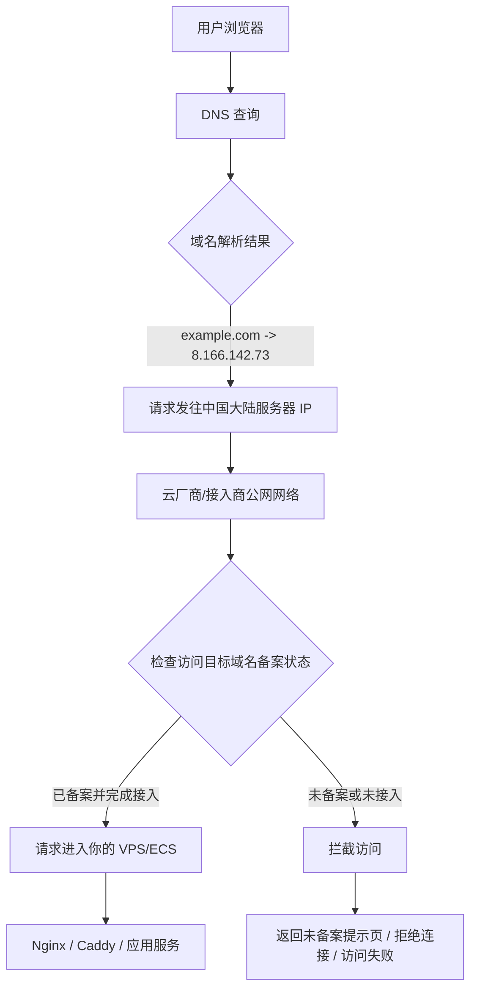
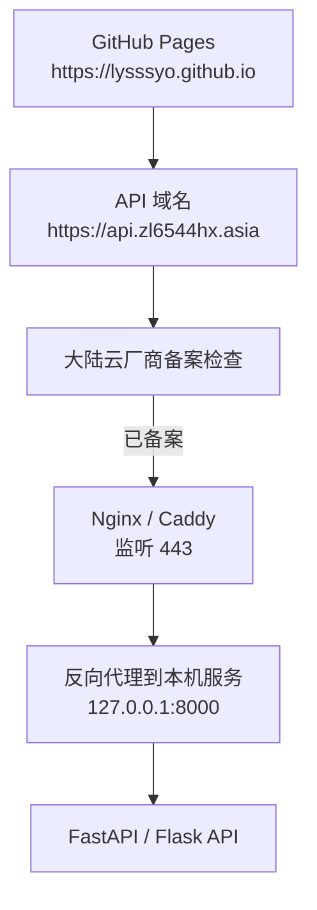

# ICP 备案与大陆服务器访问拦截

## 结论

如果一个域名没有 ICP 备案，却解析到中国大陆服务器，并通过 HTTP/HTTPS 对外提供 Web 服务，那么访问时很可能会被云厂商或接入商拦截。

这里的重点不是 DNS 不能解析，而是：

```text
DNS 可以正常解析到大陆服务器 IP
但 HTTP/HTTPS 请求到达云厂商接入网络时，可能因为目标域名未备案而被拦截
```

例如：

```text
未备案域名 example.com
    ↓ DNS 解析
8.166.142.73
    ↓ HTTP/HTTPS 访问
可能被阿里云等接入商拦截
```

## 访问链路图



## 云厂商看到的是什么

备案检查通常不是看“请求从哪个网站发起”，而是看“用户正在访问哪个目标域名”。

HTTP 请求里有 `Host` 头：

```http
Host: api.example.com
```

HTTPS 请求在 TLS 握手阶段通常会携带 SNI：

```text
SNI: api.example.com
```

云厂商或接入商可以根据这些信息判断：

```text
api.example.com 是否已经 ICP 备案
api.example.com 是否已经接入当前云厂商
```

如果不符合要求，就可能在请求真正进入你的服务器之前被拦截。

## 不是看来源域名

假设 GitHub Pages 页面调用你的 API：

```text
来源页面：https://lysssyo.github.io
目标接口：https://api.zl6544hx.asia
```

ICP备案检查主要看目标域名：

```text
api.zl6544hx.asia
```

而不是来源页面：

```text
lysssyo.github.io
```

所以，只要你的 API 目标域名已经备案并接入大陆服务器，通常就可以正常访问。


## 子域名是否需要单独备案

通常备案主体是主域名，例如：

```text
zl6544hx.asia
```

备案后，常见子域名：

```text
www.zl6544hx.asia
api.zl6544hx.asia
blog.zl6544hx.asia
```

一般不需要逐个单独备案。

但要注意：

- 域名需要已经完成 ICP 备案。
- 域名需要完成当前云厂商的备案接入。
- 如果云厂商控制台提示备案信息不一致，可能需要做接入备案或变更备案。

## 推荐部署方式

如果要让 GitHub Pages 调用大陆服务器上的 API，推荐结构是：



其中：

- `api.zl6544hx.asia` 需要解析到大陆服务器 IP。
- `zl6544hx.asia` 需要完成 ICP 备案和云厂商接入。
- Nginx/Caddy 负责 HTTPS。
- Python API 服务只监听 `127.0.0.1`，不要直接暴露公网。
- API 仍然需要鉴权，例如 `Authorization: Bearer <token>`。

## 一句话总结

ICP备案不是控制 DNS 解析，而是控制域名是否可以接入中国大陆服务器对外提供 Web 服务。

未备案域名解析到大陆 IP 后，DNS 可能正常，但 HTTP/HTTPS 访问可能在云厂商或接入商网络处被拦截，导致请求无法真正到达你的服务器应用。
