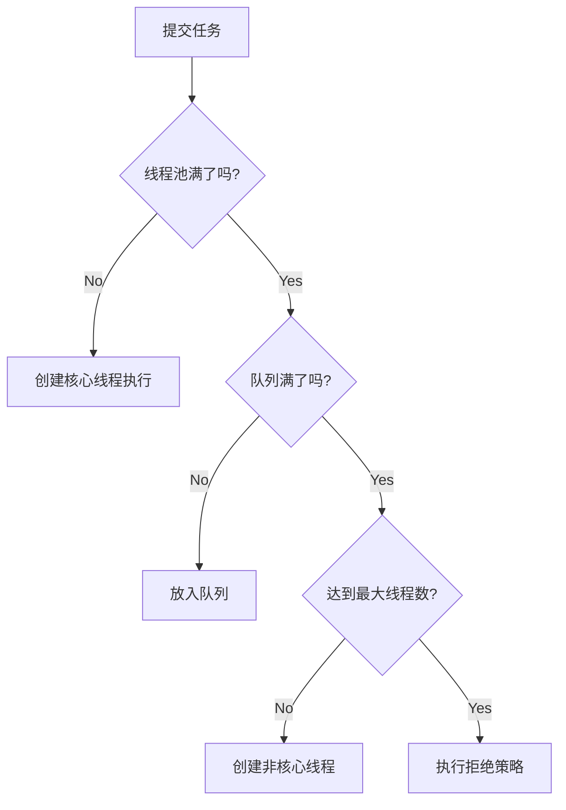

hello

```mermaid
graph TD;
A[提交任务] --> B{线程池满了吗?};
B -- No --> C[创建核心线程执行];
B -- Yes --> D{队列满了吗?};
D -- No --> E[放入队列];
D -- Yes --> F{达到最大线程数?};
F -- No --> G[创建非核心线程];
F -- Yes --> H[执行拒绝策略];
```

你好

