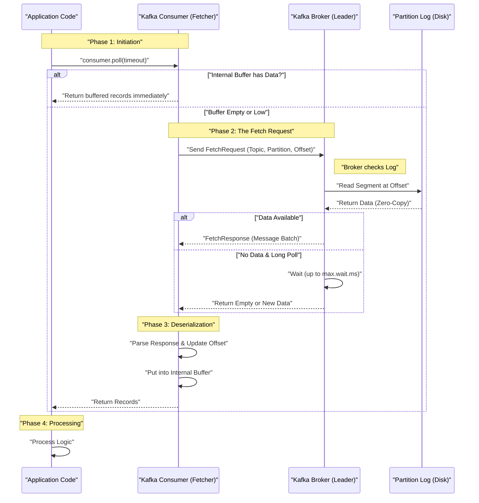

```mermaid
sequenceDiagram
    participant App as "Application Code"
    participant Consumer as "Kafka Consumer (Fetcher)"
    participant Broker as "Kafka Broker (Leader)"
    participant Log as "Partition Log (Disk)"

    Note over App, Consumer: "Phase 1: Initiation"
    App->>Consumer: "consumer.poll(timeout)"
    
    alt "Internal Buffer has Data?"
        Consumer-->>App: "Return buffered records immediately"
    else "Buffer Empty or Low"
        Note over Consumer, Broker: "Phase 2: The Fetch Request"
        Consumer->>Broker: "Send FetchRequest (Topic, Partition, Offset)"
        
        Note right of Broker: "Broker checks Log"
        Broker->>Log: "Read Segment at Offset"
        Log-->>Broker: "Return Data (Zero-Copy)"
        
        alt "Data Available"
            Broker-->>Consumer: "FetchResponse (Message Batch)"
        else "No Data & Long Poll"
            Broker->>Broker: "Wait (up to max.wait.ms)"
            Broker-->>Consumer: "Return Empty or New Data"
        end

        Note over Consumer: "Phase 3: Deserialization"
        Consumer->>Consumer: "Parse Response & Update Offset"
        Consumer->>Consumer: "Put into Internal Buffer"
        Consumer-->>App: "Return Records"
    end

    Note over App: "Phase 4: Processing"
    App->>App: "Process Logic"
```
