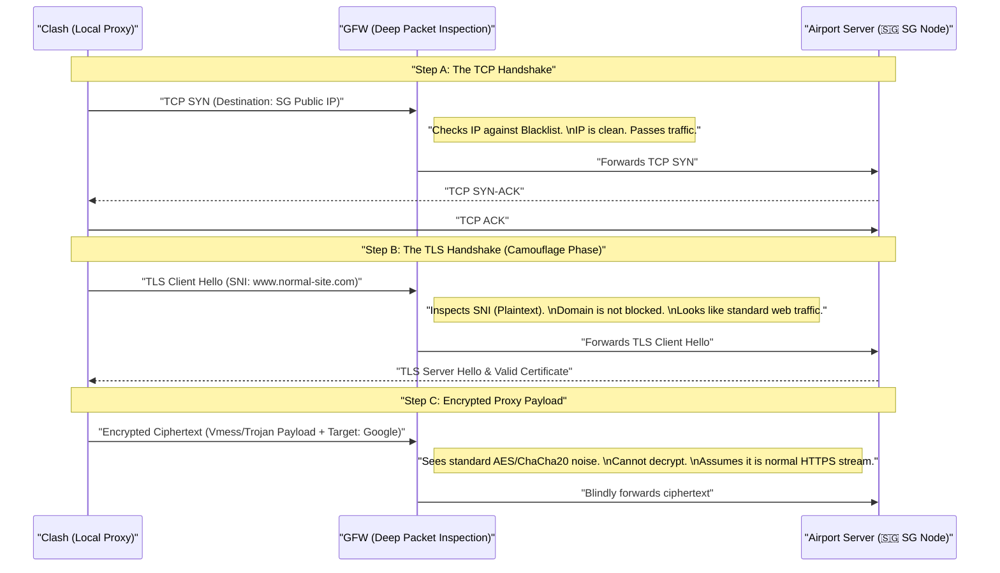

```mermaid
sequenceDiagram
    participant Clash as "Clash (Local Proxy)"
    participant GFW as "GFW (Deep Packet Inspection)"
    participant Airport as "Airport Server (🇸🇬 SG Node)"

    Note over Clash, Airport: "Step A: The TCP Handshake"
    Clash->>GFW: "TCP SYN (Destination: SG Public IP)"
    Note right of GFW: "Checks IP against Blacklist. \nIP is clean. Passes traffic."
    GFW->>Airport: "Forwards TCP SYN"
    Airport-->>Clash: "TCP SYN-ACK"
    Clash->>Airport: "TCP ACK"

    Note over Clash, Airport: "Step B: The TLS Handshake (Camouflage Phase)"
    Clash->>GFW: "TLS Client Hello (SNI: www.normal-site.com)"
    Note right of GFW: "Inspects SNI (Plaintext). \nDomain is not blocked. \nLooks like standard web traffic."
    GFW->>Airport: "Forwards TLS Client Hello"
    Airport-->>Clash: "TLS Server Hello & Valid Certificate"
    
    Note over Clash, Airport: "Step C: Encrypted Proxy Payload"
    Clash->>GFW: "Encrypted Ciphertext (Vmess/Trojan Payload + Target: Google)"
    Note right of GFW: "Sees standard AES/ChaCha20 noise. \nCannot decrypt. \nAssumes it is normal HTTPS stream."
    GFW->>Airport: "Blindly forwards ciphertext"
```

