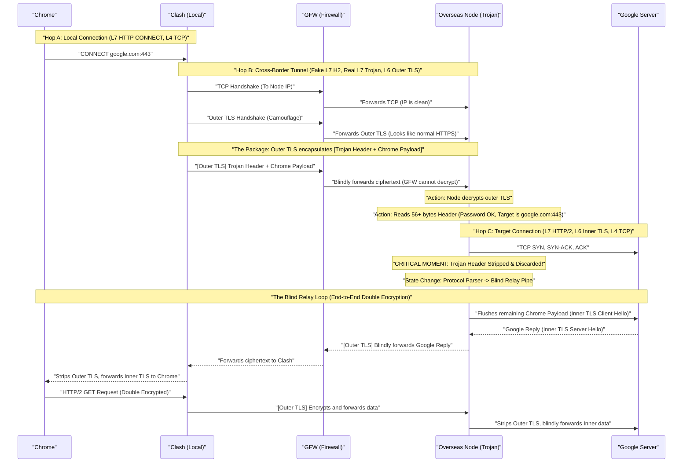

```mermaid
sequenceDiagram
    participant Chrome as "Chrome"
    participant Clash as "Clash (Local)"
    participant GFW as "GFW (Firewall)"
    participant Node as "Overseas Node (Trojan)"
    participant Google as "Google Server"

    Note over Chrome, Clash: "Hop A: Local Connection (L7 HTTP CONNECT, L4 TCP)"
    Chrome->>Clash: "CONNECT google.com:443"

    Note over Clash, Node: "Hop B: Cross-Border Tunnel (Fake L7 H2, Real L7 Trojan, L6 Outer TLS)"
    Clash->>GFW: "TCP Handshake (To Node IP)"
    GFW->>Node: "Forwards TCP (IP is clean)"
    
    Clash->>GFW: "Outer TLS Handshake (Camouflage)"
    GFW->>Node: "Forwards Outer TLS (Looks like normal HTTPS)"
    
    Note over Clash, Node: "The Package: Outer TLS encapsulates [Trojan Header + Chrome Payload]"
    Clash->>GFW: "[Outer TLS] Trojan Header + Chrome Payload"
    GFW->>Node: "Blindly forwards ciphertext (GFW cannot decrypt)"

    Note over Node: "Action: Node decrypts outer TLS"
    Note over Node: "Action: Reads 56+ bytes Header (Password OK, Target is google.com:443)"

    Note over Node, Google: "Hop C: Target Connection (L7 HTTP/2, L6 Inner TLS, L4 TCP)"
    Node->>Google: "TCP SYN, SYN-ACK, ACK"
    
    Note over Node: "CRITICAL MOMENT: Trojan Header Stripped & Discarded!"
    Note over Node: "State Change: Protocol Parser -> Blind Relay Pipe"

    Note over Chrome, Google: "The Blind Relay Loop (End-to-End Double Encryption)"
    Node->>Google: "Flushes remaining Chrome Payload (Inner TLS Client Hello)"
    Google-->>Node: "Google Reply (Inner TLS Server Hello)"
    Node-->>GFW: "[Outer TLS] Blindly forwards Google Reply"
    GFW-->>Clash: "Forwards ciphertext to Clash"
    Clash-->>Chrome: "Strips Outer TLS, forwards Inner TLS to Chrome"
    
    Chrome->>Clash: "HTTP/2 GET Request (Double Encrypted)"
    Clash->>Node: "[Outer TLS] Encrypts and forwards data"
    Node->>Google: "Strips Outer TLS, blindly forwards Inner data"
```

